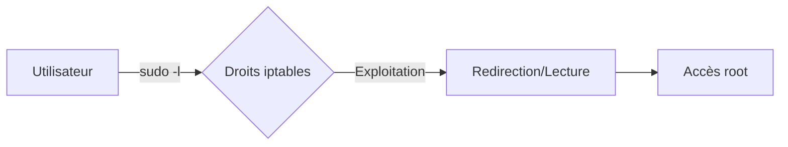

## Escalade de privilèges via iptables



## Vérification des droits sudo

La première étape consiste à identifier les permissions accordées à l'utilisateur courant sur le binaire **iptables**.

```bash
sudo -l
```

> [!warning] Prérequis
> Nécessite des droits **sudo** spécifiques sur les binaires **iptables** ou **iptables-save**.

## Analyse des permissions binaires (SUID/SGID)

Il est crucial de vérifier si des binaires possèdent le bit **SUID** activé, ce qui permettrait une exécution avec les privilèges du propriétaire (souvent root).

```bash
find / -perm -u=s -type f 2>/dev/null
```

Si un binaire lié à la gestion réseau ou à la configuration système possède ce bit, il peut être exploité pour modifier les règles **iptables** sans passer par **sudo**.

## Vérification des capacités (Capabilities)

Les **Capabilities** Linux permettent de diviser les privilèges root en unités plus petites. Un binaire peut avoir la capacité `CAP_NET_ADMIN` sans être root.

```bash
getcap -r / 2>/dev/null
```

> [!tip] Exploitation
> Si un binaire possède `cap_net_admin+ep`, il peut manipuler les tables **iptables** directement, permettant une persistance réseau ou un détournement de trafic sans élévation de privilèges complète.

## Analyse des scripts de démarrage

L'analyse des scripts exécutés au démarrage ou par des services système peut révéler des appels à **iptables** avec des privilèges élevés.

```bash
ls -la /etc/init.d/
systemctl list-unit-files --state=enabled
```

Vérifiez si ces scripts sont modifiables par l'utilisateur courant. Une injection de commande dans un script de démarrage exécuté par root garantit une élévation de privilèges persistante.

## Analyse des dépendances de bibliothèques

Si un binaire **iptables** ou un service associé charge des bibliothèques partagées, il est possible d'effectuer un **Library Hijacking**.

```bash
ldd /usr/sbin/iptables
```

Si le binaire charge une bibliothèque depuis un répertoire où l'utilisateur a des droits en écriture, il est possible de remplacer cette bibliothèque par une version malveillante pour exécuter du code arbitraire lors de l'appel au binaire.

## Redirection de port

Il est possible d'utiliser **iptables** pour rediriger le trafic réseau, facilitant ainsi des attaques de type man-in-the-middle ou le détournement de flux vers des services locaux.

```bash
sudo iptables -t nat -A PREROUTING -p tcp --dport 4444 -j REDIRECT --to-ports 1337
```

## Lecture de fichiers sensibles

La commande **iptables-save** peut être détournée pour lire le contenu de fichiers restreints en redirigeant la sortie vers un fichier accessible ou en exploitant la gestion des flux.

```bash
sudo iptables-save -c > /tmp/output.txt
cat /tmp/output.txt
```

## Modification de sudoers

L'exploitation des droits sur **iptables-save** permet d'injecter des règles de privilèges dans le fichier **/etc/sudoers** via l'utilisation de **tee**. Cette technique est détaillée dans les notes sur **Sudo Rights Exploitation** et **Linux Privilege Escalation**.

```bash
sudo iptables-save -c | tee /etc/sudoers
echo "user ALL=(ALL) NOPASSWD: ALL" >> /etc/sudoers
sudo su
```

> [!danger] Risque de corruption
> La modification de **/etc/sudoers** peut corrompre le système et rendre la machine instable.

> [!note] Technique de bypass
> L'utilisation de **tee** pour écrire dans des fichiers protégés est une méthode classique pour contourner les restrictions de redirection de flux lors de l'utilisation de **sudo**.

## Nettoyage de traces

Pour maintenir la discrétion après l'élévation de privilèges, il est nécessaire de supprimer l'historique des commandes exécutées. Ces actions s'inscrivent dans les procédures de **Persistence Techniques** et de nettoyage post-exploitation.

```bash
history -c && rm -rf ~/.bash_history
```