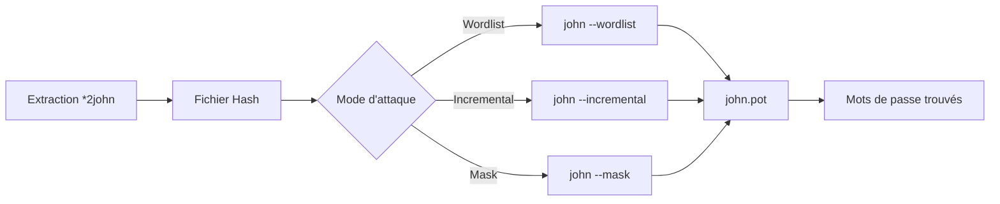

Ce diagramme illustre le flux de travail standard lors de l'utilisation de **John the Ripper** pour le cassage de mots de passe.



> [!info] Le fichier john.pot est critique : ne jamais le supprimer si vous voulez garder une trace des mots de passe déjà trouvés.

> [!warning] Attention à la consommation CPU/GPU lors de l'utilisation intensive des modes incremental ou mask.

> [!tip] Toujours utiliser --format si le type de hash est connu pour accélérer considérablement le processus.

> [!note] Les outils *2john ne sont pas toujours installés par défaut, vérifier le path ou le package john-data.

## Commandes de base

| Commande | Description |
|---|---|
| `john <hash_file>` | Lance une attaque par défaut (mode Single Crack). |
| `john --wordlist=<wordlist> <hash_file>` | Utilise une liste de mots pour une attaque par dictionnaire. |
| `john --incremental <hash_file>` | Utilise le mode Incremental pour générer toutes les combinaisons possibles. |
| `john --show <hash_file>` | Affiche les mots de passe déjà cassés. |
| `john --status` | Affiche l'état d'avancement d'une attaque en cours. |
| `john --restore` | Reprend une session interrompue. |
| `john --session=<session_name>` | Spécifie un nom pour une session afin de faciliter la restauration ultérieure. |

## Formats de hachages supportés

Utilisez **--format** pour spécifier le type de hachage. Pour détecter automatiquement le format :

```bash
john --list=formats
```

| Format | Description |
|---|---|
| `raw-md5` | Hachage brut MD5. |
| `sha256` | SHA-256 brut. |
| `bcrypt` | Blowfish-based. |
| `LM` | Windows LAN Manager. |
| `NT` | Windows NT. |
| `mscash` | Cache de mots de passe MS. |
| `mysql` | Hachages MySQL. |
| `oracle` | Hachages Oracle DB. |
| `pdf` | Fichiers PDF protégés. |
| `rar` | Archives RAR protégées. |
| `zip` | Archives ZIP protégées. |

## Modes d'attaque

| Mode | Commande | Description |
|---|---|---|
| Single Crack | `john <hash_file>` | Utilise une simple liste de mots pour deviner les mots de passe. |
| Wordlist | `john --wordlist=<file> <hash_file>` | Utilise une liste de mots externe pour une attaque par dictionnaire. |
| Incremental | `john --incremental <hash_file>` | Génère toutes les combinaisons possibles. |
| Mask | `john --mask=?l?d?u?s <hash_file>` | Génère des mots de passe basés sur un masque. |
| Hybrid | `john --wordlist=<file> --rules <hash_file>` | Combine une attaque par dictionnaire et des règles de transformation. |
| External | `john --external=<function> <hash_file>` | Utilise un script ou une fonction personnalisée pour générer les mots de passe. |

## Options avancées

| Option | Commande | Description |
|---|---|---|
| Spécification de règles | `--rules=<rule_set>` | Applique un jeu de règles pour transformer les mots de passe. |
| Spécification de masque | `--mask=<mask>` | Utilise un masque pour générer les mots de passe. |
| Personnalisation des caractères | `--incremental:charset=<file>` | Charge un ensemble de caractères spécifique pour le mode Incremental. |
| Limite de longueur | `--min-len=<length>` et `--max-len=<length>` | Définit les longueurs minimale et maximale des mots de passe générés. |
| Utilisation GPU | `--format=opencl` ou `--format=CUDA` | Active l'accélération matérielle si le format supporte OpenCL ou CUDA. |
| Progrès en temps réel | `--progress-every=<seconds>` | Affiche les progrès à intervalles réguliers. |
| Exclusion de caractères | `--reject-chars=<chars>` | Exclut certains caractères des combinaisons générées. |

## Masque

Les masques permettent de générer des mots de passe basés sur un modèle précis.

| Symbole | Description |
|---|---|
| `?l` | Lettres minuscules (a-z). |
| `?u` | Lettres majuscules (A-Z). |
| `?d` | Chiffres (0-9). |
| `?s` | Caractères spéciaux (!, @, #, etc.). |
| `?a` | Lettres, chiffres et symboles. |
| `?c` | Ensemble complet des caractères ASCII. |

Exemple pour tester des mots de passe commençant par une lettre majuscule, suivie de trois chiffres :

```bash
john --mask=?u?d?d?d <hash_file>
```

## Gestion des sessions

| Commande | Description |
|---|---|
| `john --session=<name>` | Démarre une session nommée. |
| `john --restore=<name>` | Reprend une session interrompue. |
| `john --status=<name>` | Affiche l'état d'une session spécifique. |

## Crackage de fichiers

**John the Ripper** peut traiter divers types de fichiers protégés après extraction des hachages via des outils **2john**.

| Commande | Description |
|---|---|
| `pdf2john file.pdf > hash.txt` | Extrait les hachages d'un fichier PDF. |
| `rar2john file.rar > hash.txt` | Extrait les hachages d'une archive RAR. |
| `zip2john file.zip > hash.txt` | Extrait les hachages d'une archive ZIP. |
| `keepass2john file.kdbx > hash.txt` | Extrait les hachages d'une base KeePass. |

Exemple de crackage :

```bash
john --wordlist=<wordlist> hash.txt
```

## Personnalisation des règles

Les règles permettent de modifier les mots de passe d'une liste pour augmenter les chances de succès. La configuration se situe dans `/etc/john/john.conf` (ou `~/.john/john.conf`).

Syntaxe de base dans le fichier de configuration :
```ini
[List.Rules:MyCustomRule]
# Ajoute '2023' à la fin de chaque mot
$2$0$2$3
# Met la première lettre en majuscule
c
```

| Transformation | Exemple | Description |
|---|---|---|
| `Az` | `--rules=Aa` | Convertit les minuscules en majuscules et inversement. |
| `d5` | `--rules=d5` | Ajoute un chiffre (5) à la fin de chaque mot. |
| `Az$!` | `--rules=Az$!` | Combine plusieurs transformations (majuscule, ajout de `!`). |

## Configuration de john.conf (personnalisation des règles complexes)

Le fichier `john.conf` est le cœur de la personnalisation. Pour créer des règles complexes, définissez une section `[List.Rules:NomDeLaRegle]`.

Exemple de règle complexe pour tester des variations courantes :
```ini
[List.Rules:ComplexTest]
# Ajoute des années courantes
$2$0$2$3
$2$0$2$4
# Remplace 'a' par '@' et 'i' par '1'
s/a/@/
s/i/1/
```
Appliquez ensuite cette règle avec :
```bash
john --wordlist=rockyou.txt --rules=ComplexTest hash.txt
```

## Gestion du fichier john.pot (nettoyage, duplication)

Le fichier `john.pot` stocke les mots de passe trouvés. Il est essentiel pour éviter de recasser des hashes déjà résolus.

- **Nettoyage des doublons** : Si vous avez fusionné plusieurs fichiers, utilisez `sort -u` pour nettoyer le fichier :
```bash
sort -u ~/.john/john.pot -o ~/.john/john.pot
```
- **Extraction spécifique** : Pour extraire uniquement les mots de passe d'un format précis :
```bash
john --show --format=nt > cracked_nt.txt
```

## Intégration avec Hashcat (comparaison et workflow)

John est excellent pour les formats complexes (KeePass, PDF), tandis que Hashcat est supérieur pour la vitesse brute (GPU).

- **Workflow recommandé** :
1. Utiliser `john` pour extraire les hashes et tester des dictionnaires simples.
2. Si le hash est standard (ex: SHA256, NTLM), convertir le format si nécessaire et basculer sur `hashcat` pour l'attaque par masque ou brute-force intensif.
3. Utiliser le fichier `.pot` de John pour alimenter une wordlist personnalisée pour Hashcat :
```bash
cut -d':' -f2 ~/.john/john.pot > custom_wordlist.txt
hashcat -m 1000 -a 0 hash.txt custom_wordlist.txt
```

## Performance et optimisation (benchmark)

Avant de lancer une attaque longue, vérifiez les performances de votre matériel sur le format cible :

```bash
john --test --format=bcrypt
```

- **Optimisation** :
- Utilisez `--fork=N` pour paralléliser sur plusieurs cœurs CPU :
```bash
john --wordlist=rockyou.txt --fork=4 hash.txt
```
- Vérifiez la charge CPU avec `htop` pour ajuster le nombre de processus.

## Suivi et progression

| Commande | Description |
|---|---|
| `john --show <hash_file>` | Affiche les mots de passe déjà cassés et leurs hachages correspondants. |
| `john --pot=<file>` | Spécifie un fichier `.pot` pour enregistrer les résultats. |
| `john --format=<hash_type>` | Filtre les mots de passe cassés par type de hachage. |

## Exemples pratiques

1. Cassage de hachages **NTLM** avec une liste de mots :

```bash
john --wordlist=/usr/share/wordlists/rockyou.txt --format=nt hash.txt
```

2. Utilisation d'un masque pour les mots de passe avec des lettres et chiffres :

```bash
john --mask=?u?l?l?d?d <hash_file>
```

3. Relancer une session interrompue :

```bash
john --restore
```

4. Filtrage des résultats pour un format spécifique :

```bash
john --show --format=raw-md5 hash.txt
```

## Liens associés

- Hashcat
- Active Directory Password Attacks
- Linux Privilege Escalation
- Windows Privilege Escalation