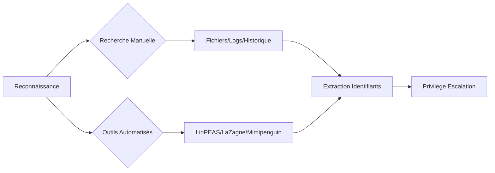

La recherche d'identifiants (Credential Harvesting) est une étape critique de la phase de post-exploitation, souvent liée aux techniques de **Linux Privilege Escalation**, **Credential Dumping** et **Persistence Techniques**.

## Fichiers

### Types à examiner
- Fichiers de configuration : `.conf`, `.config`, `.cnf`
- Bases de données : `.sql`, `.db`
- Notes : `.txt`
- Scripts : `.py`, `.sh`, `.c`, `.jar`
- Clés SSH : fichiers contenant `PRIVATE KEY`

### Commandes
- Trouver des fichiers spécifiques par extension :
    ```bash
    for ext in ".conf .config .cnf"; do find / -name "*$ext" 2>/dev/null; done
    ```
- Rechercher des mots-clés :
    ```bash
    for file in $(find / -name "*.cnf" 2>/dev/null); do grep -i "user\|password\|pass" $file 2>/dev/null; done
    ```
- Trouver des scripts sensibles :
    ```bash
    for ext in ".py .sh .c .jar"; do find / -name "*$ext" 2>/dev/null; done
    ```
- Rechercher des clés SSH :
    ```bash
    grep -rnw "PRIVATE KEY" /home/* 2>/dev/null | grep ":1"
    ```

> [!warning] Attention aux faux positifs avec grep
> L'utilisation de **grep** sur des répertoires système peut générer un volume important de faux positifs. Il est recommandé de filtrer les résultats par utilisateur ou par répertoire spécifique.

## Environnement (variables d'env, alias)

### Analyse des variables
Les variables d'environnement contiennent parfois des secrets (API keys, mots de passe de base de données).

### Commandes
- Lister les variables d'environnement :
    ```bash
    env
    export
    ```
- Vérifier les alias persistants :
    ```bash
    cat ~/.bashrc ~/.bash_profile ~/.zshrc | grep "alias"
    ```

## Services (fichiers de conf de services web/db)

### Emplacements critiques
Les services web (Apache, Nginx) et bases de données (MySQL, PostgreSQL) stockent souvent des credentials en clair dans leurs fichiers de configuration.

### Commandes
- Fichiers de configuration web :
    ```bash
    cat /var/www/html/config.php 2>/dev/null
    cat /etc/nginx/nginx.conf 2>/dev/null
    ```
- Fichiers de configuration base de données :
    ```bash
    cat /etc/mysql/my.cnf 2>/dev/null
    cat /etc/postgresql/*/main/pg_hba.conf 2>/dev/null
    ```

## GPG/Clés privées (gpg-agent)

### Analyse des clés
La recherche de clés GPG permet de déchiffrer des fichiers sensibles ou d'usurper l'identité d'un utilisateur.

### Commandes
- Rechercher les répertoires GPG :
    ```bash
    find / -name ".gnupg" -type d 2>/dev/null
    ```
- Lister les clés disponibles :
    ```bash
    gpg --list-keys
    gpg --list-secret-keys
    ```

## Historique

### Types d’historique
- Commandes utilisateur : `.bash_history`, `.zsh_history`
- Fichiers de configuration de shell : `.bashrc`, `.bash_profile`

### Commandes
- Lire les dernières commandes tapées :
    ```bash
    tail -n10 /home/*/.bash_history
    ```
- Rechercher des informations dans `.bashrc` :
    ```bash
    grep "password\|key\|token" /home/*/.bashrc
    ```

## Logs

### Types de journaux
- Logs système : `/var/log/messages`, `/var/log/syslog`
- Logs d'authentification : `/var/log/auth.log`, `/var/log/secure`
- Logs spécifiques : `/var/log/mysqld.log`, `/var/log/httpd/`

### Commandes
- Rechercher des connexions SSH, des erreurs ou des commandes sudo :
    ```bash
    for log in /var/log/*; do grep -i "ssh\|sudo\|failure\|password" $log 2>/dev/null; done
    ```

> [!danger] Nécessité de privilèges root
> L'accès à `/var/log/auth.log` ou aux fichiers de mémoire nécessite des privilèges **root**.

## Mémoire

### Outils pour la mémoire
- **mimipenguin** :
    ```bash
    sudo python3 mimipenguin.py
    ```
- **laZagne** :
    ```bash
    sudo python3 laZagne.py all
    ```

> [!warning] Risque de stabilité
> L'utilisation d'outils de dump mémoire peut provoquer une instabilité du système ou déclencher des alertes EDR/IDS.

## Navigateur

### Types d’informations
- Firefox : `logins.json`
- Chromium/Chrome : Fichiers SQLite dans le profil utilisateur

### Commandes
- Localiser les fichiers Firefox :
    ```bash
    ls -l ~/.mozilla/firefox/
    ```
- Lire `logins.json` avec **firefox_decrypt** :
    ```bash
    python3 firefox_decrypt.py
    ```
- Décryptage avec **laZagne** :
    ```bash
    python3 laZagne.py browsers
    ```

## Cronjobs

### Vérification
- Fichiers cron système : `/etc/crontab`, `/etc/cron.*`
- Fichiers utilisateur : `crontab -l`

### Commandes
- Afficher le fichier cron système :
    ```bash
    cat /etc/crontab
    ```
- Lister les cronjobs par répertoire :
    ```bash
    ls -la /etc/cron.*
    ```

## Bases de données

### Types à examiner
- Fichiers locaux : `.sql`, `.db`
- Caches : `.db-shm`, `.db-wal`

### Commandes
- Lister les bases de données locales :
    ```bash
    find / -name "*.db" 2>/dev/null
    ```
- Rechercher des données dans les fichiers `.db` :
    ```bash
    sqlite3 <database_file> "SELECT * FROM <table_name>;"
    ```

## Outils d'automatisation (LinPEAS, Linux Smart Enumeration)

### Outils recommandés
L'utilisation d'outils automatisés permet une énumération rapide et exhaustive.

- **LinPEAS** : Le standard pour l'énumération de privilèges et de secrets.
    ```bash
    ./linpeas.sh -a > enumeration_output.txt
    ```
- **Linux Smart Enumeration (lse)** : Très efficace pour filtrer les résultats pertinents.
    ```bash
    ./lse.sh -l 1
    ```

## Outils tiers et automatisation

- **mimipenguin** : Extraction des mots de passe en mémoire.
- **laZagne** : Extraction des mots de passe de divers services.
- **firefox_decrypt** : Décryptage des mots de passe Firefox.
- **John the Ripper** / **hashcat** : Craquage de mots de passe.

> [!tip] Importance de la discrétion
> Privilégier les recherches ciblées plutôt que les scans massifs pour éviter la détection.

### Exemple de recherche automatisée
```bash
for ext in ".conf .config .cnf"; do
  echo "Recherche des fichiers $ext :"
  find / -name "*$ext" 2>/dev/null | xargs grep -i "password\|user" 2>/dev/null
done
```