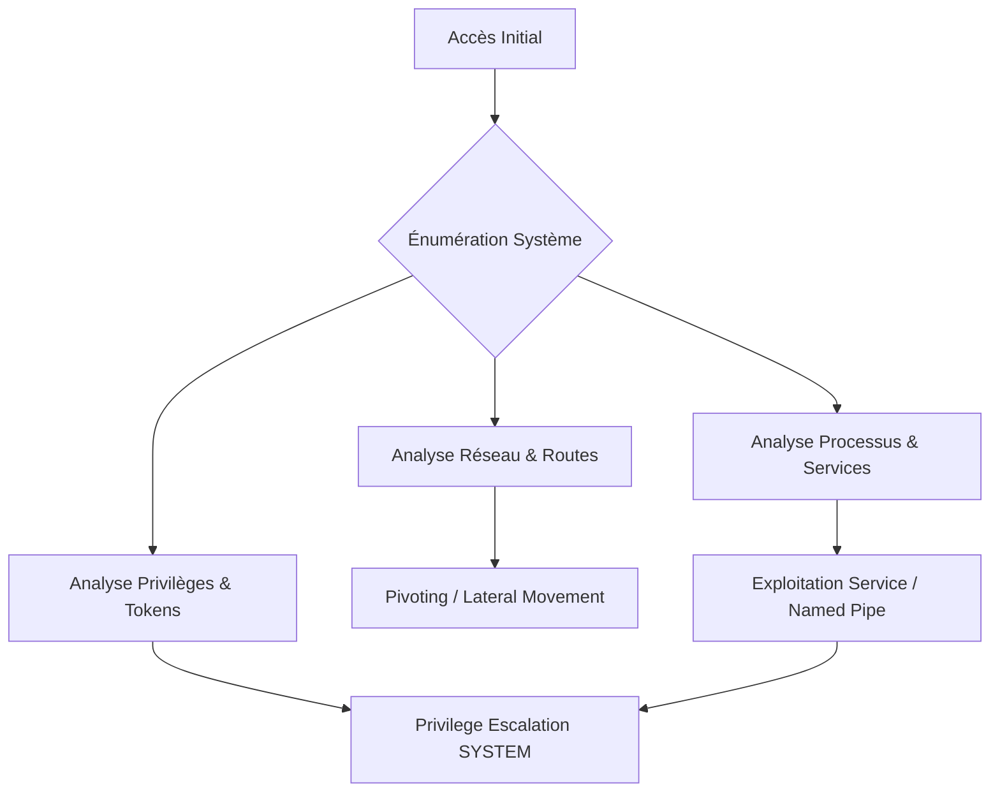

## Interface réseau et IP

### Commandes Windows

```powershell
ipconfig /all
Get-NetIPAddress
Get-NetIPConfiguration
```

### Analyse des interfaces

> [!info] Vérifier les interfaces dual-homed pour le pivoting
> L'identification d'interfaces multiples permet de cartographier des segments réseau non accessibles directement depuis l'extérieur.

- **DNS Suffix** : Indique le domaine Active Directory interne.
- **MAC Address** : Permet d'identifier la virtualisation (ex: VMware, Hyper-V).
- **DHCP** : Indique si l'hôte est configuré dynamiquement ou statiquement.

## Routage et domaines

### Commandes Windows

```powershell
route print
netstat -rn
Get-NetRoute
nltest /domain_trusts
nltest /dclist:domain.local
```

- **Routes** : L'analyse des tables de routage révèle des sous-réseaux internes.
- **Trusts** : Les relations d'approbation entre domaines facilitent le mouvement latéral.

## Cache ARP

### Commandes

```cmd
arp -a
```

- **Cache ARP** : Permet d'identifier les hôtes récemment contactés sur le segment local, utiles pour le sniffing ou le ciblage de mouvements latéraux.

## Protections système (AV/EDR)

### Commandes PowerShell

```powershell
Get-MpComputerStatus
sc query windefend
tasklist /FI "IMAGENAME eq MsMpEng.exe"
wmic /namespace:\\root\SecurityCenter2 path AntiVirusProduct get displayName,pathToSignedProductExe,productState
```

> [!danger] Risque de détection
> La présence d'un EDR actif impose l'utilisation de techniques de "Living off the Land" et l'évitement de binaires non signés.

## AppLocker

### Commandes PowerShell

```powershell
Get-AppLockerPolicy -Effective
Get-AppLockerPolicy -Local
Get-AppLockerPolicy -Effective | select -ExpandProperty RuleCollections
Get-AppLockerPolicy -Local | Test-AppLockerPolicy -path "C:\Windows\System32\cmd.exe" -User Everyone
```

> [!warning] Attention aux faux positifs lors de l'analyse des permissions AppLocker
> Les règles peuvent varier selon l'utilisateur et le contexte d'exécution.

## LOLBAS

### Commandes d'énumération

```powershell
where cmd
where powershell
where regsvr32
where wmic
where mshta
where certutil
powershell -c "whoami"
```

> [!tip] Toujours privilégier les outils 'Living off the Land' avant de dropper des binaires
> L'utilisation de binaires natifs comme **regsvr32**, **wmic**, **rundll32**, **mshta**, **msbuild**, **bitsadmin**, **certutil** réduit l'empreinte sur le système.

## Informations système

### Commandes

```powershell
systeminfo
wmic qfe
wmic product get name
Get-WmiObject -Class Win32_Product
set
echo %PATH%
```

## Processus et services

### Commandes

```powershell
tasklist /svc
tasklist /v
sc query
Get-Service
```

> [!info] Identifier les processus tournant en SYSTEM pour l'usurpation de token
> L'analyse des processus **SYSTEM** est cruciale pour l'élévation de privilèges via **SeImpersonatePrivilege**.

## Utilisateurs et groupes

### Commandes

```powershell
whoami
whoami /groups
whoami /priv
net user
net localgroup
net localgroup Administrators
quser
```

## Politiques de sécurité

### Commandes

```powershell
net accounts
secedit /export /cfg secpol.cfg
reg query HKLM\SOFTWARE\Microsoft\Windows\CurrentVersion\Policies\System /v EnableLUA
```

## Analyse de privilèges

| Type de privilège | Vérification | Exploitation |
| :--- | :--- | :--- |
| **SeImpersonatePrivilege** | `whoami /priv` | **Juicy Potato** |
| **SeAssignPrimaryTokenPrivilege** | `whoami /priv` | **PrintSpoofer**, **RoguePotato** |
| **SeBackupPrivilege** | `whoami /priv` | Accès SAM / Shadow Copy |
| **SeDebugPrivilege** | `whoami /priv` | Injection de processus |
| **SeLoadDriverPrivilege** | `whoami /priv` | Driver malveillant |

## Active Directory

### Commandes

```powershell
nltest /dclist:domain.local
systeminfo | findstr /B /C:"Domain"
hostname
whoami /user
net group /domain
net group "Domain Admins" /domain
```

## Named Pipes

### Commandes d'énumération

```powershell
gci \\.\pipe\
pipelist.exe /accepteula
accesschk.exe /accepteula \\.\pipe\<pipename> -v
accesschk.exe /accepteula -w \\.\pipe\* -v
```

> [!tip] Prioriser les Named Pipes accessibles en écriture par Everyone
> Un accès en écriture sur un pipe appartenant à un service **SYSTEM** permet souvent d'obtenir une exécution de code arbitraire.

## Outils d'énumération

| Outil | Usage |
| :--- | :--- |
| **winPEAS** | Énumération automatique |
| **Seatbelt** | Énumération ciblée |
| **PowerUp** | PrivEsc automatique |
| **AccessChk** | Vérification des ACL |
| **Handle** | Analyse des descripteurs de fichiers |

## Analyse des tâches planifiées (Scheduled Tasks)

### Commandes

```powershell
# Lister les tâches planifiées
schtasks /query /fo LIST /v
# Lister les tâches via PowerShell
Get-ScheduledTask | Select-Object TaskName, TaskPath, State, @{Name="RunAsUser";Expression={$_.Principal.UserId}}
```

## Recherche de mots de passe en clair

### Commandes

```powershell
# Recherche récursive dans les fichiers de configuration
findstr /si password *.xml *.ini *.txt *.config
# Recherche dans le registre (ex: AutoLogon)
reg query "HKLM\SOFTWARE\Microsoft\Windows NT\CurrentVersion\Winlogon" /v DefaultPassword
# Historique PowerShell
type %userprofile%\AppData\Roaming\Microsoft\Windows\PowerShell\PSReadline\ConsoleHost_history.txt
```

## Analyse des fichiers binaires non protégés (Unquoted Service Paths)

### Commandes

```powershell
# Identifier les services avec des chemins non protégés par des guillemets
wmic service get name,displayname,pathname,startmode | findstr /i "Auto" | findstr /i /v "C:\Windows\\" | findstr /i /v """
```

## Recherche de clés SSH ou certificats clients

### Commandes

```powershell
# Recherche de clés privées SSH
dir /s /b id_rsa
# Recherche de certificats et clés de transport
dir /s /b *.pfx
dir /s /b *.cer
dir /s /b *.pem
```
```