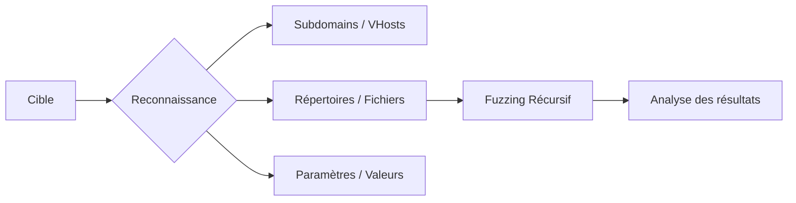

La reconnaissance web via **ffuf** permet d'automatiser la découverte de ressources et de paramètres. Le flux de travail standard pour une énumération efficace est représenté ci-dessous :



## Directory Fuzzing

### Commande de base
```bash
ffuf -w /chemin/vers/wordlist.txt -u http://IP:PORT/FUZZ
```

### Fuzzing de répertoires
```bash
ffuf -w /opt/useful/seclists/Discovery/Web-Content/common.txt -u http://IP:PORT/FUZZ
```

### Fuzzing de fichiers avec extension
```bash
ffuf -w /opt/useful/seclists/Discovery/Web-Content/common.txt -u http://IP:PORT/FUZZ.php
```

### Fuzzing d'extensions
```bash
ffuf -w /opt/useful/seclists/Discovery/Web-Content/web-extensions.txt -u http://IP:PORT/indexFUZZ
```

### Fuzzing de pages dans un sous-dossier
```bash
ffuf -w /opt/useful/seclists/Discovery/Web-Content/common.txt -u http://IP:PORT/blog/FUZZ.php
```

## Recursive Fuzzing

### Commande de base
```bash
ffuf -w /opt/useful/seclists/Discovery/Web-Content/directory-list-2.3-small.txt:FUZZ \
-u http://IP:PORT/FUZZ \
-recursion \
-recursion-depth 1 \
-e .php \
-v
```

### Commande automatisée complète
```bash
ffuf -w /opt/useful/seclists/Discovery/Web-Content/directory-list-2.3-small.txt:FUZZ \
-u http://IP:PORT/FUZZ \
-recursion -recursion-depth 2 \
-e .php,.html \
-mc 200,403 \
-t 60 \
-v
```

## Subdomain & VHost Fuzzing

### Subdomain Fuzzing (DNS public)
```bash
ffuf -w /opt/useful/seclists/Discovery/DNS/subdomains-top1million-5000.txt:FUZZ \
-u https://FUZZ.example.com/ \
-mc 200,204,301,302,307,401,403,405,500
```

### VHost Fuzzing (Host Header)
```bash
ffuf -w /opt/useful/seclists/Discovery/DNS/subdomains-top1million-5000.txt:FUZZ \
-u http://example.htb/ \
-H 'Host: FUZZ.example.htb' \
-mc 200,204,301,302,307,401,403 \
-v
```

## Parameter & Value Fuzzing

### Fuzzing de paramètres GET
```bash
ffuf -w /opt/useful/seclists/Discovery/Web-Content/burp-parameter-names.txt:FUZZ \
-u http://target.htb/page.php?FUZZ=value \
-fs 1234
```

### Fuzzing de paramètres POST
```bash
ffuf -w /opt/useful/seclists/Discovery/Web-Content/burp-parameter-names.txt:FUZZ \
-u http://target.htb/page.php \
-X POST -d 'FUZZ=value' \
-H 'Content-Type: application/x-www-form-urlencoded' \
-fs 1234
```

### Fuzzing de valeurs POST
```bash
for i in $(seq 1 1000); do echo $i >> ids.txt; done

ffuf -w ids.txt:FUZZ \
-u http://target.htb/page.php \
-X POST -d 'id=FUZZ' \
-H 'Content-Type: application/x-www-form-urlencoded' \
-fs 1234
```

## Analyse des résultats (Workflow de tri)

Pour traiter efficacement les sorties volumineuses, il est recommandé d'exporter les résultats au format JSON pour une manipulation ultérieure avec **jq** ou de trier directement via les options de filtrage de **ffuf**.

```bash
# Export des résultats pour analyse
ffuf -w wordlist.txt -u http://target.htb/FUZZ -o results.json -of json

# Tri des résultats par taille de réponse pour identifier les anomalies
cat results.json | jq '.results[] | {url: .url, size: .length}' | sort -k4 -n
```

[!warning] Importance du filtrage
L'utilisation de **-fs**, **-fw**, et **-fl** est cruciale pour réduire le bruit et éliminer les faux positifs lors de l'analyse des résultats.

## Gestion des sessions et cookies (Auth fuzzing)

Lorsqu'une ressource nécessite une authentification, il est impératif de transmettre les cookies de session ou les jetons d'autorisation.

```bash
ffuf -w wordlist.txt -u http://target.htb/admin/FUZZ \
-H "Cookie: session=votre_cookie_ici" \
-H "Authorization: Bearer votre_token_jwt" \
-mc 200
```

## Intégration avec Burp Suite (Workflow complet)

L'intégration avec **Burp Suite** permet de visualiser les requêtes générées et de rejouer manuellement les découvertes intéressantes.

```bash
# Proxyfication du trafic via Burp
ffuf -w wordlist.txt -u http://target.htb/FUZZ -x http://127.0.0.1:8080
```

[!note] Workflow
L'intégration avec **Burp Suite** est indispensable pour inspecter les requêtes en temps réel et faciliter le passage vers l'exploitation (voir notes **Burp Suite** et **Web**).

## Techniques d'évasion (WAF bypass)

Pour contourner des filtres simples ou des WAF, on peut modifier les en-têtes ou utiliser des encodages spécifiques.

```bash
# Utilisation d'en-têtes pour simuler une IP interne ou contourner des restrictions
ffuf -w wordlist.txt -u http://target.htb/FUZZ \
-H "X-Forwarded-For: 127.0.0.1" \
-H "X-Originating-IP: 127.0.0.1" \
-H "User-Agent: Mozilla/5.0 (compatible; Googlebot/2.1; +http://www.google.com/bot.html)"
```

## Options et filtrage

| Option | Description |
| :--- | :--- |
| `-mc` | Match uniquement les codes HTTP spécifiés |
| `-fc` | Ignore les codes HTTP spécifiés |
| `-fs` | Ignore les réponses avec une taille spécifique |
| `-fl` | Filtre par nombre de lignes |
| `-fw` | Filtre par nombre de mots |
| `-t` | Définit le nombre de threads |
| `-o` | Sauvegarde les résultats dans un fichier |
| `-v` | Mode verbeux |
| `-c` | Active la sortie colorée |
| `-recursion` | Active le scan récursif |
| `-e` | Extensions à tester |

> [!danger] Attention au DoS
> Ne pas utiliser un nombre de threads trop élevé sur des serveurs de production pour éviter de saturer les ressources ou de déclencher des mécanismes de protection.

> [!tip] Baseline
> Il est nécessaire de définir une ligne de base (baseline) avant de lancer un fuzzing de paramètres pour identifier la réponse standard du serveur.

> [!info] DNS vs VHost
> Il existe une différence critique entre le DNS public, qui résout des domaines réels, et le VHost (Host Header), qui permet d'accéder à des sites hébergés sur une même IP sans enregistrement DNS public.