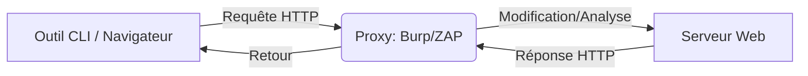

## Gestion des certificats CA pour le HTTPS

Pour intercepter le trafic HTTPS, le certificat de l'autorité de certification (CA) du proxy doit être installé dans le magasin de certificats du navigateur ou du système.

### Burp Suite
1. Démarrer Burp et configurer le navigateur pour utiliser `127.0.0.1:8080`.
2. Accéder à `http://burp` dans le navigateur.
3. Cliquer sur **CA Certificate** pour télécharger `cacert.der`.
4. Importer le certificat dans les paramètres du navigateur (ex: Firefox : `Settings > Privacy & Security > Certificates > View Certificates > Authorities > Import`).

### OWASP ZAP
1. `Tools > Options > Dynamic SSL Certificates`.
2. Cliquer sur **Save** pour exporter le certificat `owasp_zap_root_ca.cer`.
3. Procéder à l'importation dans le magasin de certificats du système ou du navigateur.

## Configuration des Scopes et filtres de proxy

La définition d'un **Scope** permet de limiter le bruit et de se concentrer uniquement sur la cible définie.

### Burp Suite
* **Scope** : `Target > Scope settings`. Ajouter l'URL de la cible (ex: `^https?://target\.com/.*$`).
* **Filtres** : Dans `Proxy > HTTP History`, cliquer sur la barre de filtre et cocher **Show only in-scope items**.

### OWASP ZAP
* **Scope** : Clic droit sur l'URL dans l'arborescence `Sites` > `Include in Context`.
* **Filtres** : Utiliser la barre de recherche et les filtres de contexte en haut de l'onglet `History`.

## Modification automatique des requêtes (Request Modification)

### Burp Suite
Menu : `Proxy > Options > Match and Replace > Add`

| Paramètre | Valeur |
| :--- | :--- |
| **Type** | `Request Header` |
| **Match** | `^User-Agent.*$` |
| **Replace** | `User-Agent: HackTheBox Agent 1.0` |
| **Regex match** | `True` |

### ZAP (OWASP ZAP Replacer)
Menu : `Options > Replacer` ou `[CTRL+R]`

| Champ | Valeur |
| :--- | :--- |
| **Description** | HTB User-Agent |
| **Match Type** | Request Header |
| **Match String** | User-Agent |
| **Replacement** | HackTheBox Agent 1.0 |
| **Enabled** | `True` |
| **Initiators** | Apply to all HTTP(S) messages |

> [!warning]
> Le **Replacer** de **ZAP** est puissant mais nécessite une configuration précise des **Initiators** pour éviter d'impacter tout le trafic.

## Modification automatique des réponses (Response Modification)

### Burp Suite
Exemple : contournement des champs numériques HTML pour l'injection de commande.

| Paramètre | Valeur |
| :--- | :--- |
| **Type** | Response body |
| **Match** | `type="number"` |
| **Replace** | `type="text"` |
| **Regex match** | `False` |

Règle complémentaire :
```text
Match: maxlength="3"
Replace: maxlength="100"
```

## Répétition de requêtes (Repeater)

### Burp Repeater
1. Sélectionner une requête dans `Proxy > HTTP History`.
2. `[CTRL+R]` pour envoyer dans **Repeater**.
3. `[CTRL+SHIFT+R]` pour basculer vers l'onglet **Repeater**.
4. Modifier et cliquer sur **Send**.

### ZAP Repeater
1. Clic droit sur une requête > `Open/Resend with Request Editor`.
2. Modifier et cliquer sur **Send**.

## Encodage et décodage de données

### URL Encoding
| Caractère | Problème sans encodage | Encodage |
| :--- | :--- | :--- |
| Espace | Termine la requête | `%20` ou `+` |
| `&` | Sépare des paramètres | `%26` |
| `#` | Début d’un fragment URL | `%23` |

> [!tip]
> Toujours vérifier l'encodage (URL, Base64) avant d'injecter des payloads pour éviter les erreurs de serveur.

### Manipulation de données
Exemple : Cookie **Base64**
```text
eyJ1c2VybmFtZSI6Imd1ZXN0IiwgImlzX2FkbWluIjpmYWxzZX0=
```
Décodage : `{"username":"guest", "is_admin":false}`
Modification : `{"username":"admin", "is_admin":true}`

## Utilisation des extensions (BApp Store / ZAP Marketplace)

Les extensions permettent d'automatiser des tâches complexes (ex: détection de vulnérabilités spécifiques, encodage custom).

* **Burp Suite** : `Extender > BApp Store`. Extensions recommandées : *Logger++*, *Autorize* (pour tester les contrôles d'accès), *Turbo Intruder*.
* **OWASP ZAP** : `Manage Add-ons` (icône puzzle). Extensions recommandées : *Community Scripts*, *Python Scripting*.

## Gestion des sessions et authentification complexe

Pour maintenir une session valide lors de tests automatisés :

* **Burp Suite** : `Project options > Sessions > Session Handling Rules`. Permet de définir des macros pour re-authentifier automatiquement si la session expire.
* **OWASP ZAP** : `Tools > Options > HTTP Sessions`. Permet de définir des jetons de session (ex: `JSESSIONID`) et de gérer les règles de ré-authentification via le `Forced User Mode`.

## Analyse comparative des performances (Burp Pro vs Community)

| Fonctionnalité | Burp Community | Burp Professional |
| :--- | :--- | :--- |
| **Intruder** | Limité (1 req/s) | Illimité (High speed) |
| **Scanner** | Non inclus | Inclus (Automatisé) |
| **Extensions** | Basique | Accès complet (BApp Store) |
| **Collaborator** | Non | Inclus (OOB testing) |

## Proxying d'outils CLI

### Proxychains
Configuration dans `/etc/proxychains.conf` :
```bash
http 127.0.0.1 8080
```
Utilisation :
```bash
proxychains curl http://TARGET:PORT
```

### Nmap
```bash
nmap --proxies http://127.0.0.1:8080 -Pn -pPORT -sC TARGET
```

### Metasploit
```bash
msfconsole
use auxiliary/scanner/http/robots_txt
set PROXIES HTTP:127.0.0.1:8080
set RHOST TARGET
set RPORT PORT
run
```

> [!note]
> Le proxying d'outils CLI via **proxychains** est plus fiable que les options natives (ex: **--proxies** de **Nmap**).

## Fuzzing avec Burp Intruder

### Configuration
1. `Proxy > HTTP History` > Clic droit > `Send to Intruder` (`Ctrl+I`).
2. Onglet **Positions** : Sélectionner le paramètre > `Add §`.
3. Onglet **Payloads** : `Payload Type` > `Simple List` > Charger la wordlist.
4. Onglet **Options** : `Grep - Match` > Ajouter `200 OK` pour filtrer les résultats.

> [!danger]
> La version Community de **Burp Suite** limite le débit de l'**Intruder** à 1 requête par seconde.

## Liens associés
- [[Burp Suite]]
- [[Enumeration]]
- [[FFUF]]
- [[Payloads]]
- [[Web]]