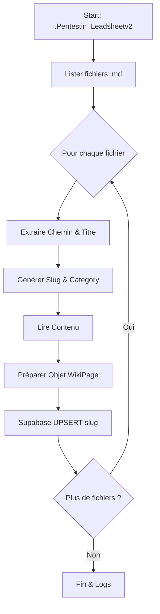

# Plan de Migration : .Pentestin_Leadsheetv2 vers Wiki Supabase

Ce plan détaille le transfert des fichiers Markdown de prise de notes vers la base de données Supabase pour le Wiki.

## 1. Objectifs
- Transférer tous les fichiers `.md` du dossier `.Pentestin_Leadsheetv2`.
- Respecter l'arborescence via le champ `category`.
- Utiliser le chemin complet pour le `slug`.
- Écraser les données existantes si le slug correspond.
- Marquer toutes les notes comme `published: true`.
- Pas de tags automatiques.

## 2. Analyse des Données
- **Source** : `trxtxbook.com/.Pentestin_Leadsheetv2/`
- **Destination** : Table `wiki_pages` dans Supabase.
- **Structure de la table `wiki_pages`** (inférée) :
    - `id` (uuid)
    - `title` (text)
    - `slug` (text, unique)
    - `category` (text)
    - `content` (text)
    - `published` (boolean)
    - `updated_at` (timestamptz)
    - `likes` (integer, default 0)
    - `tags` (text[])

## 3. Stratégie de Transformation
| Champ | Règle de transformation | Exemple |
| :--- | :--- | :--- |
| **Title** | Nom du fichier sans extension `.md`. | `SSH.md` -> `SSH` |
| **Category** | Chemin relatif du dossier parent. | `1- Info/Services/SSH.md` -> `1- Info/Services` |
| **Slug** | Chemin complet normalisé (minuscules, sans espaces). | `1- Info/Services/SSH.md` -> `1-info-services-ssh` |
| **Content** | Contenu brut du fichier Markdown. | - |
| **Published**| Toujours `true`. | `true` |
| **Tags** | Tableau vide `[]`. | `[]` |

## 4. Implémentation du Script (`scripts/migrate-leadsheet.js`)
- Utilisation de `fs` et `path` pour la lecture récursive des fichiers.
- Utilisation de `@supabase/supabase-js` avec la `SERVICE_ROLE_KEY` pour contourner les politiques RLS.
- Méthode `upsert` sur la table `wiki_pages` basée sur la contrainte `slug`.

## 5. Étapes d'Exécution
1.  Créer le script `trxtxbook.com/scripts/migrate-leadsheet.js`.
2.  Charger les variables d'environnement (`VITE_SUPABASE_URL`, `SUPABASE_SERVICE_ROLE_KEY`).
3.  Lister récursivement tous les fichiers `.md`.
4.  Extraire et transformer les données pour chaque fichier.
5.  Envoyer par lots (batches) ou unitairement vers Supabase.
6.  Valider l'importation via la console ou le frontend.

## 6. Diagramme de Flux

